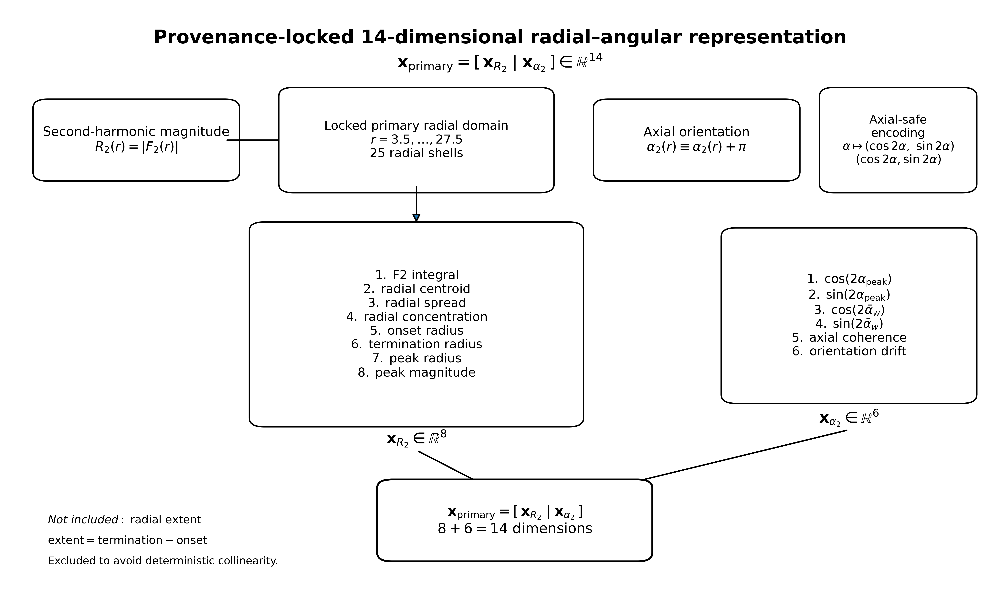
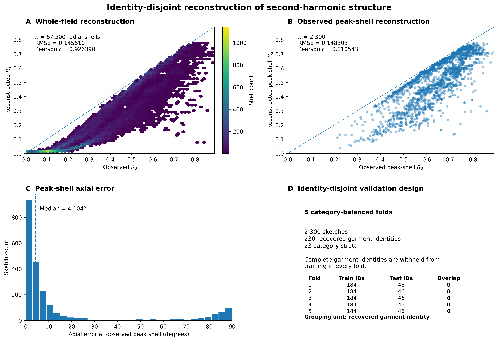
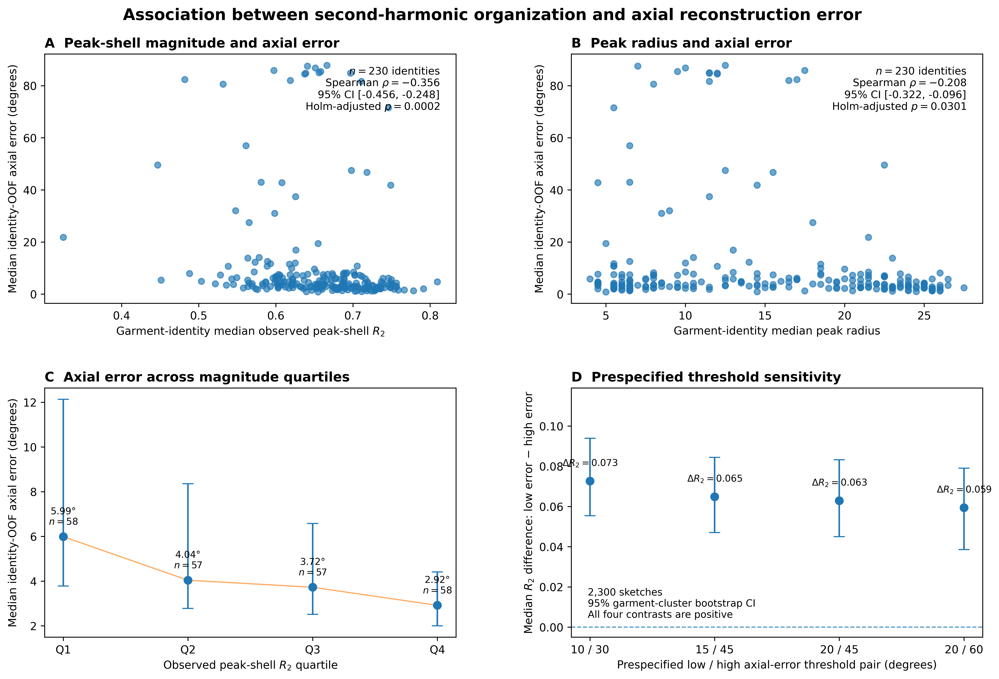

# 4. Results

## 4.1 Population, radial-domain and representation locks

The final analysis retained all 2,300 sketches. The conditional angular tensor had shape \(2300\times72\times72\), the second-harmonic magnitude field had shape \(2300\times72\), and the locked circular field had shape \(2300\times25\). All 25 circular shells lay in the prespecified radial domain from 3.50 to 27.50. The construction from a representative sketch to the centroid-relative polar field, conditional angular distribution, second-harmonic magnitude, and axial orientation is illustrated in Figure 1.

**Figure 1. Radial–angular construction and second-harmonic interpretation.** (A) Representative CLO-SKET sketch with intensity-weighted centroid. (B) Centroid-relative polar geometry used to accumulate foreground intensity by radius and angle. (C) Conditional angular distribution \(p(\theta\mid r)\); the shaded interval marks the locked 25-shell primary radial domain \(r=3.5,\ldots,27.5\). (D) Second-harmonic magnitude \(R_2(r)=|F_2(r)|\), with the selected observed peak shell marked. (E) Axial orientation \(\alpha_2(r)\) over the locked domain. The top inset illustrates one-, two-, and three-fold angular organization; the second harmonic is used here because its orientation is axial, with \(\alpha\equiv\alpha+\pi\).

The primary representation was the exact concatenation of eight direct \(F_2\) radial descriptors and six axial-safe \(\alpha_2\) descriptors (Figure 2). The resulting matrix had shape \(2300\times14\), contained only finite values, reproduced the Cell 23C column order, and matched the independently concatenated \(8+6\) matrix exactly; the maximum absolute difference was 0.0. No historical 28-dimensional family assembly was asserted.

**Figure 2. Provenance-locked 14-dimensional radial–angular representation.** The primary vector is the exact concatenation of eight direct second-harmonic magnitude descriptors and six axial-safe orientation descriptors. The radial block comprises integrated \(F_2\) magnitude, radial centroid, radial spread, radial concentration, onset radius, termination radius, peak radius, and peak magnitude. The axial block encodes peak and magnitude-weighted mean orientations through doubled-angle cosine/sine coordinates together with axial coherence and orientation drift. Radial extent is excluded because it is exactly termination minus onset.

The observed circular quantities \(C_2\), \(S_2\), \(R_2\), and \(\mu_2\), together with their reconstructed counterparts, each had shape \(2300\times25\). At the selected observed peak shell, the maximum absolute discrepancy between observed \(R_2\) and observed \(|F_2|\) was \(6.661\times10^{-16}\). This numerical result confirmed the expected identity \(R_2=|F_2|\); the two quantities were therefore not counted as independent evidence.

## 4.2 File duplication and garment-identity structure

All 2,300 path strings were unique. SHA-256 hashing found no repeated raw-file pairs, and hashing of decoded pixel arrays found no repeated decoded-pixel pairs. The perceptual-hash screen identified 11 candidate pairs at Hamming distance 0, 39 at distance at most 2, and 248 at distance at most 4. These candidates were treated as an image-review screen rather than proof of duplication or shared lineage.

Filename and category structure recovered 230 category-qualified garment identities, exactly 10 identities in each of the 23 categories. Garment identities contained 9–11 sketches and 9–11 distinct replicate identifiers. Eight identity–replicate combinations were repeated in the filename records. The recovered identity structure supplied a defensible cluster variable but did not prove mutual independence of the 230 garment identities.

## 4.3 Leakage audit and identity-disjoint fold lock

The historical sketch-level out-of-fold design did not separate garment identities. In every one of its five folds, all 230 test identities also occurred in training; consequently, 100% of test sketches had their garment identity represented in the corresponding training partition. Historical reconstruction estimates were therefore retained only as development comparators.

The replacement design used five category-balanced, identity-disjoint folds. Each test fold contained 46 complete garment identities—two from every category—and each training fold contained the remaining 184 identities. Test-fold sizes ranged from 459 to 461 sketches because identity-level replication was slightly unbalanced. Every sketch and every garment identity was tested exactly once, and train/test identity overlap was zero in every fold.

## 4.4 Identity-disjoint reconstruction of \(C_2\) and \(S_2\)

Two fixed `HistGradientBoostingRegressor` models reconstructed \(C_2\) and \(S_2\) from radius and observed \(|F_2(r)|\). Across the five identity-disjoint folds, \(C_2\) RMSE ranged from 0.210938 to 0.228147 and \(S_2\) RMSE ranged from 0.124814 to 0.131585 (Table 1). Garment-identity overlap was zero in every fit, and all 57,500 valid sketch-shell rows received exactly one out-of-fold prediction.

**Table 1. Identity-disjoint fold performance for component reconstruction.**

| Fold | Training identities | Test identities | Identity overlap | \(C_2\) RMSE | \(S_2\) RMSE |
|---:|---:|---:|---:|---:|---:|
| 0 | 184 | 46 | 0 | 0.216957 | 0.124959 |
| 1 | 184 | 46 | 0 | 0.213426 | 0.124814 |
| 2 | 184 | 46 | 0 | 0.210938 | 0.127228 |
| 3 | 184 | 46 | 0 | 0.228147 | 0.128320 |
| 4 | 184 | 46 | 0 | 0.220904 | 0.131585 |

Across all held-out rows, the fold-local global baseline produced RMSEs of 0.300420 for \(C_2\) and 0.129034 for \(S_2\). The radius-only comparator produced RMSEs of 0.287288 and 0.128729, respectively. Adding \(|F_2|\) to radius reduced \(C_2\) RMSE to 0.218161, an absolute reduction of 0.069127 and a relative reduction of 24.06%. For \(S_2\), RMSE decreased to 0.127405, an absolute reduction of 0.001324 and a relative reduction of 1.03% (Table 2).

**Table 2. Comparator performance and incremental contribution of \(|F_2|\).**

| Model | \(C_2\) RMSE | \(S_2\) RMSE |
|---|---:|---:|
| Fold-local global baseline | 0.300420 | 0.129034 |
| Radius only, identity OOF | 0.287288 | 0.128729 |
| Radius + \(|F_2|\), identity OOF | **0.218161** | **0.127405** |

The strongly asymmetric incremental gains indicate that the supplied magnitude was substantially informative for the cosine component but added little beyond radius for the sine component. Because \(|F_2|\), \(C_2\), and \(S_2\) were computed from the same conditional angular field, this remains a shared-source reconstruction diagnostic rather than recovery of an independent target.

## 4.5 Impact of garment-identity leakage on reconstruction estimates

Changing only the validation unit from sketch to garment identity produced little change in the aggregate point estimates. For the whole field, historical sketch-level out-of-fold reconstruction had \(R_2\) RMSE 0.145516, Pearson \(r=0.927269\), and mean reconstructed \(R_2=0.212319\). Identity-disjoint reconstruction had RMSE 0.145610, Pearson \(r=0.926390\), and mean reconstructed \(R_2=0.212487\).

At the observed peak shell, the median observed \(R_2\) was 0.660428 under both validations. Historical sketch-level out-of-fold reconstruction produced median reconstructed \(R_2=0.557371\), median \(\Delta R_2=-0.091925\), RMSE 0.149218, Pearson \(r=0.807987\), and median axial error \(4.157680^\circ\). Identity-disjoint reconstruction produced median reconstructed \(R_2=0.566561\), median \(\Delta R_2=-0.084261\), RMSE 0.148303, Pearson \(r=0.810543\), and median axial error \(4.104118^\circ\).

The high-error proportion above \(45^\circ\) was 15.70% in both analyses. The low-error proportion at or below \(15^\circ\) changed from 78.04% to 78.17%, and the intermediate proportion changed from 6.26% to 6.13%. Thus, the historical split was structurally leaky, but the practical change in this reconstruction diagnostic was small. Final reporting nevertheless used the identity-disjoint estimates because they evaluate transfer to unseen recovered garment identities.

## 4.6 Cluster-aware uncertainty for identity-OOF reconstruction

Garment-cluster bootstrap intervals were computed by resampling complete identities. Whole-field \(R_2\) RMSE was 0.145610 (95% CI 0.144271–0.146947), and whole-field Pearson correlation was 0.926390 (0.924356–0.928325). At the observed peak shell, \(R_2\) RMSE was 0.148303 (0.143363–0.153125), and Pearson correlation was 0.810543 (0.793049–0.827517).

The median peak-shell magnitude difference was negative:

\[
\operatorname{median}(\Delta R_2)=-0.084261
\quad
(95\%\ \mathrm{CI}\ -0.095655\ \text{to}\ -0.072696),
\]

indicating systematic peak-shell magnitude attenuation. This is a calibration-compression diagnostic, not evidence of semantic or physical failure.

Median peak-shell axial error was \(4.104118^\circ\) (3.815065°–4.511576°). The low-error proportion was 78.17% (75.77%–80.60%), the intermediate proportion was 6.13% (5.13%–7.17%), and the high-error proportion was 15.70% (13.50%–17.95%). Figure 3 summarizes the identity-disjoint field and peak-shell reconstruction together with the fold design.

**Figure 3. Identity-disjoint reconstruction validation.** (A) Observed versus reconstructed \(R_2\) over all 57,500 held-out sketch-shell rows (RMSE 0.145610; Pearson \(r=0.926390\)). (B) Observed versus reconstructed \(R_2\) at each sketch's observed peak shell (\(n=2,300\); RMSE 0.148303; Pearson \(r=0.810543\)). (C) Axial reconstruction error at the observed peak shell; the dashed line marks the median \(4.104^\circ\). (D) Five category-balanced folds withheld complete recovered garment identities, with 184 training identities, 46 test identities, all 23 categories in each test fold, and zero train/test identity overlap. Reconstruction is a shared-source consistency diagnostic because \(R_2\), \(C_2\), and \(S_2\) derive from the same conditional angular field.

## 4.7 Peak-shell reconstruction across observed-\(R_2\) strata

Observed peak-shell \(R_2\) quartiles were 0.5691, 0.6604, and 0.7314. Each quartile contained 575 sketches. Median axial error decreased monotonically from 8.59° in the weakest quartile to 4.41°, 3.51°, and 2.89° in successive quartiles. The corresponding high-error proportions were 24.87%, 15.65%, 12.00%, and 10.26%.

Within-quartile Spearman correlations between observed \(R_2\) and axial error were small (−0.0739, −0.0521, −0.0466, and −0.1114). These range-restricted summaries do not contradict the population-level ordering. No inferential correlation was computed from the four quartile medians.

Reconstructed peak-shell magnitude was lower than observed in 2,299 of 2,300 sketches. Median reconstructed \(R_2\) increased across the quartiles, but remained below the corresponding observed median in every stratum. Since quartiles were selected using observed \(R_2\), between-stratum \(\Delta R_2\) patterns are affected by mathematical coupling and regression to the mean.

## 4.8 Garment-level primary associations

The confirmatory association analysis assigned equal weight to each garment identity by reducing its sketches to medians. Garment-level median observed peak-shell \(R_2\) was modestly negatively associated with garment-level median axial error:

\[
\rho=-0.355875,
\qquad
95\%\ \text{cluster-bootstrap CI}
=-0.455749\ \text{to}\ -0.248336.
\]

The category-stratified permutation probability was \(p_{\mathrm{raw}}=0.000100\), and the Holm-adjusted value for the two primary hypotheses was \(p_{\mathrm{Holm}}=0.000200\).

Garment-level median selected peak radius was also negatively associated with garment-level median axial error:

\[
\rho=-0.207675,
\qquad
95\%\ \text{cluster-bootstrap CI}
=-0.322472\ \text{to}\ -0.095626,
\]

with category-stratified \(p_{\mathrm{raw}}=0.030097\) and \(p_{\mathrm{Holm}}=0.030097\) (Table 3). The two identity-level associations are visualized in Figure 4A–B, and their bootstrap and category-stratified permutation distributions are shown in Figure 5.

**Table 3. Primary garment-level monotonic associations (\(n=230\) identities).**

| Quantity | Spearman \(\rho\) | 95% cluster-bootstrap CI | Raw permutation \(p\) | Holm \(p\) |
|---|---:|---:|---:|---:|
| Median observed peak-shell \(R_2\) vs median axial error | −0.355875 | [−0.455749, −0.248336] | 0.000100 | 0.000200 |
| Median selected peak radius vs median axial error | −0.207675 | [−0.322472, −0.095626] | 0.030097 | 0.030097 |

For descriptive visualization at the same inferential unit, the 230 garment-identity medians were divided into quartiles of observed peak-shell \(R_2\). Median identity-OOF axial error decreased from 5.99° (Q1; \(n=58\)) to 4.04° (Q2; \(n=57\)), 3.72° (Q3; \(n=57\)), and 2.92° (Q4; \(n=58\)) (Figure 4C). This identity-level quartile display is descriptive and is distinct from the sketch-level strata in Section 4.7.

At the sketch level, the corresponding Spearman correlations were −0.253366 for observed peak-shell \(R_2\) and −0.271404 for selected peak radius. These pooled-sketch estimates were retained as descriptive summaries without inferential p-values.

The peak-radius result describes sensitivity in this dataset. Peak radius is selected from 25 discrete, bounded shells and can be censored at the domain boundaries; the association does not establish a physical radial law.

**Figure 4. Association between second-harmonic organization and axial reconstruction error.** (A) Across 230 garment-identity medians, observed peak-shell \(R_2\) was negatively associated with identity-OOF axial error (Spearman \(\rho=-0.355875\), 95% garment-cluster bootstrap CI \([-0.455749,-0.248336]\), Holm-adjusted \(p=0.000200\)). (B) Median selected peak radius showed a weaker negative association (\(\rho=-0.207675\), 95% CI \([-0.322472,-0.095626]\), Holm-adjusted \(p=0.030097\)). (C) Descriptive identity-level quartiles show decreasing median axial error with increasing observed peak-shell \(R_2\); no inferential test is assigned to the four quartile medians. (D) Across four prespecified sketch-level low/high axial-error threshold pairs, the low-error group had higher median observed peak-shell \(R_2\) in every comparison; error bars are 95% garment-cluster bootstrap intervals. Outcome-defined threshold groups are descriptive rather than prospective reliability classes.

**Figure 5. Identity-aware uncertainty and category-stratified permutation inference for the two primary associations.** (A,C) Garment-cluster bootstrap distributions from 5,000 replicates for the observed peak-shell \(R_2\) and selected peak-radius Spearman associations; dashed lines mark percentile 95% intervals and solid lines the observed statistics. (B,D) Null distributions from 10,000 permutations performed within garment category, with observed statistics marked; Holm-adjusted permutation probabilities were 0.000200 and 0.030097. Because permutations were restricted within category, the conditional null distributions need not be centered at zero; they preserve category structure while breaking the within-category identity-level correspondence.

## 4.9 Outcome-defined bands and threshold sensitivity

Using the primary 15°/45° definition, 1,798 sketches were in the low-error band, 141 in the intermediate band, and 361 in the high-error band. Median observed peak-shell \(R_2\) was 0.674442 in the low-error band and 0.609574 in the high-error band. Their median difference was 0.064868 (95% garment-cluster bootstrap CI 0.047036–0.084433), and Cliff's \(\delta\) was 0.269838 (0.188673–0.351032).

The same direction persisted across all four prespecified threshold pairs (Table 4; Figure 4D). Median differences ranged from 0.059442 to 0.072677 and Cliff's \(\delta\) ranged from 0.236987 to 0.300349. All cluster-bootstrap intervals remained above zero.

**Table 4. Threshold sensitivity of the descriptive low/high observed-\(R_2\) contrast.**

| Low/high thresholds | Low / middle / high \(n\) | Low median \(R_2\) | High median \(R_2\) | Median difference (95% CI) | Cliff's \(\delta\) (95% CI) |
|---|---:|---:|---:|---:|---:|
| 10° / 30° | 1665 / 239 / 396 | 0.679165 | 0.606488 | 0.072677 [0.055431, 0.093955] | 0.300349 [0.220369, 0.379317] |
| 15° / 45° | 1798 / 141 / 361 | 0.674442 | 0.609574 | 0.064868 [0.047036, 0.084433] | 0.269838 [0.188673, 0.351032] |
| 20° / 45° | 1853 / 86 / 361 | 0.672488 | 0.609574 | 0.062914 [0.044974, 0.083241] | 0.258506 [0.177205, 0.338632] |
| 20° / 60° | 1853 / 125 / 322 | 0.672488 | 0.613045 | 0.059442 [0.038585, 0.079032] | 0.236987 [0.151712, 0.325826] |

For selected peak radius under the primary 15°/45° definition, the low- and high-error medians were 19.5 and 7.5 shell-coordinate units. Cliff's \(\delta\) was 0.435692 (95% CI 0.375745–0.494340).

These bands were defined after observing axial error and overlap strongly across threshold configurations. They are descriptive outcome groups, not independent replications, optimized thresholds, or validated prospective reliability classes. Accordingly, no band-comparison p-values were promoted.

## 4.10 Algebraically coupled calibration diagnostic

The sketch-level Spearman correlation between observed peak-shell \(R_2\) and \(\Delta R_2=\widehat R_2-R_2\) was \(+0.1714\). Because \(\Delta R_2\) contains the observed value algebraically with a negative sign, this correlation is mathematically coupled. It was retained only as a diagnostic and received no p-value.

## 4.11 Integrated evidence and final claim boundary

The results establish four main points. First, the primary radial–angular representation is an exactly audited 14-dimensional vector containing eight direct \(F_2\) descriptors and six axial-safe \(\alpha_2\) descriptors. Second, the identity-disjoint reconstruction predicts every valid held-out shell without garment-identity overlap and yields similar aggregate performance to the historical, leaky sketch split. Third, lower observed peak-shell second-harmonic magnitude and smaller selected peak radius are associated with larger axial reconstruction error at the garment-identity level. Fourth, the low/high observed-\(R_2\) separation is directionally stable across four prespecified outcome-band definitions.

The evidence remains bounded. Observed \(R_2\) and \(|F_2|\) are identical by construction, reconstruction from \((r,|F_2|)\) is a shared-source consistency diagnostic, and outcome-defined bands are not prospective classes. The audit does not establish mutual independence of the 230 recovered garment identities. Therefore, cluster intervals and permutation results support population language only conditionally on that independence assumption. No result establishes causality, semantic garment-part recognition, human-like understanding, a physical radial law, von Mises fitting, or reconstruction of the complete angular density.
