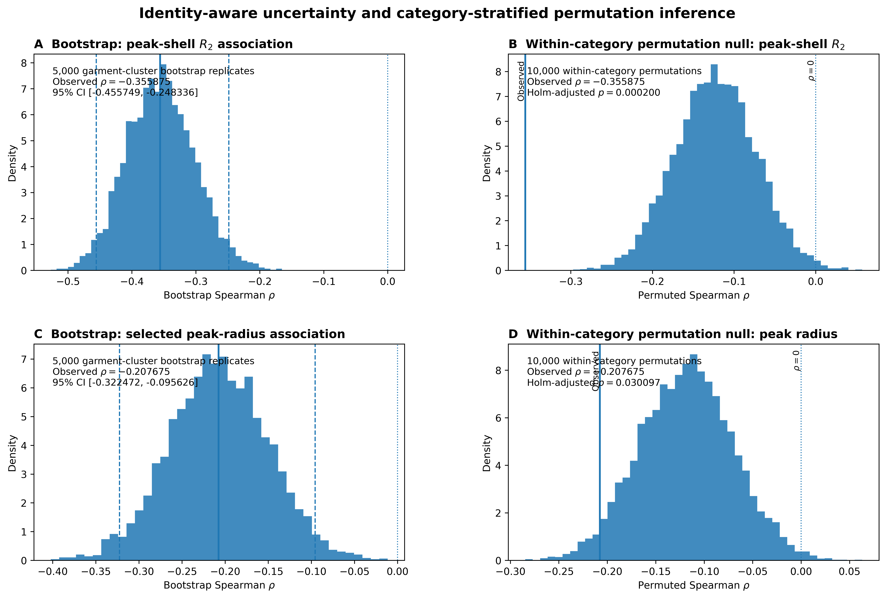

# CLO-SKET — IVC Submission Manuscript

> **Submission front matter to complete before journal upload**
>
> - Final manuscript title: [TO BE CONFIRMED]
> - Author names: [TO BE CONFIRMED]
> - Affiliations: [TO BE CONFIRMED]
> - Corresponding author and email: [TO BE CONFIRMED]
>
> The scientific body below is assembled from the frozen repository source files. Do not edit scientific claims in this master independently; edit the canonical source section and rebuild instead.

---

# Abstract

Garment sketches encode design structure through multiple geometric organizations that need not be captured by a single representation. We investigate whether explicit radial–axial geometry provides reproducible information beyond conventional morphology in repeated garment sketches, while separating predictive utility from garment-specific correspondence. Using all 2,300 sketches in CLO-SKET, comprising 23 garment categories and 230 recovered garment identities, we construct a compact 14-dimensional representation from centroid-relative shell-conditioned second-harmonic geometry.

For foreground angular distribution \(p(\theta\mid r)\) at radial shell \(r\), the second harmonic is

\[
F_2(r)=\sum_k p(\theta_k\mid r)e^{-2\mathrm{i}\theta_k}
      =C_2(r)-\mathrm{i}S_2(r),
\]

from which radial organization and axial orientation are obtained as

\[
R_2(r)=|F_2(r)|,
\qquad
\alpha_2(r)=\frac{1}{2}\operatorname{atan2}\!\left(S_2(r),C_2(r)\right)
\pmod{\pi}.
\]

Eight radial descriptors summarize the distribution of \(R_2(r)\), while six axial descriptors encode orientation using doubled-angle coordinates, yielding an explicit 14-dimensional axial–radial representation. The second harmonic is used because \(m=2\) is the lowest non-zero Fourier order compatible with undirected axial orientation, \(\theta\equiv\theta+\pi\).

The central experiment tests whether this compact representation adds category-discriminative information beyond a frozen 135-dimensional morphology representation under category-balanced, garment-identity-disjoint validation. Morphology alone achieved a pooled out-of-fold macro-F1 of \(0.2978\); augmenting it with the 14-dimensional axial–radial representation increased macro-F1 to \(0.3358\), giving

\[
\Delta F_{1,\mathrm{macro}}=+0.0380.
\]

A category-stratified garment-identity bootstrap gave a 95% confidence interval of \([+0.0202,+0.0559]\), and the increment remained positive across all 10 repeated grouped partitions (mean \(+0.0323\), range \(+0.0206\) to \(+0.0433\)). Mechanistic ablation localized most of the direct increment to the radial component: adding the eight radial descriptors to morphology increased macro-F1 by \(+0.0268\), whereas the six axial descriptors alone contributed \(+0.0023\).

Critically, predictive improvement did not imply garment-specific complementary information. In a 2,000-replicate control that permuted complete axial–radial identity blocks within garment category while preserving category composition and block size, the correctly aligned increment did not exceed the misalignment null (null mean \(+0.0429\); empirical \(p=0.763\)). Thus, the observed gain cannot be attributed to exact morphology–axial–radial correspondence at the individual-garment level and is more consistent with category-level geometric organization.

Independent representation diagnostics establish the mathematical and numerical behavior underlying this result. Rigid-image rotation controls support the expected invariance of radial magnitude and doubled-angle equivariance of axial orientation; coordinate-frame randomization demonstrates that phase reconstruction depends substantially on canonical orientation; and sensitivity analyses distinguish stable global radial summaries from domain-sensitive localized descriptors.

These results establish a bounded but consequential finding: **explicit radial organization captures reproducible garment-category structure beyond a substantially larger morphology representation, but this additional utility is primarily distributional at the category level rather than evidence of garment-specific geometric complementarity.** The resulting framework provides both an interpretable representation of garment-sketch geometry and an identity-aware experimental procedure for determining where its predictive information resides.

**Keywords:** garment sketches; radial–axial geometry; second harmonic; Fourier descriptors; morphology; incremental representation value; grouped cross-validation; identity-aware validation

---

# 1. Introduction

Garment sketches occupy an unusual position in computational fashion. They are visually sparse, yet they encode substantial design structure: silhouette, proportion, symmetry, directional organization, and the placement of form relative to the garment centre. Contemporary systems have demonstrated that such sketches can support garment retrieval, image synthesis, editing, three-dimensional reconstruction, and sewing-pattern generation. In most of these settings, however, the sketch is treated primarily as an input signal whose usefulness is judged by downstream performance. Much less attention is given to a different question: **what geometric information is actually present in the sketch, and whether distinct geometric representations capture the same or different aspects of that information.**

This distinction matters because garment shape is not a single geometric property. A conventional morphology representation can describe properties of foreground form such as extent, occupancy, contour organization, and related shape statistics. The same sketch can also be viewed relative to its centre: structural evidence may occur preferentially at particular radial distances, and that evidence may exhibit characteristic orientation about the centre. These views are related because they arise from the same drawing, but they are not mathematically identical. Consequently, the presence of a second representation does not by itself establish that it contains useful information beyond morphology. That question requires an explicit incremental test.

We study this problem using CLO-SKET, containing 2,300 sketches from 23 garment categories. The repeated-sketch structure of the dataset is particularly important. The sketches correspond to 230 recovered source-garment identities, with approximately ten drawings per garment. Different sketches of the same source garment are therefore dependent observations. A random image-level train/test split can place renderings of the same garment on both sides of the validation boundary and thereby confound generalization to unseen files with generalization to unseen garment identities. Throughout this study, complete garment identities are consequently treated as the fundamental validation and resampling units.

## 1.1 Explicit radial–axial geometry

To characterize geometric organization beyond conventional morphology, we represent each sketch relative to its intensity-weighted centroid and examine the distribution of foreground evidence jointly over radius and angle. Within radial shell \(r\), foreground mass defines a conditional angular distribution \(p(\theta\mid r)\). Its second circular harmonic,

\[
F_2(r)=\sum_k p(\theta_k\mid r)\exp(-2\mathrm{i}\theta_k),
\]

provides two conceptually distinct quantities:

\[
R_2(r)=|F_2(r)|,
\qquad
\alpha_2(r)=\frac{1}{2}\arg F_2(r)\pmod{\pi}.
\]

Here, \(R_2(r)\) measures the strength of second-harmonic angular organization at radius \(r\), whereas \(\alpha_2(r)\) describes its undirected axial orientation. The use of the second harmonic follows from the axial equivalence \(\theta\equiv\theta+\pi\): \(m=2\) is the lowest non-zero Fourier order compatible with an orientation for which directions separated by \(180^\circ\) represent the same axis.

Rather than retaining the complete shell field as a high-dimensional representation, we summarize it with a compact 14-dimensional vector. Eight radial coordinates describe the distribution of second-harmonic magnitude across radius, including integrated magnitude, radial centroid, spread, concentration, support and peak quantities. Six axial coordinates describe peak and magnitude-weighted orientations through doubled-angle Cartesian encoding, together with axial coherence and orientation drift. Algebraically redundant quantities are excluded.

This construction provides an interpretable representation, but interpretability alone is not sufficient evidence of usefulness. Nor does mathematical difference from morphology imply empirically distinct information. The central question is therefore whether the compact axial–radial representation improves discrimination of previously unseen garment identities **after a substantially larger morphology representation is already available**.

## 1.2 From representation description to incremental information

Let

\[
\mathbf z_M\in\mathbb R^{135}
\]

denote the frozen morphology representation and let

\[
\mathbf z_R\in\mathbb R^{8},\qquad
\mathbf z_A\in\mathbb R^{6},\qquad
\mathbf z_{RA}=\mathbf z_R\oplus\mathbf z_A\in\mathbb R^{14}
\]

denote the radial, axial, and complete axial–radial representations, respectively.

The primary experiment compares a classifier receiving morphology alone with the same classifier receiving morphology augmented by the complete axial–radial vector. For a fixed evaluation score \(\mathcal S\), the primary effect is

\[
\boxed{
\Delta_{RA}
=
\mathcal S(\mathbf z_M\oplus\mathbf z_{RA})
-
\mathcal S(\mathbf z_M)
}
\tag{1}
\]

under identical garment-identity-disjoint folds, preprocessing, and classifier specification.

Equation (1) deliberately defines **incremental predictive utility**, not statistical independence. A positive \(\Delta_{RA}\) demonstrates that the augmented representation improves the specified prediction task under the locked protocol. It does not establish that axial–radial geometry is information-theoretically independent of morphology, nor does it identify the level at which the useful structure resides.

That distinction leads to a second question. Suppose correctly aligned axial–radial descriptors improve prediction beyond morphology. The improvement could depend on the particular radial–axial geometry of each garment, or it could arise from broader category-conditioned distributions. We distinguish these possibilities using a category-preserving alignment control. Complete axial–radial identity blocks are reassigned among garments within the same category while morphology, category composition, block-size structure, validation folds, and classifier specification remain fixed. This destroys exact garment-level morphology–axial–radial correspondence while preserving category-level axial–radial structure.

The comparison therefore separates two propositions that are easily conflated:

\[
\text{axial–radial descriptors add predictive utility}
\]

from

\[
\text{their utility requires correct garment-level correspondence}.
\]

The former is tested by the incremental contrast in Eq. (1); the latter requires the observed aligned increment to exceed the category-preserving misalignment distribution.

## 1.3 Why the distinction is scientifically important

Feature concatenation can produce an apparent performance gain for several reasons. A new feature block may encode genuinely useful instance-specific structure; it may provide a more convenient coordinate system for structure already associated with class; or its apparent benefit may be unstable across particular train/test partitions. Simply reporting that a concatenated model performs better cannot distinguish among these explanations.

We therefore treat incremental value as a sequence of increasingly restrictive tests. First, radial and axial components are evaluated separately to determine which mathematical component carries the observed utility. Second, complete garment identities rather than sketches are resampled to quantify uncertainty without treating repeated drawings as independent observations. Third, the complete experiment is repeated across multiple category-balanced identity partitions to assess split stability. Finally, category-preserving identity-block permutation tests whether correct garment-level alignment itself contributes beyond the category-level distribution of the added representation.

The radial–axial representation is also subjected to independent mathematical and numerical validation. Reconstruction experiments examine what information remains recoverable after explicit harmonic phase is omitted. Rigid-image rotations test the expected invariant behavior of radial magnitude and doubled-angle equivariance of axial orientation. Analytic coordinate-frame controls determine whether phase reconstruction reflects intrinsic magnitude information or shared orientation in the canonical image frame. Parameter-sensitivity analyses distinguish broad radial summaries from localized descriptors that depend more strongly on discretization and radial boundaries. Phase-conditioning analysis further establishes when axial orientation becomes numerically unstable as harmonic magnitude decreases.

These analyses have a different role from the incremental prediction experiment. They establish **what the representation measures, how it transforms, and where it becomes unreliable**. The incremental experiment establishes **whether the resulting measurements contribute predictive structure beyond morphology and at what level that contribution resides**.

## 1.4 Research questions and contributions

The study is organized around three primary research questions:

**RQ1 — Geometric representation.** Can garment sketches be represented by a compact and mathematically explicit radial–axial description whose radial and orientation components have defined transformation properties and measurable numerical limitations?

**RQ2 — Incremental representation value.** Does the 14-dimensional radial–axial representation add reproducible garment-category information beyond a frozen 135-dimensional morphology representation when validation withholds complete garment identities?

**RQ3 — Localization of incremental utility.** Which component of the representation carries the incremental utility, and does that utility require exact garment-level correspondence between morphology and radial–axial geometry, or can it be explained by category-level geometric structure?

The contributions are consequently not a new Fourier transform or a claim that handcrafted descriptors outperform learned fashion representations. Instead, the study contributes an explicit second-harmonic radial–axial measurement of garment sketches; a compact 14-dimensional representation with algebraic redundancy removed and axial quantities encoded according to their circular geometry; an identity-disjoint experimental framework for testing its incremental value beyond morphology; mechanistic radial/axial ablations; cluster-aware uncertainty and repeated-partition stability analysis; and a category-preserving identity-alignment control that distinguishes predictive improvement from garment-specific correspondence.

This distinction defines the intended scope of inference. Evidence that

\[
\mathcal S(\mathbf z_M\oplus\mathbf z_{RA})>\mathcal S(\mathbf z_M)
\]

supports incremental predictive utility under the tested task. Evidence that the aligned increment exceeds an appropriate misalignment null would additionally support a role for exact garment-level correspondence. Failure of the latter test would not invalidate the former; instead, it would localize the useful information at a different structural level.

The resulting framework therefore asks not merely whether an additional geometric representation *works*, but **what it contributes, whether that contribution reproduces under identity-aware validation, and where in the hierarchy from garment instance to garment category the useful geometric structure resides.**
---

# 2. Related Work

## 2.1 Garment sketches as computational inputs

Garment sketches have been used as computational inputs for reconstruction, editing, synthesis, retrieval, and pattern generation. Earlier geometry-oriented systems established that sparse drawings can carry information sufficient for downstream garment construction. Yasseen et al. (2013) converted mannequin-guided sketches into quadrilateral garment meshes. Wang et al. (2018) learned a shared latent space linking sketched fold patterns, sewing-pattern parameters, body shape, and simulated garments. Fondevilla et al. (2021) transferred style from annotated fashion sketches to three-dimensional characters. More recently, SketchTailor maps a single garment sketch to three-dimensional sewing patterns using a Vision Mamba encoder and deformable Transformer decoder (Huang et al., 2025).

A parallel line of work treats the sketch principally as a conditioning signal for image synthesis or editing. Multimodal Garment Designer conditions latent-diffusion fashion editing on sketches together with text and human pose (Baldrati et al., 2023). TexControl uses a two-stage diffusion pipeline in which a sketch constrains garment outline before a second stage refines texture (Zhang et al., 2024). FashionSD-X similarly incorporates sketch and text information into a latent-diffusion garment-synthesis framework (Singh and Patras, 2024). Cao et al. (2023) condition compatible clothing generation jointly on user sketches and reference garments.

The scale and scope of sketch-based fashion benchmarks are also increasing. GarmentSketch contains 26,249 sketches spanning 21 garment categories, paired with detailed textual descriptions and evaluated for sketch-guided fashion image generation (Bui et al., 2026). VietFashion instead studies sketch-text composed retrieval for culturally specific garments, beginning from 650 sketches and expanding the associated image collection to more than 21,000 generated examples (Cao et al., 2026).

These developments establish that garment sketches are computationally informative, but their dominant objective is task performance: generating an image, reconstructing a garment or sewing pattern, transferring style, or retrieving a compatible target. CLO-SKET addresses a different question. The sketch is treated as an observational geometric object, and the objective is to construct an explicit low-dimensional measurement whose algebraic dependencies, coordinate assumptions, repeated-measure structure, and sensitivity to analysis choices can be examined directly.

## 2.2 Explicit garment-shape and frequency-domain representations

Explicit numerical representations of garment form predate current generative systems. An and Li (2014) combined wavelet Fourier descriptors with supervised dimensionality reduction for fashion-flat classification. Tsuru et al. (2021) represented garment silhouettes using standardized measurements and analysed designer collections using multidimensional scaling and clustering. Such work demonstrates that garment outlines can be transformed into interpretable numerical summaries rather than represented only by learned latent embeddings.

More generally, Fourier descriptors provide a classical representation of periodic outline structure (Zahn and Roskies, 1972), while geometric morphometrics provides alternative methods for analysing curves and shapes, including forms without conventional anatomical landmarks (Bookstein, 1997; McCane, 2013). These approaches motivate explicit representations in which geometric assumptions remain inspectable.

Frequency-domain methods have also appeared in modern garment synthesis. Liang et al. (2023), for example, incorporated Fast Fourier Transform features into a controllable garment-image generator to model periodic texture structure. Their objective and signal differ fundamentally from the present work: the frequency-domain representation is used to improve texture expansion and regularity during synthesis, whereas CLO-SKET applies angular harmonics to the spatial distribution of sketch foreground geometry itself.

CLO-SKET therefore does not claim novelty for Fourier analysis, polar coordinates, outline measurement, or statistical shape analysis individually. Its methodological contribution lies in combining centroid-referenced polar occupancy, shell-conditional angular distributions, axial harmonic statistics, repeated-sketch validation, and explicit sensitivity controls in a single auditable measurement framework.

## 2.3 Radial–angular geometry

Let a retained sketch foreground location be represented relative to the foreground centroid \((c_x,c_y)\) by

\[
r=\sqrt{(x-c_x)^2+(y-c_y)^2},
\qquad
\theta=\operatorname{atan2}(y-c_y,x-c_x).
\]

The radial coordinate records distance from the centroid, while the angular coordinate records occupancy around it. Polar parameterizations also occur in garment-pattern analysis, although for different representations and objectives (Oh and Kim, 2026).

For radial shell \(r_k\), CLO-SKET constructs the observed conditional angular distribution

\[
p(\theta_j\mid r_k)
=
\frac{H(r_k,\theta_j)}
{\sum_{j'}H(r_k,\theta_{j'})},
\]

where \(H(r_k,\theta_j)\) denotes foreground mass in radial bin \(k\) and angular bin \(j\). The shell therefore defines a circular probability distribution from which harmonic structure can be measured directly.

For harmonic order \(m\),

\[
F_m(r_k)
=
\sum_j
p(\theta_j\mid r_k)e^{-\mathrm{i}m\theta_j}.
\]

The primary analysis uses \(m=2\). This choice follows from axial rather than directional geometry. If orientations separated by \(\pi\) denote the same undirected axis,

\[
\theta\equiv\theta+\pi,
\]

then

\[
F_m(\theta+\pi)
=
(-1)^m F_m(\theta).
\]

Odd harmonics change sign under a \(180^\circ\) reversal, whereas even harmonics are invariant. Consequently, \(m=2\) is the lowest non-zero harmonic compatible with axial symmetry. Higher even harmonics such as \(m=4\) are also axially invariant but describe finer angular organization rather than the lowest-order axial structure. This symmetry argument, rather than retrospective predictive performance, determines the primary harmonic order.

A prespecified low-order control over \(m=1,2,3,4\) was subsequently used to assess whether the observed spectrum is consistent with that choice and whether \(m=2\) is redundant with neighbouring harmonics. The control does not treat harmonic order as a post-hoc model-selection parameter.

## 2.4 Axial statistics and second-harmonic representation

For the primary harmonic,

\[
F_2(r_k)
=
C_2(r_k)-\mathrm{i}S_2(r_k).
\]

Axial data require doubled-angle treatment because orientations separated by \(180^\circ\) represent the same undirected axis (Jammalamadaka and SenGupta, 2001). The second-harmonic magnitude and axial orientation are therefore

\[
R_2(r_k)
=
|F_2(r_k)|
=
\sqrt{C_2(r_k)^2+S_2(r_k)^2},
\]

and

\[
\alpha_2(r_k)
=
\frac12
\operatorname{atan2}
\left(
S_2(r_k),
C_2(r_k)
\right)
\pmod{\pi}.
\]

Thus \(R_2\in[0,1]\) measures the strength of shell-level second-harmonic axial organization, while \(\alpha_2\) gives the corresponding undirected orientation.

These quantities are deterministic summaries of the observed conditional angular histogram. In particular,

\[
R_2^2=C_2^2+S_2^2
\]

is an algebraic identity, not independent evidence. CLO-SKET does not fit a von Mises distribution, estimate a likelihood-based concentration parameter, or reconstruct the complete angular density from \(F_2\).

The final representation aggregates this field into eight radial-magnitude descriptors and six axial-orientation descriptors,

\[
\mathbf{x}
=
\left[
\mathbf{x}_{F_2}^{(8)},
\mathbf{x}_{\alpha_2}^{(6)}
\right]
\in\mathbb{R}^{14}.
\]

The representation is explicit: each coordinate has a defined geometric construction and no PCA or learned embedding is used to create the 14-dimensional vector.

## 2.5 Coordinate dependence, discretization, and measurement sensitivity

Explicit geometric descriptors remain interpretable only if their dependence on coordinate conventions and numerical design choices is also examined. This issue is especially important for angular statistics because Cartesian harmonic components depend on the image coordinate frame even when the underlying axial structure is unchanged.

For a physical image rotation by \(\phi\),

\[
F_2'(r)
=e^{-\,\mathrm{i}2\phi}F_2(r),
\]

so

\[
R_2'(r)=R_2(r),
\]

while \((C_2,S_2)\) rotate in doubled-angle Cartesian space. A global-rotation control therefore distinguishes coordinate-dependent component behaviour from coordinate-free vector and magnitude behaviour. A separate garment-identity-randomized rotation control removes population-wide alignment while preserving repeated-sketch identity structure, providing a direct diagnostic of how much reconstruction depends on a shared canonical image frame.

Numerical discretization presents a related issue. The radial and angular histograms require finite binning, while several radial descriptors depend on support thresholds, local windows, and a finite analysis domain. CLO-SKET therefore treats these settings as measurement specifications rather than empirically optimal constants. Sensitivity analyses vary angular resolution, radial resolution, radial domain, support threshold, and concentration-window width while leaving the frozen primary representation unchanged.

This distinction is particularly important for localized radial descriptors. Integrated magnitude, radial centroid, and radial spread summarize broad radial structure. In contrast, onset, termination, concentration, and discrete peak location depend more directly on domain boundaries and resolution. Peak radius is therefore interpreted as a window-dependent localization statistic rather than a universal intrinsic radial scale.

## 2.6 Reconstruction as a shared-source consistency diagnostic

The reconstruction experiment uses the observed shell coordinate and second-harmonic magnitude as predictors,

\[
(r,R_2(r)),
\]

and estimates the Cartesian components

\[
\widehat C_2(r)
=
f_C(r,R_2(r)),
\qquad
\widehat S_2(r)
=
f_S(r,R_2(r)).
\]

The predicted vector then implies

\[
\widehat R_2(r)
=
\sqrt{
\widehat C_2(r)^2+
\widehat S_2(r)^2
},
\]

and

\[
\widehat\alpha_2(r)
=
\frac12
\operatorname{atan2}
\left(
\widehat S_2(r),
\widehat C_2(r)
\right)
\pmod{\pi}.
\]

Because predictors and targets arise from the same observed angular field, reconstruction is explicitly treated as a shared-source consistency diagnostic. It does not demonstrate semantic recognition, recovery of garment parts, reconstruction of the full angular distribution, or a physical radial law.

The rotation controls further constrain its interpretation. A common global rotation preserves the substantive coordinate-free reconstruction behaviour, whereas independent garment-identity rotations remove the shared absolute orientation frame. The purpose of these controls is not to improve reconstruction performance but to identify which aspects of recoverability arise from intrinsic harmonic magnitude and which depend on population-level coordinate alignment.

## 2.7 Phase conditioning and interpretation of angular error

The magnitude of a harmonic vector also determines the numerical conditioning of its orientation. For

\[
\alpha_2
=
\frac12
\operatorname{atan2}(S_2,C_2),
\]

a first-order perturbation gives

\[
d\alpha_2
=
\frac{
C_2\,dS_2-S_2\,dC_2
}{
2(C_2^2+S_2^2)
}
=
\frac{
C_2\,dS_2-S_2\,dC_2
}{
2R_2^2
}.
\]

By the Cauchy--Schwarz inequality,

\[
|d\alpha_2|
\le
\frac{
\sqrt{dC_2^2+dS_2^2}
}{
2R_2
}.
\]

Thus phase becomes intrinsically less well-conditioned as \(R_2\rightarrow0\), even for comparable Cartesian perturbations. This geometric fact is important when interpreting associations between harmonic magnitude and reconstruction error. A negative association between \(R_2\) and angular error should not automatically be treated as an independent empirical law: part of the relationship is expected from the geometry of phase estimation itself.

CLO-SKET therefore supplements the magnitude-error association with the Cartesian perturbation norm and the corresponding conditioning quantity

\[
\frac{
\|\Delta(C_2,S_2)\|
}{
2R_2
}.
\]

The role of this analysis is explanatory rather than causal. It tests whether observed out-of-fold angular errors are consistent with the expected conditioning geometry and explicitly avoids treating \(R_2\) alone as a deterministic cause of error.

## 2.8 Repeated sketches and identity-aware validation

Repeated observations create another form of dependency that is distinct from algebraic dependence. CLO-SKET contains multiple sketches associated with recovered source-garment identities. An image-level split can therefore place drawings of the same garment in both training and test sets, creating an evaluation that measures unseen image files rather than transfer to unseen garments.

The final validation design assigns complete garment identities to folds. Five category-balanced folds each hold out two identities per category, and train/test garment-identity overlap is zero. Reconstruction is consequently evaluated out of fold on unseen recovered garment identities.

The same principle governs uncertainty and confirmatory inference. Complete garment identities, not individual sketches, form the bootstrap resampling unit. Association analyses first reduce repeated sketches to garment-identity summaries and then perform permutation within category strata. These choices address the measured dependence created by repeated sketches, while inference remains conditional on the recovered garment identities being appropriate independent sampling units.

The distinction matters because increasingly large fashion datasets do not by themselves guarantee an appropriate statistical evaluation unit. GarmentSketch, VietFashion, and recent multimodal fashion datasets expand the scale and diversity of sketch-conditioned tasks (Baldrati et al., 2023; Bui et al., 2026; Cao et al., 2026), whereas the present study emphasizes dependency-aware evaluation within a smaller repeated-sketch dataset.

## 2.9 Research gap and study position

Recent work demonstrates rapid progress in sketch-conditioned fashion generation, editing, retrieval, and sewing-pattern reconstruction. Large generative and multimodal systems increasingly learn how sketches correspond to rendered garments, text, people, or production patterns. Explicit shape-analysis research, in parallel, establishes that garment outlines and periodic geometric signals can be represented numerically.

A narrower gap remains between these two traditions. Comparatively little work treats repeated garment sketches as a statistical measurement population and simultaneously keeps visible

\[
\text{representation}
\rightarrow
\text{algebraic dependency}
\rightarrow
\text{coordinate dependence}
\rightarrow
\text{parameter sensitivity}
\rightarrow
\text{validation unit}
\rightarrow
\text{uncertainty}
\rightarrow
\text{claim boundary}.
\]

CLO-SKET addresses this measurement problem rather than competing directly with generative fashion systems.

The study asks whether foreground geometry can be encoded as an explicit 14-dimensional radial--angular representation; whether its second-harmonic field exhibits reproducible structure for unseen garment identities; how reconstruction depends on the canonical coordinate frame; whether the representation is stable to reasonable discretization and parameter perturbations; why the second harmonic is the appropriate lowest-order axial statistic; and how observed harmonic magnitude and Cartesian reconstruction perturbation jointly condition axial error.

The intended contribution is therefore an auditable geometric measurement and validation framework for repeated garment sketches. It does not establish semantic garment understanding, causal geometric laws, a universally optimal radial window or harmonic order, prospective reliability classification, complete angular-density reconstruction, or human-like interpretation.

---

# 3. Methods

## 3.1 Study design and scope

This study evaluates an explicit axial–radial representation of garment-sketch geometry and, as its central confirmatory question, tests whether that representation contributes reproducible garment-category information beyond a frozen morphology representation when complete source-garment identities are withheld from validation.

The study contains two linked but inferentially distinct components. First, a **representation-validation component** establishes the mathematical construction and numerical behavior of the axial–radial measurement: centroid-relative polar transformation, shell-conditioned angular distributions, second-harmonic magnitude and axial orientation, compact descriptor construction, reconstruction diagnostics, rotation controls, discretization and parameter sensitivity, phase conditioning, and garment-level association analysis. These analyses determine what the representation measures, how it transforms, and where its numerical limitations arise.

Second, a **locked incremental-value experiment** compares the frozen 135-dimensional morphology representation with the same representation augmented by the compact 14-dimensional axial–radial vector. This experiment uses identical category-balanced, garment-identity-disjoint folds, identical preprocessing, and one fixed classifier across all feature sets. Its primary estimand is the change in macro-F1 produced by adding the complete axial–radial representation to morphology. Radial-only and axial-only additions are mechanistic ablations and cannot replace the primary contrast.

The compact representation contains eight radial descriptors derived from second-harmonic magnitude and six axial descriptors represented with doubled-angle coordinates. No principal-component analysis, learned embedding, semantic segmentation, von Mises fitting, or reconstruction of the complete angular density is used to construct it.

A further category-preserving identity-block permutation distinguishes **incremental predictive utility** from **garment-specific correspondence**. A positive augmented-minus-morphology effect establishes utility for the tested category-discrimination task; only an observed effect exceeding the category-preserving misalignment null would support the stronger proposition that the utility depends on exact garment-level morphology–axial–radial correspondence. Statistical independence, information-theoretic uniqueness, semantic meaning, and causality are outside the claim boundary.

---

## 3.2 Dataset and garment-identity reconstruction

The analysis used all 2,300 images in the CLO-SKET dataset, organized into 23 garment categories. Garment identity was reconstructed from the category-qualified source identifier encoded in each filename. The accompanying replicate identifier denoted the repeated sketch associated with that source garment.

This procedure recovered

\[
N_{\mathrm{id}}=230
\]

garment identities, exactly 10 within each category. Individual identities contained 9–11 sketches because of irregular filename records.

All 2,300 file paths were unique. SHA-256 hashing detected no repeated raw files, and hashing of decoded pixel arrays detected no repeated decoded images. Perceptual hashing was used only to identify visually similar candidate pairs and was not interpreted as evidence of file duplication or shared lineage.

Recovered garment identity was treated as the indivisible clustering unit for cross-validation, bootstrap resampling, and confirmatory association analysis. The available metadata do not establish that the 230 recovered garment identities constitute mutually independent population sampling units; population-level inference is therefore conditional on that assumption.

---

## 3.3 Raw-image radial–angular construction

The radial–angular representation was constructed directly from the original grayscale TIFF images at their native spatial resolution. No foreground thresholding, binarization, resizing, rotation, straightening, or principal-axis alignment was applied in this branch.

For sketch \(i\), let \(I_{ip}\in[0,255]\) denote the grayscale intensity of pixel \(p\). Continuous foreground darkness was defined as

\[
w_{ip}
=
\max\left(255-I_{ip},\,0\right).
\]

Thus darker sketch pixels contribute more mass, while white background pixels contribute zero mass.

For an image of width \(W_i\) and height \(H_i\), a common isotropic scale was defined as

\[
S_i
=
\max(W_i,H_i).
\]

Pixel coordinates \((u_{ip},v_{ip})\) were mapped to an aspect-ratio-preserving isotropic coordinate system,

\[
x_{ip}
=
\frac{u_{ip}-(W_i-1)/2
}{
S_i
},
\qquad
y_{ip}
=
\frac{
v_{ip}-(H_i-1)/2
}{
S_i
}.
\]

The same scale factor was used for both axes, so portrait sketches were not independently stretched along \(x\) and \(y\).

The darkness-weighted centroid was

\[
c_{x,i}
=
\frac{
\sum_p w_{ip}x_{ip}
}{
\sum_p w_{ip}
},
\qquad
c_{y,i}
=
\frac{
\sum_p w_{ip}y_{ip}
}{
\sum_p w_{ip}
}.
\]

Centroid-relative coordinates were then

\[
\widetilde x_{ip}
=
x_{ip}-c_{x,i},
\qquad
\widetilde y_{ip}
=
y_{ip}-c_{y,i},
\]

with Euclidean radius

\[
R_{ip}
=
\sqrt{
\widetilde x_{ip}^{\,2}
+
\widetilde y_{ip}^{\,2}
},
\]

and polar angle

\[
\theta_{ip}
=
\operatorname{atan2}
\left(
\widetilde y_{ip},
\widetilde x_{ip}
\right).
\]

To remove sketch-specific overall scale while preserving internal radial proportions, radius was normalized separately within each sketch:

\[
R_{i,\max}
=
\max_p R_{ip},
\]

\[
\rho_{ip}
=
\frac{
R_{ip}
}{
R_{i,\max}
},
\qquad
0\leq\rho_{ip}\leq1.
\]

The normalized radial coordinate was divided into 72 equal-width bins with edges

\[
e_j^{(r)}
=
\frac{j}{72},
\qquad
j=0,\ldots,72.
\]

The corresponding normalized radial-bin centres were

\[
\rho_j
=
\frac{
j+\tfrac12
}{
72
},
\qquad
j=0,\ldots,71.
\]

For reporting and descriptor construction, these centres were expressed in shell-coordinate units,

\[
r_j
=
72\rho_j
=
j+\frac12,
\]

so that the full radial grid is

\[
r_j
=
0.5,1.5,\ldots,71.5.
\]

Angular position was divided into 72 equal-width bins over

\[
[-\pi,\pi],
\]

with edges

\[
e_k^{(\theta)}
=
-\pi
+
k\frac{2\pi}{72},
\qquad
k=0,\ldots,72.
\]

Each angular bin therefore spans

\[
5^\circ.
\]

Let

\[
H_i(r_j,\theta_k)
\]

denote the accumulated darkness mass of pixels assigned jointly to radial bin \(j\) and angular bin \(k\):

\[
H_i(r_j,\theta_k)
=
\sum_p
w_{ip}
\,
\mathbf 1
\left[
\rho_{ip}\in B_j^{(r)}
\right]
\mathbf 1
\left[
\theta_{ip}\in B_k^{(\theta)}
\right].
\]

Pixels with \(\rho_{ip}=1\) were retained in the final radial bin.

For radial shell \(r_j\), define its accumulated darkness mass as

\[
M_i(r_j)
=
\sum_{k=1}^{72}
H_i(r_j,\theta_k).
\]

For nonempty shells,

\[
M_i(r_j)>10^{-14},
\]

the conditional angular distribution was

\[
p_i(\theta_k\mid r_j)
=
\frac{
H_i(r_j,\theta_k)
}{
M_i(r_j)
},
\]

so that

\[
\sum_{k=1}^{72}
p_i(\theta_k\mid r_j)
=
1.
\]

Empty radial shells were represented by zeros.

This shell conditioning separates angular organization from the amount of foreground mass present at a given radius. Consequently, radial shells containing more total ink do not dominate the angular statistic solely because they contain more foreground intensity.

---

## 3.4 Rigid-image rotation control of the 14-dimensional representation

The analytic rotation controls described later test coordinate-frame dependence directly in second-harmonic space. A separate image-domain perturbation control was performed to verify that the final 14-dimensional representation exhibits the intended invariant and equivariant behavior when the input sketch itself is rigidly rotated and the complete radial-angular measurement is recomputed.

All 2,300 sketches were evaluated at the physical rotation angles

\[
\phi
\in
\{-20^\circ,-10^\circ,-5^\circ,0^\circ,5^\circ,10^\circ,20^\circ\}.
\]

This control was label-free and did not fit or refit any predictive model.

To prevent clipping of the original rectangular sketch under rotation, each grayscale image was first embedded in a square white canvas whose side length was at least the diagonal of the original image,

\[
L_i
=
\left\lceil
\sqrt{H_i^2+W_i^2}
\right\rceil,
\]

with a one-pixel parity adjustment where required to maintain centered embedding. The same padded canvas was used for the reference condition and every rotated condition.

For non-zero \(\phi\), the padded grayscale image was rotated using bilinear interpolation with fixed canvas size,

\[
\texttt{expand=False},
\]

and white background fill,

\[
\texttt{fillcolor}=255.
\]

The \(0^\circ\) condition used the same padded canvas without interpolation.

After rotation, the complete radial-angular construction was rerun from the rotated grayscale image using the same frozen measurement procedure as for the primary representation. No descriptor definition, radial domain, angular discretization, or post-processing rule was changed for the rotation control.

For second-harmonic magnitude, a rigid physical rotation ideally satisfies

\[
F_2'(r)
=
e^{-i2\phi}F_2(r),
\]

so that

\[
R_2'(r)
=
R_2(r).
\]

Accordingly, radial and magnitude-derived quantities were evaluated as approximately rotation-invariant numerical descriptors.

For an axial orientation \(\alpha\),

\[
\alpha'
=
\alpha+\phi
\pmod{\pi}.
\]

Its doubled-angle Cartesian representation therefore transforms as

\[
\begin{bmatrix}
\cos 2\alpha'\\
\sin 2\alpha'
\end{bmatrix}
=
\begin{bmatrix}
\cos 2\phi & -\sin 2\phi\\
\sin 2\phi & \cos 2\phi
\end{bmatrix}
\begin{bmatrix}
\cos 2\alpha\\
\sin 2\alpha
\end{bmatrix}.
\]

Thus, the peak-orientation and magnitude-weighted mean-orientation coordinate pairs were evaluated as axial-equivariant quantities under the expected \(R(2\phi)\) action.

Axial coherence,

\[
\kappa_i,
\]

and orientation drift,

\[
\delta_i,
\]

were treated as rotation-invariant scalar descriptors because they depend on relative rather than absolute axial orientation.

Numerical stability of the radial-magnitude field was summarized by the normalized mean absolute error of the primary-domain \(R_2(r)\) profile relative to the \(0^\circ\) reference. Axial equivariance was evaluated by decoding the rotated doubled-angle orientation pairs and comparing the observed orientation shift with the imposed physical rotation. Coherence and orientation drift were evaluated by their absolute changes from the reference condition.

This perturbation control evaluates empirical numerical behavior under the tested rotations only. It does not imply exact invariance under arbitrary image transformations, nor robustness beyond the evaluated rotation range.

---

## 3.5 Angular harmonics and axial orientation

For harmonic order \(m\), the complex angular moment at radial shell \(r_j\) was

\[
F_{m,i}(r_j)
=
\sum_{k=1}^{72}
p_i(\theta_k\mid r_j)
e^{-\mathrm{i}m\theta_k}.
\]

The negative exponential follows the discrete Fourier-transform convention used in the implementation.

The primary analysis uses \(m=2\):

\[
F_{2,i}(r_j)
=
C_{2,i}(r_j)
-
\mathrm{i}S_{2,i}(r_j),
\]

where

\[
C_{2,i}(r_j)
=
\sum_k
p_i(\theta_k\mid r_j)
\cos(2\theta_k),
\]

and

\[
S_{2,i}(r_j)
=
\sum_k
p_i(\theta_k\mid r_j)
\sin(2\theta_k).
\]

The second-harmonic magnitude is

\[
R_{2,i}(r_j)
=
|F_{2,i}(r_j)|
=
\sqrt{
C_{2,i}(r_j)^2+
S_{2,i}(r_j)^2
}.
\]

For notational convenience,

\[
m_i(r_j)
\equiv
R_{2,i}(r_j).
\]

The associated axial orientation is

\[
\alpha_{2,i}(r_j)
=
\frac12
\operatorname{atan2}
\left(
S_{2,i}(r_j),
C_{2,i}(r_j)
\right)
\pmod{\pi}.
\]

Because orientation is axial rather than directional,

\[
\alpha
\equiv
\alpha+\pi.
\]

Axial angular distance was therefore defined as

\[
d_{\mathrm{ax}}(a,b)
=
\min
\left[
|a-b|\bmod\pi,\,
\pi-(|a-b|\bmod\pi)
\right],
\]

which lies on

\[
[0,\pi/2].
\]

Reported angular errors are expressed on the equivalent interval

\[
[0^\circ,90^\circ].
\]

---

## 3.6 Why the second harmonic is the primary angular statistic

The choice \(m=2\) follows from the symmetry of the orientation quantity being represented rather than from retrospective comparison of harmonic performance. The representation targets undirected axial organization, so an axis at angle \(\theta\) is equivalent to the same axis at \(\theta+\pi\).

Under a \(180^\circ\) reversal,

\[
\theta
\mapsto
\theta+\pi.
\]

For harmonic order \(m\),

\[
e^{-\mathrm{i}m(\theta+\pi)}
=
e^{-\mathrm{i}m\theta}
e^{-\mathrm{i}m\pi}
=
(-1)^m
e^{-\mathrm{i}m\theta}.
\]

Hence

\[
F_m(\theta+\pi)
=
(-1)^mF_m(\theta).
\]

Odd harmonics change sign under axial reversal, whereas even harmonics are invariant. Consequently,

\[
m=2
\]

is the lowest non-zero harmonic compatible with this axial equivalence.

The higher even harmonic \(m=4\) is also axially invariant but represents finer angular organization. Harmonics \(m=1\) and \(m=3\) were used as directional controls and \(m=4\) as a higher-order axial control; these comparisons were descriptive and did not redefine the primary \(m=2\) representation.

---

## 3.7 Primary radial domain and peak quantities

The reported shell coordinate \(r_j=j+\tfrac12\) is a dimensionless bin-coordinate representation of the sketch-normalized radius \(\rho_j=(j+\tfrac12)/72\); it is not a physical pixel distance.

The primary radial analysis was defined on 25 shell centers,

\[
\mathcal R
=
\{3.5,4.5,\ldots,27.5\}.
\]

For sketch \(i\), the observed peak shell was

\[
j_i^\star
=
\arg\max_{j:r_j\in\mathcal R}
m_i(r_j),
\]

with peak radius

\[
r_i^\star
=
r_{j_i^\star},
\]

and peak magnitude

\[
m_i^\star
=
m_i(r_i^\star).
\]

Because

\[
m_i(r)=R_{2,i}(r)=|F_{2,i}(r)|,
\]

the identities

\[
m_i^\star
=
R_{2,i}(r_i^\star)
=
|F_{2,i}(r_i^\star)|
\]

refer to the same measured quantity and are not treated as independent evidence.

Peak radius is the location of a discrete argmax on a finite domain. It was therefore treated as a localized, window-dependent statistic, and its boundary occupancy and radial-domain sensitivity were evaluated explicitly.

---

## 3.8 Eight radial-magnitude descriptors

Let

\[
m_i(r)=R_{2,i}(r)
\]

over the primary domain \(\mathcal R\). Integrals were evaluated using the trapezoidal rule at radial-shell centers. Their units are radial-bin-coordinate units rather than physical distance, and the integrated magnitude is not interpreted as Fourier energy.

### Integrated magnitude

\[
I_i
=
\int_{\mathcal R}
m_i(r)\,dr.
\]

### Magnitude-weighted radial centroid

\[
\bar r_i
=
\frac{
\int_{\mathcal R}
r\,m_i(r)\,dr
}{
I_i
}.
\]

### Magnitude-weighted radial spread

\[
s_{r,i}
=
\sqrt{
\frac{
\int_{\mathcal R}
(r-\bar r_i)^2m_i(r)\,dr
}{
I_i
}
}.
\]

### Peak concentration

With \(r_i^\star\) denoting the discrete peak location, radial concentration was defined as the fraction of integrated magnitude within four shell-coordinate units of the peak,

\[
q_i
=
\frac{
\int_{
\mathcal R\cap
[r_i^\star-4,r_i^\star+4]
}
m_i(r)\,dr
}{
I_i
}.
\]

### Support onset and termination

Let

\[
\tau_i
=
0.10\,m_i^\star.
\]

The support onset and termination radii were

\[
r_i^{\mathrm{on}}
=
\min
\{
r\in\mathcal R:
m_i(r)\geq\tau_i
\},
\]

and

\[
r_i^{\mathrm{off}}
=
\max
\{
r\in\mathcal R:
m_i(r)\geq\tau_i
\}.
\]

The eight radial features were therefore

\[
\mathbf x_i^{(F_2)}
=
[
I_i,\,
\bar r_i,\,
s_{r,i},\,
q_i,\,
r_i^{\mathrm{on}},\,
r_i^{\mathrm{off}},\,
r_i^\star,\,
m_i^\star
]
\in\mathbb R^8.
\]

Radial extent,

\[
r_i^{\mathrm{off}}
-
r_i^{\mathrm{on}},
\]

was excluded because it is exactly determined by two retained coordinates.

---

## 3.9 Six axial descriptors

The peak axial orientation was

\[
\alpha_i^\star
=
\alpha_{2,i}(r_i^\star).
\]

A magnitude-weighted axial mean was constructed through the doubled-angle resultant

\[
Z_i
=
\sum_{r_j\in\mathcal R}
m_i(r_j)
e^{\mathrm{i}2\alpha_{2,i}(r_j)},
\]

with

\[
\bar\alpha_i
=
\frac12
\arg(Z_i)
\pmod{\pi}.
\]

Axial coherence was

\[
\kappa_i
=
\frac{
|Z_i|
}{
\sum_{r_j\in\mathcal R}
m_i(r_j)
},
\qquad
0\leq\kappa_i\leq1.
\]

Orientation drift across the primary radial domain was

\[
\delta_i
=
d_{\mathrm{ax}}
\left[
\alpha_{2,i}(3.5),
\alpha_{2,i}(27.5)
\right].
\]

Raw axial angles were not entered directly into the primary Euclidean feature vector. Peak and mean directions were encoded in doubled-angle Cartesian form:

\[
\mathbf x_i^{(\alpha_2)}
=
[
\cos(2\alpha_i^\star),\,
\sin(2\alpha_i^\star),\,
\cos(2\bar\alpha_i),\,
\sin(2\bar\alpha_i),\,
\kappa_i,\,
\delta_i
]
\in\mathbb R^6.
\]

This encoding is invariant under

\[
\alpha
\mapsto
\alpha+\pi.
\]

Additional persistence and weighted-dispersion summaries were excluded because they were redundant with retained coordinates. Algebraically reconstructed quantities were used only for numerical consistency checks and were not added as independent features.

---

## 3.10 Primary 14-dimensional representation

The final sketch-level representation was

\[
\mathbf x_i
=
\left[
\mathbf x_i^{(F_2)}
\mid
\mathbf x_i^{(\alpha_2)}
\right]
\in
\mathbb R^{14}.
\]

The representation matrix therefore had dimensions

\[
2300\times14.
\]

The eight radial and six axial coordinates were concatenated in the order defined above. An independent reconstruction of the two feature blocks reproduced the stored representation exactly, with maximum absolute numerical difference zero, and all values were finite.

---

## 3.11 Confirmatory incremental representation-value experiment

The central downstream experiment asked whether the frozen compact axial–radial representation adds garment-category information beyond the frozen morphology representation under validation that withholds complete garment identities.

Let

\[
\mathbf z_{R,i}\in\mathbb R^8,
\qquad
\mathbf z_{A,i}\in\mathbb R^6,
\qquad
\mathbf z_{RA,i}=\mathbf z_{R,i}\oplus\mathbf z_{A,i}\in\mathbb R^{14},
\]

and let

\[
\mathbf z_{M,i}\in\mathbb R^{135}
\]

denote the independently frozen morphology vector. Seven feature sets were fixed before the compact-representation outcomes were inspected:

\[
R,\quad A,\quad R{+}A,\quad M,\quad M{+}R,\quad M{+}A,\quad M{+}R{+}A,
\]

with dimensions

\[
8,\ 6,\ 14,\ 135,\ 143,\ 141,\ 149,
\]

respectively.

The primary augmented representation was

\[
\mathbf z_{MRA,i}
=
\mathbf z_{M,i}\oplus\mathbf z_{RA,i}.
\]

For score function \(\mathcal S\), the confirmatory effect was

\[
\Delta_{RA}
=
\mathcal S(M{+}R{+}A)-\mathcal S(M).
\]

Macro-F1 was the primary metric and balanced accuracy the secondary metric. The radial and axial mechanistic increments were

\[
\Delta_R
=
\mathcal S(M{+}R)-\mathcal S(M),
\]

and

\[
\Delta_A
=
\mathcal S(M{+}A)-\mathcal S(M).
\]

These ablations were retained regardless of their observed performance and were not eligible to replace \(\Delta_{RA}\) as the primary comparison.

The experiment was locked against outcome-dependent feature selection, classifier switching, hyperparameter search, category or identity removal, image-level random cross-validation, selective reporting of folds or repeated partitions, and promotion of a more favorable ablation to the primary hypothesis. A historical result from a broader 28-dimensional radial–angular representation had been seen before this experiment; this exposure was explicitly recorded. The compact 14-dimensional representation, its radial/axial decomposition, and the present confirmatory contrast were frozen separately before their scores were computed.

---

## 3.12 Identity-aware validation and fixed estimator

The 230 recovered garment identities were the indivisible grouping units. Five deterministic category-balanced folds were constructed so that each test fold contained exactly two garment identities from each of the 23 categories:

\[
46\ \text{test identities/fold},
\qquad
184\ \text{training identities/fold}.
\]

All repeated sketches belonging to a garment identity remained on the same side of a fold boundary. Train/test identity overlap was zero, and every sketch appeared in exactly one test fold.

Every feature set used the same estimator pipeline. Features were standardized using \(\texttt{StandardScaler}\) fitted only on the training portion of each fold, followed by multinomial logistic regression with

\[
\texttt{penalty}=\mathrm{L2},
\qquad
C=1.0,
\qquad
\texttt{solver}=\texttt{lbfgs},
\]

\[
\texttt{max\_iter}=5000,
\qquad
\texttt{class\_weight}=\texttt{None},
\qquad
\texttt{random\_state}=20260820.
\]

No classifier or hyperparameter was tuned separately for any feature block. Predictions from the five held-out folds were pooled to obtain the primary out-of-fold macro-F1 and balanced accuracy.

---

## 3.13 Identity-cluster uncertainty and repeated-partition stability

Uncertainty in the primary incremental effect was quantified by paired resampling of complete garment identities. Because unrestricted identity bootstrap samples can occasionally omit a garment category, the manuscript-facing robustness interval used a category-stratified identity bootstrap. Within each of the 23 categories, 10 garment identities were sampled with replacement; when an identity was selected, all of its repeated sketches and paired predictions from both \(M\) and \(M{+}R{+}A\) were retained.

For bootstrap replicate \(b\),

\[
\Delta_{RA}^{(b)}
=
\mathcal S^{(b)}(M{+}R{+}A)
-
\mathcal S^{(b)}(M).
\]

A total of

\[
B=5000
\]

replicates were generated with random state 20260820. Percentile 95% confidence intervals were defined by the 2.5th and 97.5th percentiles of the bootstrap distribution. The fraction of positive bootstrap replicates was treated descriptively and was not reported as a permutation \(p\)-value.

Partition sensitivity was assessed independently using 10 category-balanced grouped five-fold partitions with seeds

\[
20260820,20260821,\ldots,20260829.
\]

Within every repeat, each category again contributed two complete identities to each test fold, and the same locked estimator was used. No repeat was discarded. The distribution of \(\Delta_{RA}\), together with the radial increment \(\Delta_R\), was used to assess whether the observed effect depended on a particular deterministic identity partition.

---

## 3.14 Category-preserving garment-identity alignment permutation

Incremental predictive utility does not by itself show that the added axial–radial vector must correspond to the same individual garment as the morphology vector. To test this stronger proposition, a category-preserving alignment-permutation control was performed.

The morphology matrix, category labels, validation folds, estimator, and observed outcome labels remained fixed. Complete 14-dimensional axial–radial blocks were reassigned among garment identities **within the same garment category**. Reassignment was additionally restricted to identities with the same number of repeated sketches, so the 9-, 10-, and 11-sketch block structure was preserved exactly. This maintained the marginal category-conditioned axial–radial distribution while breaking exact garment-level correspondence wherever an alternative equal-size identity block existed.

For permutation \(b\), the null augmented effect was

\[
\Delta_{RA,\mathrm{null}}^{(b)}
=
\mathcal S\!\left(M+\pi_b(R{+}A)\right)
-
\mathcal S(M),
\]

where \(\pi_b\) denotes the category- and block-size-preserving identity reassignment. Structural audit showed that the procedure misaligned 97.3913% of sketch rows; the residual 2.6087% arose from singleton category-by-block-size groups for which no alternative equal-size identity existed.

The observed statistic was the correctly aligned effect

\[
\Delta_{RA,\mathrm{obs}}
=
\mathcal S(M{+}R{+}A)-\mathcal S(M).
\]

Using

\[
B=2000
\]

permutations and random state 20260820, the one-sided corrected empirical probability was

\[
p_{\mathrm{align}}
=
\frac{
1+
\sum_{b=1}^{B}
\mathbf 1
\left[
\Delta_{RA,\mathrm{null}}^{(b)}
\geq
\Delta_{RA,\mathrm{obs}}
\right]
}{
B+1
}.
\]

This test asks whether **correct garment-level alignment produces a larger increment than category-preserving misalignment**. Failure to reject this null does not negate a positive incremental effect; it limits its interpretation by showing that the observed utility need not depend on exact garment-level morphology–axial–radial correspondence.

---

## 3.15 Claim hierarchy for the incremental experiment

The confirmatory experiment was interpreted through an explicit hierarchy.

First, performance of \(R\), \(A\), or \(R{+}A\) alone demonstrates category-discriminative information in that representation under the tested classifier; it does not establish semantic interpretation.

Second,

\[
\Delta_{RA}>0
\]

with identity-cluster uncertainty excluding zero and positive effects across repeated grouped partitions supports reproducible **incremental predictive utility** beyond morphology under the locked task.

Third, radial and axial ablations localize which mathematical component carries the observed increment but do not redefine the primary hypothesis.

Fourth, evidence for **garment-specific correspondence** requires the correctly aligned \(\Delta_{RA}\) to exceed the category-preserving identity-misalignment null. Without such evidence, the appropriate interpretation is that the additional predictive utility is compatible with category-level distributional structure rather than exact garment-level complementarity.

None of these tests establishes statistical independence, information-theoretic uniqueness, semantic garment understanding, or causality.

---

## 3.16 Garment-identity-disjoint shell-field reconstruction

The reconstruction experiment interrogated the shell-level second-harmonic field underlying the 14-dimensional summary representation. It did not use the 14-dimensional vector itself as the predictor input.

Five category-balanced folds were constructed over the 230 recovered garment identities. Each test fold contained two complete identities from each of the 23 garment categories, giving 46 test identities per fold; the remaining 184 identities formed the training set. Train/test garment-identity overlap was zero in every fold, and every valid sketch-shell observation received exactly one out-of-fold prediction.

For sketch \(i\) and primary-domain shell \(r_j\), the predictor vector was

\[
\mathbf z_{ij}
=
\left[
r_j,\,
R_{2,i}(r_j)
\right]
=
\left[
r_j,\,
|F_{2,i}(r_j)|
\right].
\]

Separate regression models estimated the Cartesian second-harmonic components,

\[
\widehat C_{2,i}(r_j)
=
f_C(\mathbf z_{ij}),
\]

and

\[
\widehat S_{2,i}(r_j)
=
f_S(\mathbf z_{ij}).
\]

Both \(f_C\) and \(f_S\) were implemented using
`HistGradientBoostingRegressor` with

\[
\texttt{max\_iter}=250,
\qquad
\texttt{learning\_rate}=0.05,
\]

\[
\texttt{max\_leaf\_nodes}=15,
\qquad
\texttt{l2\_regularization}=1.0,
\]

and

\[
\texttt{random\_state}=42.
\]

No feature standardization or other scaling transformation was applied. All unspecified estimator arguments used the defaults of scikit-learn 1.6.1.

The final analysis was executed with Python 3.12.13, NumPy 2.0.2, and scikit-learn 1.6.1.

---

## 3.17 Rotation and coordinate-frame controls

Two complementary rotation controls evaluated the dependence of reconstruction on the common image coordinate frame.

### 3.17.1 Analytic harmonic rotation

For a physical image rotation by angle \(\phi\),

\[
\theta'
=
\theta+\phi.
\]

The \(m\)-th harmonic transforms as

\[
F_m'(r)
=
e^{-\mathrm{i}m\phi}
F_m(r).
\]

For \(m=2\),

\[
F_2'(r)
=
e^{-\mathrm{i}2\phi}
F_2(r).
\]

Writing

\[
F_2=C_2-\mathrm{i}S_2,
\]

the corresponding Cartesian transformation is

\[
C_2'
=
C_2\cos(2\phi)
-
S_2\sin(2\phi),
\]

\[
S_2'
=
C_2\sin(2\phi)
+
S_2\cos(2\phi).
\]

Magnitude is invariant:

\[
R_2'
=
\sqrt{C_2'^2+S_2'^2}
=
R_2,
\]

while axial orientation transforms as

\[
\alpha_2'
=
\alpha_2+\phi
\pmod{\pi}.
\]

This analytic transformation was used instead of rotating raster images, thereby avoiding interpolation, resampling, and cropping artifacts.

### 3.17.2 Global-rotation control

The complete observed harmonic field was rotated by

\[
\phi
\in
\{
0^\circ,
22.5^\circ,
45^\circ,
67.5^\circ,
90^\circ
\}.
\]

For each rotation, the same predictors, estimator specification, garment-identity-disjoint folds, and evaluation metrics were used.

Separate \(C_2\) and \(S_2\) RMSEs were retained to demonstrate their expected coordinate dependence, while vector RMSE, \(R_2\) error, peak-shell \(R_2\) performance, axial error, and coordinate-frame consistency error were used as substantive diagnostics.

### 3.17.3 Garment-identity-randomized rotation

A second control removed common population-level alignment while preserving repeated-sketch identity structure.

For each randomization, one angle

\[
\phi_g
\sim
\operatorname{Uniform}(0,\pi)
\]

was sampled independently for each garment identity \(g\). Every sketch belonging to identity \(g\) received the same \(\phi_g\).

Ten randomizations were performed using seeds

\[
20260830,\ldots,20260839.
\]

The procedure preserved:

\[
R_2,
\]

radius,

garment identity,

within-identity repeated-sketch structure,

category labels,

and the five validation folds,

while disrupting shared absolute orientation across garment identities.

For unrelated axial orientations, folded angular error is uniform on

\[
[0^\circ,90^\circ],
\]

giving the chance expectations

\[
\operatorname{median}(e)=45^\circ,
\]

\[
E[e]=45^\circ,
\]

\[
P(e\leq15^\circ)=\frac{1}{6},
\]

and

\[
P(e>45^\circ)=\frac12.
\]

These values were used as reference benchmarks rather than fitted null parameters.

---

## 3.18 Parameter and discretization sensitivity

Sensitivity analyses evaluated dependence of the radial–angular representation on the fixed numerical choices used in the primary measurement specification. The primary configuration was not altered after these analyses.

### 3.18.1 Support threshold

The primary support threshold was

\[
\tau_i
=
0.10\,m_i^\star.
\]

Alternative fractions were

\[
0.05
\quad\text{and}\quad
0.15.
\]

All eight radial descriptors were recomputed while holding the radial domain and concentration width fixed.

### 3.18.2 Concentration half-width

The primary concentration half-width was

\[
h=4
\]

radial shell-coordinate units. Alternatives were

\[
h=2
\quad\text{and}\quad
h=6.
\]

All other descriptor definitions were unchanged.

### 3.18.3 Radial-domain sensitivity

The primary domain was

\[
[3.5,27.5].
\]

The following inward and outward alternatives were evaluated:

\[
[5.5,25.5],
\]

\[
[4.5,26.5],
\]

\[
[3.5,27.5],
\]

\[
[2.5,28.5],
\]

\[
[1.5,29.5],
\]

and

\[
[0.5,30.5].
\]

The canonical full 72-shell radial field was reconstructed directly from the raw images before domain expansion was evaluated. The primary 25-shell \(C_2\), \(S_2\), and \(R_2\) fields were reproduced numerically before the expanded field was accepted for sensitivity analysis.

For each domain, descriptor rank stability, peak-location changes, endpoint occupancy, and peak-magnitude changes were quantified relative to the primary specification.

### 3.18.4 Angular-resolution sensitivity

The canonical 72 angular bins were coarsened to

\[
36
\quad\text{and}\quad
24
\]

bins by exact aggregation of adjacent angular mass bins. No image interpolation was used.

For each resolution, \(F_2\), \(C_2\), \(S_2\), \(R_2\), axial orientation, peak magnitude, and peak radius were recomputed. The 72-bin field served as the reference.

### 3.18.5 Radial-resolution sensitivity

The canonical 72 radial bins were coarsened by exact radial mass aggregation to

\[
36
\quad\text{and}\quad
24
\]

bins.

Because the primary radial-domain boundaries do not align exactly with all coarser grids, a second resolution analysis isolated bin resolution from domain mismatch using the common normalized physical interval

\[
\frac{1}{12}
\leq
r_{\mathrm{norm}}
\leq
\frac13.
\]

This interval corresponds exactly to 18 bins at resolution 72, 9 bins at resolution 36, and 6 bins at resolution 24.

The concentration half-width was kept constant in normalized physical coordinates,

\[
h_{\mathrm{norm}}
=
\frac{4}{72}.
\]

Rank stability and absolute changes in each radial descriptor were then quantified relative to the 72-bin representation.

These sensitivity analyses characterize measurement dependence; they are not parameter-selection procedures and do not establish that the primary configuration is universally optimal.

---

## 3.19 Low-order harmonic control

To place the primary second harmonic within the observed low-order spectrum, harmonics

\[
m\in\{1,2,3,4\}
\]

were computed from the same canonical 72-bin conditional angular distributions and evaluated on the same 25-shell primary radial domain.

For each \(m\), the following descriptive quantities were calculated:

\[
R_m(r)
=
|F_m(r)|,
\]

integrated radial harmonic magnitude,

median shell magnitude,

peak harmonic magnitude,

peak radius,

and the fraction of integrated magnitude carried by that order relative to the sum over \(m=1,\ldots,4\).

Rank correlations between \(m=2\) and neighbouring harmonic magnitudes were used to assess whether the second harmonic duplicated other low-order structure.

Because Section 3.6 defines \(m=2\) from the axial orientation convention of the measurement, these comparisons were interpreted as consistency and non-redundancy controls rather than a search for the empirically best harmonic order.

---

## 3.20 Phase-conditioning analysis

Axial phase becomes poorly conditioned when the magnitude of its underlying Cartesian vector is small. This relationship was derived explicitly for the second harmonic.

Let

\[
\alpha_2
=
\frac12
\operatorname{atan2}(S_2,C_2).
\]

Its first-order differential is

\[
d\alpha_2
=
\frac12
\frac{
C_2\,dS_2
-
S_2\,dC_2
}{
C_2^2+S_2^2
},
\]

or equivalently,

\[
d\alpha_2
=
\frac{
C_2\,dS_2
-
S_2\,dC_2
}{
2R_2^2
}.
\]

By the Cauchy--Schwarz inequality,

\[
|C_2\,dS_2-S_2\,dC_2|
\leq
R_2
\sqrt{
dC_2^2+dS_2^2
},
\]

giving

\[
|d\alpha_2|
\leq
\frac{
\sqrt{
dC_2^2+dS_2^2
}
}{
2R_2
}.
\]

For the observed out-of-fold reconstruction, define Cartesian perturbations

\[
\Delta C_2
=
\widehat C_2-C_2,
\]

\[
\Delta S_2
=
\widehat S_2-S_2,
\]

and perturbation norm

\[
E_{CS}
=
\sqrt{
(\Delta C_2)^2+
(\Delta S_2)^2
}.
\]

The empirical conditioning quantity was

\[
B_\alpha
=
\frac{
E_{CS}
}{
2R_2
}.
\]

The absolute first-order approximation was

\[
L_\alpha
=
\left|
\frac{
C_2\Delta S_2
-
S_2\Delta C_2
}{
2R_2^2
}
\right|.
\]

These quantities were computed over the out-of-fold field and at the observed peak shell.

For manuscript-facing association analysis, repeated sketches were reduced to garment-identity medians. Spearman correlations with median peak-shell axial error were calculated for:

\[
R_2,
\]

\[
1/R_2,
\]

\[
E_{CS},
\]

\[
B_\alpha,
\]

and

\[
L_\alpha.
\]

The analysis tests whether empirical axial reconstruction error is consistent with the expected geometry of phase estimation. It does not assume that the first-order approximation is exact for large perturbations or that \(R_2\) causally determines angular error.

### Magnitude-stratified conditioning

For descriptive visualization, the 230 garment identities were divided into quartiles according to median observed peak-shell \(R_2\). Within each quartile, median component-error norm, conditioning bound, first-order phase approximation, and actual axial error were summarized.

These quartiles were descriptive strata rather than independent inferential groups.

---

## 3.21 Garment-level association analysis

The principal association analysis evaluated the relationship between observed peak-shell harmonic magnitude and peak-shell axial reconstruction error.

For garment identity \(g\), repeated sketches were reduced to medians:

\[
\widetilde R_{2,g}
=
\operatorname{median}_{i\in g}
R_{2,i}(r_i^\star),
\]

\[
\widetilde e_g
=
\operatorname{median}_{i\in g}
e_i.
\]

Spearman's rank correlation was computed across the 230 garment identities:

\[
\rho_R
=
\rho_s
\left(
\widetilde R_{2,g},
\widetilde e_g
\right).
\]

Selected peak radius was evaluated as a secondary, sensitivity-qualified association:

\[
\widetilde r_g^\star
=
\operatorname{median}_{i\in g}
r_i^\star,
\]

\[
\rho_r
=
\rho_s
\left(
\widetilde r_g^\star,
\widetilde e_g
\right).
\]

Peak radius is interpreted more cautiously because it is defined by an argmax over a finite radial domain and showed material domain and resolution sensitivity.

Spearman correlations computed over all 2,300 sketches were retained only as descriptive pooled-sketch summaries and were not assigned inferential \(p\)-values.

The permutation probabilities for the two garment-level association tests were adjusted jointly using Holm's procedure.

---

## 3.22 Garment-cluster bootstrap

Uncertainty intervals were estimated using

\[
B=5000
\]

bootstrap replicates.

Complete garment identities, rather than individual sketches or sketch-shell rows, were sampled with replacement. Whenever an identity was selected, all of its repeated sketches and, where relevant, all 25 radial shells were included.

Percentile 95% confidence intervals were defined by the

\[
2.5^{\mathrm{th}}
\]

and

\[
97.5^{\mathrm{th}}
\]

percentiles of the bootstrap distribution.

The bootstrap was applied to reconstruction metrics, peak-shell quantities, garment-level correlations, and descriptive low/high error-group contrasts as appropriate.

---

## 3.23 Category-stratified permutation inference

For each of the two garment-level association tests,

\[
10{,}000
\]

permutations were performed.

Permutation was restricted within the 23 garment-category strata. Garment-level outcome values were shuffled only among identities belonging to the same category, preserving category composition while breaking the within-category correspondence between predictor and outcome.

For observed statistic \(T_{\mathrm{obs}}\), the two-sided corrected permutation probability was

\[
p
=
\frac{
1+
\sum_{b=1}^{B}
\mathbf 1
\left(
|T_b|
\geq
|T_{\mathrm{obs}}|
\right)
}{
B+1
},
\qquad
B=10{,}000.
\]

The two resulting permutation probabilities were adjusted by Holm's procedure.

Because permutation was conditional on garment category, the corresponding null distributions were not required to be centered at zero.

---

## 3.24 Outcome-defined error bands and threshold sensitivity

Peak-shell axial errors were summarized descriptively into low, intermediate, and high bands.

The primary descriptive thresholds were

\[
e_i\leq15^\circ,
\]

\[
15^\circ<e_i\leq45^\circ,
\]

and

\[
e_i>45^\circ.
\]

Sensitivity was evaluated using four tested low/high threshold pairs:

\[
10^\circ/30^\circ,
\]

\[
15^\circ/45^\circ,
\]

\[
20^\circ/45^\circ,
\]

and

\[
20^\circ/60^\circ.
\]

For each threshold definition, median observed peak-shell \(R_2\) was compared between the low- and high-error groups.

Effect size was summarized by Cliff's delta,

\[
\delta_C
=
P(R_{2,\mathrm{low}}>R_{2,\mathrm{high}})
-
P(R_{2,\mathrm{low}}<R_{2,\mathrm{high}}).
\]

Confidence intervals were obtained by resampling complete garment identities.

Because the error bands are defined using the observed outcome, overlap strongly across threshold choices, and are not independent experimental groups, no inferential \(p\)-values were assigned to these band comparisons. The thresholds were not optimized against the data and are not interpreted as prospective reliability cutoffs.

---

## 3.25 Algebraically coupled calibration diagnostic

Peak-shell magnitude error was defined as

\[
\Delta R_{2,i}
=
\widehat R_{2,i}(r_i^\star)
-
R_{2,i}(r_i^\star).
\]

Any association between observed \(R_2\) and \(\Delta R_2\) is mathematically coupled because the observed value appears explicitly with a negative sign in the definition of the difference.

Accordingly, the Spearman correlation

\[
\rho_s
\left[
R_{2,i}(r_i^\star),
\Delta R_{2,i}
\right]
\]

was reported only as a descriptive calibration diagnostic and was assigned no inferential \(p\)-value.

---

## 3.26 Scope of inference

The study supports two distinct classes of claims. The representation-validation analyses support an explicit 14-dimensional second-harmonic description of garment sketches, its expected radial-magnitude and axial-orientation transformation behavior over the tested controls, numerical reconstruction diagnostics on withheld recovered garment identities, phase-conditioning analysis, parameter sensitivity, and cluster-aware garment-level associations.

The central confirmatory experiment supports a narrower downstream claim: under the locked logistic-regression protocol and garment-identity-disjoint validation, the compact axial–radial representation can be tested for reproducible incremental garment-category utility beyond the frozen 135-dimensional morphology representation. Bootstrap and repeated-partition analyses quantify uncertainty and split stability of that increment. Radial/axial ablations identify where the increment is concentrated.

The category-preserving alignment permutation imposes an additional claim boundary. Incremental predictive utility and garment-specific correspondence are not equivalent. Only an aligned effect exceeding the misalignment null would support the proposition that exact garment-level morphology–axial–radial pairing is necessary for the observed gain. Otherwise, the gain must be described more conservatively as compatible with category-level distributional geometric structure.

Several further boundaries are explicit. The identity

\[
R_2=|F_2|
\]

is algebraic and is not independent corroborating evidence. Reconstruction of \(C_2\) and \(S_2\) from \((r,R_2)\) is a shared-source consistency diagnostic because predictors and targets arise from the same conditional angular field. Rotation controls establish behavior only under the tested transformations and show that phase reconstruction depends substantially on population-level orientation relative to the common image frame. Localized radial descriptors, particularly peak radius and support boundaries, remain conditional on the chosen radial domain and discretization.

Finally, population-level inference is conditional on treating the 230 recovered garment identities as appropriate independent sampling units. No analysis establishes statistical independence between feature families, information-theoretic uniqueness, causal garment geometry, semantic garment-part recognition, human-like visual understanding, a physical radial law, a prospective reliability classifier, likelihood-based circular modeling, or reconstruction of the complete angular density.

---

# 4. Results

## 4.1 Study population and locked representations

All 2,300 CLO-SKET sketches were retained. Filename grammar and one explicitly recovered exceptional filename yielded 230 garment identities, exactly 10 identities in each of 23 garment categories. Complete garment identities contained 9–11 repeated sketches and were used as the indivisible validation and resampling units.

The independently frozen morphology matrix contained 135 coordinates. The manuscript-defined axial–radial representation contained eight radial and six axial coordinates,

\[
\mathbf z_{RA}=\mathbf z_R\oplus\mathbf z_A\in\mathbb R^{14}.
\]

The eight-dimensional radial block excluded radial extent because the stored quantity was exactly termination radius minus onset radius. Peak and magnitude-weighted axial orientations were encoded by doubled-angle cosine/sine pairs. The resulting 14-dimensional matrix reproduced the previously locked representation hash exactly. Seven feature sets entered the downstream experiment without outcome-dependent modification: \(R\), \(A\), \(R+A\), \(M\), \(M+R\), \(M+A\), and \(M+R+A\).

The five primary folds were category-balanced and garment-identity-disjoint. Every test fold contained 46 identities—two from each category—and every identity appeared in exactly one test fold. Train/test identity overlap was zero.

---

## 4.2 The compact axial–radial representation added predictive utility beyond morphology

Under the locked out-of-fold classifier, morphology alone achieved macro-F1 \(0.297788\) and balanced accuracy \(0.298261\). The complete compact axial–radial representation alone achieved macro-F1 \(0.219993\) and balanced accuracy \(0.231304\). When the 14 axial–radial coordinates were added to morphology, performance increased to macro-F1 \(0.335765\) and balanced accuracy \(0.336087\).

Thus, the preregistered primary contrast was

\[
\Delta_{RA}^{F_1}
=
0.335765-0.297788
=
+0.037977,
\]

with corresponding balanced-accuracy increment

\[
\Delta_{RA}^{BA}
=
0.336087-0.298261
=
+0.037826.
\]

The macro-F1 increment was positive in all five primary folds, ranging from \(+0.011157\) to \(+0.085268\). Balanced-accuracy differences were likewise positive in all five folds.

**Table 1. Locked pooled out-of-fold category-discrimination performance.**

| Feature set | Dimensions | Macro-F1 | Balanced accuracy |
|---|---:|---:|---:|
| \(R\) | 8 | 0.206831 | 0.224348 |
| \(A\) | 6 | 0.081165 | 0.106522 |
| \(R+A\) | 14 | 0.219993 | 0.231304 |
| \(M\) | 135 | 0.297788 | 0.298261 |
| \(M+R\) | 143 | 0.324540 | 0.325217 |
| \(M+A\) | 141 | 0.300087 | 0.300435 |
| **\(M+R+A\)** | **149** | **0.335765** | **0.336087** |

The observed improvement therefore establishes incremental predictive utility for the complete compact representation under the locked task. It does not by itself establish statistical independence or garment-specific complementarity.

---

## 4.3 Mechanistic ablation localized most direct utility to the radial block

The eight-dimensional radial representation was substantially more discriminative on its own than the six-dimensional axial representation: macro-F1 was \(0.206831\) for \(R\) compared with \(0.081165\) for \(A\). Their concatenation reached \(0.219993\).

The same pattern appeared when the blocks were added to morphology. The radial increment was

\[
\Delta_R^{F_1}
=
0.324540-0.297788
=
+0.026752,
\]

whereas the axial increment was

\[
\Delta_A^{F_1}
=
0.300087-0.297788
=
+0.002299.
\]

For balanced accuracy, the corresponding increments were \(+0.026957\) and \(+0.002174\). Adding the complete \(R+A\) block produced a larger macro-F1 increment, \(+0.037977\), than either component alone.

These ablations indicate that radial organization carries most of the direct incremental signal in this classifier, while the axial block alone adds little to morphology. The fact that \(M+R+A\) exceeded \(M+R\) descriptively does not constitute a separately preregistered significance test for the axial contribution conditional on \(R\).

---

## 4.4 Identity-cluster uncertainty supported a positive incremental effect

A category-stratified bootstrap resampled complete garment identities within each garment category while preserving the paired predictions from \(M\) and \(M+R+A\). Across 5,000 replicates, the mean macro-F1 increment was \(+0.037909\), with percentile 95% confidence interval

\[
[+0.020242,\,+0.055852].
\]

All 5,000 bootstrap replicates produced a positive macro-F1 difference. Balanced accuracy showed a mean increment of \(+0.037968\) with 95% interval

\[
[+0.020000,\,+0.056239],
\]

again with no non-positive replicate.

An unrestricted identity-cluster bootstrap, retained as an audit analysis, produced closely similar intervals: \([+0.019230,+0.055573]\) for macro-F1 and \([+0.019221,+0.057648]\) for balanced accuracy. The category-stratified analysis is emphasized because unrestricted resampling occasionally omitted an entire category.

**Table 2. Category-stratified garment-identity bootstrap for the primary contrast.**

| Metric | Observed \(\Delta\) | Bootstrap mean \(\Delta\) | 95% CI | Positive replicates |
|---|---:|---:|---:|---:|
| Macro-F1 | +0.037977 | +0.037909 | [+0.020242, +0.055852] | 5000 / 5000 |
| Balanced accuracy | +0.037826 | +0.037968 | [+0.020000, +0.056239] | 5000 / 5000 |

The bootstrap fraction positive is descriptive and is not interpreted as a permutation probability.

---

## 4.5 The incremental effect reproduced across independent grouped partitions

The locked comparison was repeated across 10 category-balanced grouped five-fold partitions. The full axial–radial increment was positive in every repeat.

For macro-F1,

\[
\overline{\Delta}_{RA}
=
+0.032253,
\qquad
SD=0.006805,
\]

with repeat-level values ranging from \(+0.020620\) to \(+0.043275\). Balanced-accuracy increments were also positive in all 10 repeats, with mean \(+0.031565\), standard deviation \(0.007362\), and range \(+0.019565\) to \(+0.043913\).

At the individual-fold level, 44 of 50 macro-F1 differences were positive and six were negative. The radial increment was positive in all 10 repeated partitions, with mean macro-F1 increment \(+0.028850\).

**Table 3. Stability of the primary increment across repeated garment-identity partitions.**

| Quantity | Mean | SD | Minimum | Maximum | Positive repeats |
|---|---:|---:|---:|---:|---:|
| \(\Delta_{RA}\), Macro-F1 | +0.032253 | 0.006805 | +0.020620 | +0.043275 | 10 / 10 |
| \(\Delta_{RA}\), balanced accuracy | +0.031565 | 0.007362 | +0.019565 | +0.043913 | 10 / 10 |
| \(\Delta_R\), Macro-F1 | +0.028850 | — | — | — | 10 / 10 |

The positive effect was therefore not confined to the single deterministic five-fold partition used for the primary pooled estimate.

---

## 4.6 Category-preserving misalignment did not support garment-specific correspondence

The strongest interpretive test produced a different result. In 2,000 permutations, complete axial–radial identity blocks were reassigned within garment category while matching block size exactly. This preserved category-conditioned axial–radial structure but broke exact morphology–axial–radial correspondence for 97.3913% of sketch rows.

For macro-F1, the correctly aligned observed increment was

\[
\Delta_{RA,\mathrm{obs}}=+0.037977.
\]

The category-preserving misalignment null had mean

\[
\mathbb E(\Delta_{RA,\mathrm{null}})=+0.042896,
\]

standard deviation \(0.007141\), and 2.5th, 50th, and 97.5th percentiles \(+0.029088\), \(+0.043094\), and \(+0.056838\), respectively. A total of 1,525 of 2,000 null permutations equalled or exceeded the observed increment, giving

\[
p_{\mathrm{align}}=0.762619.
\]

Balanced accuracy gave the same conclusion: observed increment \(+0.037826\), null mean \(+0.042258\), and empirical \(p_{\mathrm{align}}=0.729635\).

**Table 4. Category-preserving garment-identity alignment control.**

| Metric | Observed \(\Delta\) | Null mean | Null SD | Null 2.5% | Null 97.5% | Empirical \(p\) |
|---|---:|---:|---:|---:|---:|---:|
| Macro-F1 | +0.037977 | +0.042896 | 0.007141 | +0.029088 | +0.056838 | 0.762619 |
| Balanced accuracy | +0.037826 | +0.042258 | 0.007145 | +0.028261 | +0.056522 | 0.729635 |

The observed gain therefore did **not** exceed what was obtained after destroying almost all exact garment-level correspondence while retaining category-level structure. Experiment 06 consequently supports reproducible incremental predictive utility but does not support the stronger claim that the utility arises from garment-specific morphology–axial–radial complementarity.

The null mean being slightly larger than the observed aligned effect should not be interpreted as evidence that misalignment is intrinsically beneficial. The permutation experiment was designed to test whether correct alignment produces an unusually large increment; it did not. The scientifically supported localization is therefore conservative: the useful axial–radial signal is compatible with category-conditioned distributional structure and is not shown to require exact garment-level pairing.

---

## 4.7 Outcome-free visualization of radial–axial organization

To visualize what the measured field represents without selecting examples by classification success, prediction correctness, or Experiment 06 effect size, three sketches were chosen using frozen radial-organization magnitude alone at prespecified low, median, and high quantiles, with different garment categories enforced.

The selected examples were a Cardigan at the low radial-organization quantile, a Jumpsuit near the median, and a Dress at the high quantile. Their observed shell fields illustrate how \(R_2(r)\) localizes the strength of second-harmonic organization over radius while \(\alpha_2(r)\) records the corresponding undirected axial orientation. This figure is descriptive and is not evidence for category separation.

## 4.6 Study population and primary representation

The analysis retained all 2,300 CLO-SKET sketches. The conditional angular tensor had dimensions \(2300\times72\times72\), the full second-harmonic field had dimensions \(2300\times72\), and the primary radial analysis comprised 25 shells spanning the fixed shell-coordinate domain

\[
r=3.5,4.5,\ldots,27.5.
\]

The construction from a representative sketch to the centroid-relative polar field, conditional angular distribution, second-harmonic magnitude, and axial orientation is illustrated in Figure 1.


**Figure 1. Radial–angular construction and second-harmonic interpretation.** (A) Representative CLO-SKET sketch with intensity-weighted centroid. (B) Centroid-relative polar geometry used to accumulate foreground intensity by radius and angle. (C) Conditional angular distribution \(p(\theta\mid r)\); the shaded interval marks the 25-shell primary radial domain \(r=3.5,\ldots,27.5\). (D) Second-harmonic magnitude \(R_2(r)=|F_2(r)|\), with the selected observed peak shell marked. (E) Axial orientation \(\alpha_2(r)\) over the primary domain. The second harmonic represents axial orientation because \(\alpha\equiv\alpha+\pi\).

The primary representation comprised eight radial second-harmonic descriptors and six axial descriptors (Figure 2),

\[
\mathbf x_i
=
\left[
\mathbf x_i^{(F_2)}
\mid
\mathbf x_i^{(\alpha_2)}
\right]
\in\mathbb R^{14}.
\]

The resulting matrix had dimensions \(2300\times14\), contained only finite values, and exactly matched an independently reconstructed \(8+6\) concatenation, with maximum absolute difference zero.


**Figure 2. Fourteen-dimensional radial–angular representation.** The radial block comprises integrated second-harmonic magnitude, radial centroid, radial spread, radial concentration, onset radius, termination radius, peak radius, and peak magnitude. The axial block represents peak and magnitude-weighted mean orientations through doubled-angle cosine/sine coordinates together with axial coherence and orientation drift. Radial extent is excluded because it is exactly termination radius minus onset radius.

The observed fields \(C_2\), \(S_2\), \(R_2\), and \(\alpha_2\), together with their reconstructed counterparts, each had dimensions \(2300\times25\). At the observed peak shell, the maximum absolute discrepancy between \(R_2\) and \(|F_2|\) was \(6.661\times10^{-16}\), numerically confirming the identity

\[
R_2=|F_2|
=\sqrt{C_2^2+S_2^2}.
\]

Accordingly, \(R_2\) and \(|F_2|\) were not treated as independent evidence.

---

## 4.7 Rigid-image rotation control of the 14-dimensional representation

A separate image-domain perturbation control evaluated whether the final 14-dimensional representation exhibited the intended transformation behavior when the raster sketch itself was rigidly rotated and the complete radial-angular measurement was recomputed.

All 2,300 sketches were evaluated at

\[
\phi
\in
\{-20^\circ,-10^\circ,-5^\circ,0^\circ,5^\circ,10^\circ,20^\circ\}.
\]

No garment labels were used and no predictive model was fitted.

### 4.7.1 Stability of the second-harmonic magnitude field

Across non-zero rotation conditions, the primary-domain second-harmonic magnitude profile showed small median numerical perturbations relative to the \(0^\circ\) reference.

The median normalized mean absolute errors were:

| Rotation | Median \(R_2\) NMAE | 95th percentile |
|---:|---:|---:|
| \(-20^\circ\) | 0.034374 | 0.110528 |
| \(-10^\circ\) | 0.025998 | 0.080176 |
| \(-5^\circ\) | 0.019959 | 0.065123 |
| \(+5^\circ\) | 0.020684 | 0.068462 |
| \(+10^\circ\) | 0.026253 | 0.083533 |
| \(+20^\circ\) | 0.033446 | 0.114846 |

The perturbation was smallest near the reference orientation and increased modestly toward the largest tested rotations, consistent with interpolation and finite-bin effects rather than exact raster-level invariance.


**Figure 3. Rigid-rotation control of the CLO-SKET radial–angular representation.**  
(A) The same canonical sketch after rigid raster rotations of \(-20^\circ\), \(0^\circ\), and \(+20^\circ\), illustrating the image-domain perturbation applied in the control. (B) Stability of the primary-domain second-harmonic radial-magnitude profile, summarized by the median and 95th-percentile normalized mean absolute error relative to the \(0^\circ\) reference. (C) Axial orientation equivariance. Recovered shifts in peak and magnitude-weighted axial orientation closely followed the ideal \(\Delta\alpha=\phi\) relation; across the tested rotations, the maximum 95th-percentile transformation errors were \(4.87^\circ\) and \(0.85^\circ\), respectively. (D) Absolute changes in the intended rotation-invariant directional scalars. Axial coherence remained numerically stable, whereas orientation drift showed small median changes but a wider upper-tail response. Together, the control supports the intended invariant/equivariant organization of the representation over the evaluated rigid rotations without implying exact raster-level invariance or robustness outside the tested perturbations.

### 4.7.2 Axial orientation transformation consistency

The two doubled-angle orientation pairs followed the expected axial transformation closely.

For the peak axial orientation, median observed shifts closely matched the imposed physical rotations:

| Rotation | Median observed shift | Median transformation error | 95th percentile error |
|---:|---:|---:|---:|
| \(-20^\circ\) | \(-19.9968^\circ\) | \(0.2554^\circ\) | \(4.8725^\circ\) |
| \(-10^\circ\) | \(-9.9985^\circ\) | \(0.1947^\circ\) | \(3.6967^\circ\) |
| \(-5^\circ\) | \(-4.9930^\circ\) | \(0.1536^\circ\) | \(2.4070^\circ\) |
| \(+5^\circ\) | \(5.0130^\circ\) | \(0.1566^\circ\) | \(2.6419^\circ\) |
| \(+10^\circ\) | \(10.0089^\circ\) | \(0.2001^\circ\) | \(3.7304^\circ\) |
| \(+20^\circ\) | \(20.0127^\circ\) | \(0.2638^\circ\) | \(4.5054^\circ\) |

The magnitude-weighted mean orientation was even more stable:

| Rotation | Median observed shift | Median transformation error | 95th percentile error |
|---:|---:|---:|---:|
| \(-20^\circ\) | \(-19.9944^\circ\) | \(0.0925^\circ\) | \(0.8485^\circ\) |
| \(-10^\circ\) | \(-9.9939^\circ\) | \(0.0791^\circ\) | \(0.7474^\circ\) |
| \(-5^\circ\) | \(-4.9927^\circ\) | \(0.0722^\circ\) | \(0.6705^\circ\) |
| \(+5^\circ\) | \(5.0048^\circ\) | \(0.0717^\circ\) | \(0.6327^\circ\) |
| \(+10^\circ\) | \(10.0047^\circ\) | \(0.0797^\circ\) | \(0.7251^\circ\) |
| \(+20^\circ\) | \(20.0065^\circ\) | \(0.0901^\circ\) | \(0.8223^\circ\) |

Thus, the doubled-angle orientation coordinates transformed closely according to the expected \(R(2\phi)\) action over the tested rotation range.

### 4.7.3 Rotation-invariant directional scalars

Axial coherence showed very small absolute changes across the tested rotations.

| Rotation | Median \(|\Delta\kappa|\) | 95th percentile |
|---:|---:|---:|
| \(-20^\circ\) | 0.002789 | 0.015726 |
| \(-10^\circ\) | 0.002417 | 0.013304 |
| \(-5^\circ\) | 0.002110 | 0.011695 |
| \(+5^\circ\) | 0.002105 | 0.012179 |
| \(+10^\circ\) | 0.002307 | 0.013588 |
| \(+20^\circ\) | 0.002923 | 0.015927 |

Orientation drift also showed small median changes, ranging from approximately \(1.11^\circ\) to \(1.42^\circ\), but with substantially larger upper-tail variation. The 95th-percentile absolute changes ranged from approximately \(24.69^\circ\) to \(29.39^\circ\).

These results support the intended transformation structure of the representation over the tested rigid rotations: the radial-magnitude block showed small numerical perturbations, the doubled-angle orientation pairs followed the expected axial transformation, and coherence and orientation drift behaved as invariant scalar descriptors. The results do not imply exact invariance under raster rotation or robustness beyond the evaluated perturbations.

---

## 4.8 Duplicate-image screening and garment-identity structure

All 2,300 file paths were unique. SHA-256 hashing detected no repeated raw files, and hashing of decoded pixel arrays detected no repeated decoded images. Perceptual-hash screening identified 11 candidate pairs at Hamming distance 0, 39 at distance at most 2, and 248 at distance at most 4. These candidates were treated as a screen for visual similarity rather than evidence of duplicated files or shared lineage.

Filename and category structure recovered 230 category-qualified garment identities, exactly 10 identities within each of the 23 categories. Individual garment identities contained 9–11 sketches and 9–11 distinct replicate identifiers. Eight identity–replicate combinations appeared more than once in the filename records.

Recovered garment identity was therefore used as the clustering unit for validation, bootstrap resampling, and confirmatory association analysis. The available metadata do not establish that the 230 recovered garment identities constitute mutually independent sampling units; population-level inference remains conditional on that assumption.

---

## 4.9 Garment-identity separation in validation

An initial image-level cross-validation design did not separate repeated sketches by garment identity: garment identities represented in each test fold were also represented in the corresponding training set. That design therefore evaluated unseen image files rather than unseen garments and was retained only as a sensitivity comparison.

The primary validation used five category-balanced, garment-identity-disjoint folds. Each test fold contained 46 complete garment identities—two identities from each of the 23 categories—and each training fold contained the remaining 184 identities. Test-fold sizes ranged from 459 to 461 sketches because the number of repeated sketches per garment identity varied slightly.

Every sketch and every recovered garment identity was held out exactly once. Train/test garment-identity overlap was zero in all five folds.

---

## 4.10 Garment-identity-disjoint reconstruction of \(C_2\) and \(S_2\)

Two fixed `HistGradientBoostingRegressor` models reconstructed \(C_2\) and \(S_2\) independently from shell radius and observed second-harmonic magnitude,

\[
\mathbf z_{ij}
=
[r_j,R_{2,i}(r_j)].
\]

Across the five garment-identity-disjoint folds, \(C_2\) RMSE ranged from 0.210938 to 0.228147 and \(S_2\) RMSE ranged from 0.124814 to 0.131585 (Table 1). All 57,500 sketch-shell rows received exactly one out-of-fold prediction.

**Table 1. Garment-identity-disjoint fold performance for component reconstruction.**

| Fold | Training identities | Test identities | Identity overlap | \(C_2\) RMSE | \(S_2\) RMSE |
|---:|---:|---:|---:|---:|---:|
| 0 | 184 | 46 | 0 | 0.216957 | 0.124959 |
| 1 | 184 | 46 | 0 | 0.213426 | 0.124814 |
| 2 | 184 | 46 | 0 | 0.210938 | 0.127228 |
| 3 | 184 | 46 | 0 | 0.228147 | 0.128320 |
| 4 | 184 | 46 | 0 | 0.220904 | 0.131585 |

Across all held-out rows, the fold-local global baseline produced RMSEs of 0.300420 for \(C_2\) and 0.129034 for \(S_2\). A radius-only model produced RMSEs of 0.287288 and 0.128729, respectively. Adding \(R_2=|F_2|\) to radius reduced \(C_2\) RMSE to 0.218161, an absolute reduction of 0.069127 and a relative reduction of 24.06%. For \(S_2\), RMSE decreased to 0.127405, an absolute reduction of 0.001324 and a relative reduction of 1.03% (Table 2).

**Table 2. Comparator performance and incremental contribution of second-harmonic magnitude.**

| Model | \(C_2\) RMSE | \(S_2\) RMSE |
|---|---:|---:|
| Fold-local global baseline | 0.300420 | 0.129034 |
| Radius only | 0.287288 | 0.128729 |
| Radius + \(R_2\) | **0.218161** | **0.127405** |

The component-specific gains were strongly asymmetric. However, the rotation analysis in Section 4.8 shows that separate \(C_2\) and \(S_2\) errors are coordinate-dependent quantities and should not be interpreted as intrinsic differences between cosine-like and sine-like garment structure.

Because \(R_2\), \(C_2\), and \(S_2\) derive from the same conditional angular distribution, reconstruction remains a shared-source consistency diagnostic rather than recovery of an independent physical or semantic target.

---

## 4.11 Sensitivity to the validation unit

Changing the validation unit from individual sketches to complete garment identities produced little change in aggregate reconstruction estimates.

For the complete 25-shell field, the initial image-level out-of-fold analysis produced \(R_2\) RMSE 0.145516, Pearson \(r=0.927269\), and mean reconstructed \(R_2=0.212319\). Garment-identity-disjoint reconstruction produced RMSE 0.145610, Pearson \(r=0.926390\), and mean reconstructed \(R_2=0.212487\).

At the observed peak shell, median observed \(R_2\) was 0.660428 under both validations. The initial image-level analysis produced median reconstructed \(R_2=0.557371\), median

\[
\Delta R_2
=
\widehat R_2-R_2
=
-0.091925,
\]

peak-shell RMSE 0.149218, Pearson \(r=0.807987\), and median axial error \(4.157680^\circ\). Garment-identity-disjoint reconstruction produced median reconstructed \(R_2=0.566561\), median \(\Delta R_2=-0.084261\), peak-shell RMSE 0.148303, Pearson \(r=0.810543\), and median axial error \(4.104118^\circ\).

The proportion of sketches with axial error above \(45^\circ\) was 15.70% under both designs. The proportion with error at or below \(15^\circ\) changed from 78.04% to 78.17%, and the intermediate proportion changed from 6.26% to 6.13%.

Thus, correcting the validation unit had little effect on aggregate reconstruction estimates. All subsequent reconstruction results nevertheless use garment-identity-disjoint predictions because these evaluate transfer to previously unseen recovered garment identities.

---

## 4.12 Garment-cluster uncertainty for reconstruction

Bootstrap uncertainty was estimated by resampling complete garment identities.

Whole-field \(R_2\) RMSE was

\[
0.145610
\quad
(95\%~\mathrm{CI}:~0.144271\text{--}0.146947),
\]

and whole-field Pearson correlation was

\[
0.926390
\quad
(0.924356\text{--}0.928325).
\]

At the observed peak shell, \(R_2\) RMSE was

\[
0.148303
\quad
(0.143363\text{--}0.153125),
\]

and Pearson correlation was

\[
0.810543
\quad
(0.793049\text{--}0.827517).
\]

The median peak-shell magnitude difference was

\[
\operatorname{median}(\Delta R_2)
=
-0.084261
\quad
(95\%~\mathrm{CI}:~-0.095655\text{ to }-0.072696),
\]

indicating systematic attenuation of reconstructed peak magnitude.

Median peak-shell axial error was

\[
4.104118^\circ
\quad
(95\%~\mathrm{CI}:~3.815065^\circ\text{--}4.511576^\circ).
\]

The proportion with error at or below \(15^\circ\) was 78.17% (75.77%–80.60%), the proportion between \(15^\circ\) and \(45^\circ\) was 6.13% (5.13%–7.17%), and the proportion above \(45^\circ\) was 15.70% (13.50%–17.95%).


**Figure 4. Garment-identity-disjoint reconstruction validation.**  
(A) Observed versus reconstructed \(R_2\) over all 57,500 held-out sketch-shell rows (RMSE 0.145610; Pearson \(r=0.926390\)). (B) Observed versus reconstructed \(R_2\) at each sketch's observed peak shell (\(n=2,300\); RMSE 0.148303; Pearson \(r=0.810543\)). (C) Axial reconstruction error at the observed peak shell; the dashed line marks the median \(4.104^\circ\). (D) The five category-balanced folds withheld complete recovered garment identities, with 184 training identities, 46 test identities, all 23 categories represented in every test fold, and zero train/test identity overlap.

---

## 4.13 Rotation and coordinate-frame control

The observed second-harmonic field was subjected to analytic rotations in doubled-angle space without image interpolation, resampling, or cropping.

For a global physical rotation by \(\phi\),

\[
F_2'(r)
=
e^{-i2\phi}F_2(r),
\]

which preserves

\[
R_2'(r)=R_2(r)
\]

while rotating the Cartesian components \(C_2\) and \(S_2\).

### 4.13.1 Global rotation

Global rotations of \(0^\circ\), \(22.5^\circ\), \(45^\circ\), \(67.5^\circ\), and \(90^\circ\) left the substantive coordinate-free reconstruction metrics essentially unchanged.

Across the five rotations, vector RMSE varied over a range of only 0.000103, \(R_2\) RMSE over 0.000307, \(R_2\) Pearson correlation over 0.000665, peak-shell \(R_2\) RMSE over 0.000647, and median peak-shell axial error over only \(0.0556^\circ\).

At a physical \(45^\circ\) rotation, the component errors exchanged exactly:

\[
C_2\text{ RMSE at }0^\circ
=
S_2\text{ RMSE at }45^\circ,
\]

\[
S_2\text{ RMSE at }0^\circ
=
C_2\text{ RMSE at }45^\circ,
\]

with numerical discrepancies below \(10^{-12}\). This demonstrates that the observed \(C_2/S_2\) error asymmetry is coordinate-dependent rather than an intrinsic distinction between the two Cartesian components.

### 4.13.2 Garment-identity-randomized rotation

A second control assigned a single random physical rotation to every sketch belonging to the same garment identity, independently across the 230 identities. Ten randomizations were performed. These perturbations preserved radius, observed \(R_2\), garment identity, repeated-sketch structure, and the original validation folds while removing the shared absolute image-axis orientation across identities.

Relative to the original upright data, mean performance across the ten randomized controls changed as follows:

**Table 3. Reconstruction under global and garment-identity-randomized rotations.**

| Condition | Vector RMSE | \(R_2\) RMSE | \(R_2\) Pearson | Peak \(R_2\) RMSE | Peak \(R_2\) Pearson | Median peak axial error |
|---|---:|---:|---:|---:|---:|---:|
| Original upright | 0.252639 | 0.145610 | 0.926390 | 0.148303 | 0.810543 | \(4.104^\circ\) |
| Global rotations, mean | 0.252597 | 0.145487 | 0.926655 | 0.148044 | 0.812051 | \(4.126^\circ\) |
| Identity-randomized rotations, mean | 0.390756 | 0.362143 | 0.713536 | 0.589963 | 0.557625 | \(44.675^\circ\) |

Under identity-randomized rotations, median axial error averaged \(44.675^\circ\), compared with \(45^\circ\) for unrelated axial orientations. Mean error was \(44.769^\circ\), compared with the same \(45^\circ\) chance expectation. The proportion with error at or below \(15^\circ\) was 0.1655, close to the chance value \(15/90=0.1667\), and the proportion above \(45^\circ\) was 0.4972, close to the chance value 0.5.

Thus, radius and second-harmonic magnitude do not intrinsically determine second-harmonic phase. The strong phase reconstruction observed in the upright dataset depends substantially on population-level orientation structure relative to the common image coordinate frame.

This result does not invalidate the radial–angular representation; rather, it identifies the coordinate information contributing to the reconstruction experiment.

---

## 4.14 Parameter and discretization sensitivity

Sensitivity analyses varied one construction choice at a time while preserving the primary representation and analysis.

### 4.14.1 Support threshold and concentration width

The primary support threshold was \(0.10\,m^\star\). Alternative thresholds of 0.05 and 0.15 left six of the eight radial descriptors exactly unchanged. Changes were confined primarily to onset and termination radii, which were exactly preserved for approximately 95–97% of sketches and remained within two shells for approximately 98–100%.

Changing the concentration half-width from the primary \(\pm4\) shell-coordinate units to \(\pm2\) or \(\pm6\) altered only the concentration coordinate by construction. The remaining seven radial descriptors were identical. Rank correlation of the concentration coordinate with its primary value remained 0.888 at half-width 2 and 0.949 at half-width 6.

### 4.14.2 Angular resolution

The canonical 72 angular bins were coarsened by exact mass aggregation to 36 and 24 bins, without image interpolation.

**Table 4. Sensitivity of the harmonic field to angular resolution.**

| Angular bins | \(R_2\) Spearman vs 72 | \(C_2\) Spearman | \(S_2\) Spearman | Median axial difference | Exact peak-radius agreement | Peak-magnitude Spearman |
|---:|---:|---:|---:|---:|---:|---:|
| 72 | 1.000000 | 1.000000 | 1.000000 | \(0.000^\circ\) | 1.000000 | 1.000000 |
| 36 | 0.999193 | 0.998844 | 0.971118 | \(2.530^\circ\) | 0.926522 | 0.998305 |
| 24 | 0.997051 | 0.995460 | 0.912654 | \(5.040^\circ\) | 0.862174 | 0.994252 |

Second-harmonic magnitude was therefore highly stable to substantial reductions in angular resolution. The larger changes in \(S_2\) than \(C_2\) were interpreted as coordinate-component effects rather than distinct physical signals.

### 4.14.3 Radial domain

The primary domain \(3.5\text{--}27.5\) contained endpoint peak locations for 22.04% of sketches. Specifically, 12.70% peaked at the lower endpoint and 9.35% at the upper endpoint.

The primary domain was compared with inward and outward alternatives extending from \(5.5\text{--}25.5\) through \(0.5\text{--}30.5\). Global radial summaries remained more stable than localized quantities. Relative to the primary domain, rank correlations at the widest tested domain \(0.5\text{--}30.5\) were 0.955 for integrated magnitude, 0.883 for radial centroid, and 0.786 for radial spread, whereas peak radius decreased to 0.511, concentration to 0.476, and onset radius to 0.471.

Among the 215 sketches whose primary peak occurred at the upper boundary \(r=27.5\), expansion to \(r=30.5\) caused 40.93% to move to a larger radius. Only 38.14% remained at 27.5 under the widest tested expansion.

Accordingly, peak radius is a window-dependent localization statistic. The endpoint occupancy and outward migration indicate partial boundary censoring, particularly for upper-boundary peaks.

### 4.14.4 Radial resolution

Radial-resolution sensitivity was assessed after exact mass aggregation from 72 to 36 and 24 radial bins. To isolate resolution from domain mismatch, all three resolutions were compared over the same normalized physical interval, \(1/12\le r_{\mathrm{norm}}\le1/3\).

**Table 5. Radial-resolution rank stability on an exact common physical domain.**

| Feature | 36 bins vs 72 | 24 bins vs 72 |
|---|---:|---:|
| Integrated magnitude | 0.978486 | 0.942134 |
| Radial centroid | 0.967402 | 0.931144 |
| Radial spread | 0.948735 | 0.892909 |
| Peak magnitude | 0.935818 | 0.877158 |
| Peak radius | 0.790820 | 0.691084 |
| Peak concentration | 0.676002 | 0.606417 |
| Onset radius | 0.591605 | 0.463113 |
| Termination radius | 0.635755 | 0.418232 |

Median normalized physical displacement of peak radius was 0.006944 at 36 bins and 0.013889 at 24 bins.

Overall, integrated magnitude, centroid, and spread were substantially more stable to domain and resolution perturbations than localized peak-, onset-, termination-, and concentration-based descriptors. The primary parameterization is therefore treated as a fixed measurement specification rather than as an empirically optimal or universally invariant configuration.

---

## 4.15 Low-order harmonic spectrum and justification of \(m=2\)

The primary second harmonic was evaluated against the neighbouring low-order harmonics \(m=1,3,4\), all derived from the same canonical 72-bin conditional angular field.

For an angular rotation by \(\pi\),

\[
F_m(\theta+\pi)
=
(-1)^m F_m(\theta).
\]

Odd harmonics therefore change sign under a \(180^\circ\) reversal, whereas even harmonics remain invariant. The observed fields reproduced this transformation numerically to better than \(5\times10^{-16}\).

The second harmonic is thus the lowest non-zero harmonic compatible with the axial orientation convention used by the representation. The empirical spectrum was examined as a consistency control rather than as a post-hoc selection criterion.

**Table 6. Low-order harmonic magnitude on the primary radial domain.**

| \(m\) | Symmetry class | Median integrated magnitude | Median peak magnitude | Median fraction of \(m=1\ldots4\) integrated content |
|---:|---|---:|---:|---:|
| 1 | directional / odd | 6.240198 | 0.592390 | 0.244719 |
| 2 | axial-compatible | **7.891117** | **0.660428** | **0.302403** |
| 3 | directional / odd | 5.691281 | 0.533454 | 0.220732 |
| 4 | axial-compatible | 5.693895 | 0.539608 | 0.221296 |

Within this low-order comparison, \(m=2\) had the largest median integrated magnitude and largest median peak magnitude. Its integrated magnitude exceeded that of the higher-order axial harmonic \(m=4\) in 87.22% of sketches, and its peak magnitude exceeded \(m=4\) in 84.74%.

The \(m=2\) integrated magnitude was only weakly rank-associated with \(m=1\) (\(\rho=0.116\)) and \(m=3\) (\(\rho=0.185\)), and moderately associated with \(m=4\) (\(\rho=0.490\)). Peak-magnitude correlation between \(m=2\) and \(m=4\) was \(\rho=0.552\).

These results support the interpretation of \(m=2\) as a substantial, non-redundant lowest-order axial statistic. They do not imply that \(m=2\) is the only informative harmonic or that higher-order angular structure is absent.

---

## 4.16 Garment-level associations and phase conditioning

The garment-level association analysis assigned equal weight to each recovered garment identity by reducing its repeated sketches to medians.

Median observed peak-shell \(R_2\) was negatively associated with median peak-shell axial reconstruction error:

\[
\rho=-0.355875,
\qquad
95\%~\mathrm{cluster\mbox{-}bootstrap~CI}
=
[-0.455749,-0.248336].
\]

The category-stratified permutation probability was

\[
p_{\mathrm{raw}}=0.000100,
\]

and the Holm-adjusted probability across the two garment-level association tests was

\[
p_{\mathrm{Holm}}=0.000200.
\]

Selected peak radius was evaluated as a secondary, sensitivity-qualified association. Median selected peak radius was negatively associated with median axial error:

\[
\rho=-0.207675,
\qquad
95\%~\mathrm{CI}
=
[-0.322472,-0.095626],
\]

with

\[
p_{\mathrm{raw}}=0.030097,
\qquad
p_{\mathrm{Holm}}=0.030097.
\]

**Table 7. Garment-level monotonic associations (\(n=230\) garment identities).**

| Quantity | Spearman \(\rho\) | 95% cluster-bootstrap CI | Raw permutation \(p\) | Holm \(p\) |
|---|---:|---:|---:|---:|
| Median observed peak-shell \(R_2\) vs median axial error | −0.355875 | [−0.455749, −0.248336] | 0.000100 | 0.000200 |
| Median selected peak radius vs median axial error | −0.207675 | [−0.322472, −0.095626] | 0.030097 | 0.030097 |

At the sketch level, the corresponding descriptive Spearman correlations were −0.253366 for observed peak-shell \(R_2\) and −0.271404 for selected peak radius. No inferential probabilities were assigned to these pooled-sketch associations.

### 4.16.1 Conditioning of axial phase

The negative \(R_2\)-error association was further examined through the perturbation geometry of axial phase. For

\[
\alpha_2
=
\frac12\operatorname{atan2}(S_2,C_2),
\]

the first-order perturbation is

\[
d\alpha_2
=
\frac{
C_2\,dS_2-S_2\,dC_2
}{
2R_2^2
},
\]

with the bound

\[
|d\alpha_2|
\le
\frac{
\sqrt{dC_2^2+dS_2^2}
}{
2R_2
}.
\]

At the garment-identity level, median peak \(R_2\) had the association reported above,

\[
\rho=-0.356,
\]

whereas median Cartesian reconstruction-error norm was much more strongly associated with median axial error,

\[
\rho=+0.760.
\]

The combined conditioning quantity

\[
\frac{
\|\Delta(C_2,S_2)\|
}{
2R_2
}
\]

showed the strongest of these associations,

\[
\rho=+0.789.
\]

The absolute first-order linearized phase perturbation was also strongly associated with actual axial error,

\[
\rho=+0.712.
\]

**Table 8. Garment-level phase-conditioning associations.**

| Quantity vs median axial error | Spearman \(\rho\) |
|---|---:|
| Median observed peak \(R_2\) | −0.356 |
| Median Cartesian reconstruction-error norm | +0.760 |
| Median conditioning bound \(\|\Delta(C_2,S_2)\|/(2R_2)\) | **+0.789** |
| Median linearized phase error | +0.712 |

Magnitude-stratified results showed the same ordering. Across garment-identity quartiles of observed peak \(R_2\), median axial error decreased monotonically:

\[
5.988^\circ
\rightarrow
4.039^\circ
\rightarrow
3.725^\circ
\rightarrow
2.918^\circ.
\]

The corresponding median conditioning bound decreased

\[
10.160^\circ
\rightarrow
7.304^\circ
\rightarrow
6.975^\circ
\rightarrow
5.268^\circ.
\]

The weakest-harmonic quartile therefore had approximately 2.05 times the median axial error of the strongest-harmonic quartile. Median Cartesian component-error norm also decreased from 0.2028 in the weakest quartile to 0.1369 in the strongest.

These results are consistent with the expected conditioning geometry of phase estimation: small harmonic magnitude increases angular sensitivity, but \(R_2\) alone does not determine reconstruction error because the Cartesian prediction perturbation also varies.


**Figure 5. Association between second-harmonic organization and axial reconstruction error.** (A) Across 230 garment-identity medians, observed peak-shell \(R_2\) was negatively associated with axial reconstruction error (Spearman \(\rho=-0.355875\), 95% garment-cluster bootstrap CI \([-0.455749,-0.248336]\), Holm-adjusted \(p=0.000200\)). (B) Selected peak radius showed a weaker, secondary association (\(\rho=-0.207675\), 95% CI \([-0.322472,-0.095626]\), Holm-adjusted \(p=0.030097\)); interpretation is sensitivity-qualified because peak location depends on the finite radial domain. (C) Garment-identity quartiles show decreasing median axial error with increasing peak \(R_2\). (D) Across four tested sketch-level low/high axial-error threshold pairs, the low-error group had higher median peak \(R_2\) in every comparison; threshold groups are descriptive rather than prospective reliability classes.



**Figure 6. Garment-identity-aware uncertainty and category-stratified permutation inference for the two garment-level association tests.** (A,C) Garment-cluster bootstrap distributions from 5,000 replicates for the peak-shell \(R_2\) and selected peak-radius Spearman associations; dashed lines mark percentile 95% intervals and solid lines the observed statistics. (B,D) Null distributions from 10,000 permutations performed within garment category, with observed statistics marked. Because permutations were restricted within category, the conditional null distributions need not be centered at zero; the procedure preserves category structure while breaking within-category identity-level correspondence.

---

## 4.17 Outcome-defined error bands and threshold sensitivity

Under the primary descriptive \(15^\circ/45^\circ\) band definition, 1,798 sketches were in the low-error band, 141 in the intermediate band, and 361 in the high-error band.

Median observed peak-shell \(R_2\) was 0.674442 in the low-error group and 0.609574 in the high-error group. The median difference was

\[
0.064868
\quad
(95\%~\mathrm{CI}:~0.047036\text{--}0.084433),
\]

and Cliff's \(\delta\) was

\[
0.269838
\quad
(0.188673\text{--}0.351032).
\]

The same direction persisted across all four tested threshold pairs (Table 9). Median \(R_2\) differences ranged from 0.059442 to 0.072677, and Cliff's \(\delta\) ranged from 0.236987 to 0.300349. All garment-cluster bootstrap intervals remained above zero.

**Table 9. Threshold sensitivity of the descriptive low/high peak-\(R_2\) contrast.**

| Low/high thresholds | Low / middle / high \(n\) | Low median \(R_2\) | High median \(R_2\) | Median difference (95% CI) | Cliff's \(\delta\) (95% CI) |
|---|---:|---:|---:|---:|---:|
| \(10^\circ/30^\circ\) | 1665 / 239 / 396 | 0.679165 | 0.606488 | 0.072677 [0.055431, 0.093955] | 0.300349 [0.220369, 0.379317] |
| \(15^\circ/45^\circ\) | 1798 / 141 / 361 | 0.674442 | 0.609574 | 0.064868 [0.047036, 0.084433] | 0.269838 [0.188673, 0.351032] |
| \(20^\circ/45^\circ\) | 1853 / 86 / 361 | 0.672488 | 0.609574 | 0.062914 [0.044974, 0.083241] | 0.258506 [0.177205, 0.338632] |
| \(20^\circ/60^\circ\) | 1853 / 125 / 322 | 0.672488 | 0.613045 | 0.059442 [0.038585, 0.079032] | 0.236987 [0.151712, 0.325826] |

For selected peak radius under the \(15^\circ/45^\circ\) definition, low- and high-error median radii were 19.5 and 7.5 shell-coordinate units, with Cliff's

\[
\delta=0.435692
\quad
(95\%~\mathrm{CI}:~0.375745\text{--}0.494340).
\]

This peak-radius contrast is interpreted descriptively because the parameter-sensitivity analysis showed material dependence of exact peak location on radial domain and radial resolution.

The error bands are defined using the observed outcome and overlap substantially across threshold configurations. They are therefore descriptive outcome strata rather than independent replications, optimized decision thresholds, or validated prospective reliability classes. No band-comparison \(p\)-values were assigned.

---

## 4.18 Algebraically coupled calibration diagnostic

At the sketch level, the Spearman correlation between observed peak-shell \(R_2\) and

\[
\Delta R_2
=
\widehat R_2-R_2
\]

was \(+0.1714\).

Because the observed value appears algebraically in \(\Delta R_2\), this correlation is mathematically coupled and cannot be interpreted as an independent association. It is retained only as a descriptive calibration diagnostic and receives no inferential \(p\)-value.

---

# 5. Discussion

## 5.1 Principal findings

This study developed and evaluated an explicit radial–angular representation of garment sketches based on shell-conditioned angular Fourier moments. The final representation contains eight radial descriptors of second-harmonic magnitude and six axial-safe descriptors of second-harmonic orientation. Its purpose is not semantic garment recognition, but geometrically interpretable measurement of how foreground structure is distributed with radius and orientation around the sketch centroid.

Several findings define the contribution.

First, the second harmonic provides a mathematically natural description of the undirected axial organization targeted by the representation. If orientation is undirected,

\[
\theta \equiv \theta+\pi,
\]

then

\[
F_m(\theta+\pi)=(-1)^mF_m(\theta).
\]

Even harmonics are therefore invariant under a \(180^\circ\) reversal, whereas odd harmonics are not. The choice \(m=2\) is consequently the lowest non-zero harmonic compatible with this axial equivalence. The empirical low-order spectrum supports this choice without being used to select it retrospectively: among \(m=1,2,3,4\), the second harmonic had the largest median integrated and peak magnitudes, while remaining only moderately related to the higher even harmonic \(m=4\).

Second, garment identity is the appropriate internal unit for evaluating generalization in CLO-SKET. The dataset contains 2,300 sketches corresponding to 230 recovered garment identities, with approximately ten sketches per identity. Complete garment identities were therefore withheld during five-fold cross-validation. Under this identity-disjoint design, reconstructed second-harmonic magnitude remained strongly aligned with observation, with whole-field \(R_2\) RMSE \(=0.145610\) and Pearson \(r=0.926390\), peak-shell RMSE \(=0.148303\) and Pearson \(r=0.810543\), and median peak-shell axial error \(=4.104^\circ\).

Third, the reconstruction experiment is strongly dependent on the common image coordinate frame. A complementary image-domain rotation control tested the transformation behavior
of the 14-dimensional representation itself. When all 2,300 raster sketches were
rigidly rotated by \(\pm5^\circ\), \(\pm10^\circ\), and \(\pm20^\circ\) and the
complete measurement pipeline was recomputed, the radial-magnitude block showed
small median numerical perturbations, while the two doubled-angle orientation
pairs tracked the imposed rotations closely under the expected \(R(2\phi)\)
action. Magnitude-weighted mean orientation was particularly stable, with
95th-percentile transformation error remaining below \(0.85^\circ\) over the
tested range. Axial coherence changed only slightly, whereas orientation drift
showed small median changes but a substantially wider upper tail. These results
support the intended invariant/equivariant transformation structure of the
representation over the tested rigid rotations, without implying exact raster
invariance or robustness beyond those perturbations. Global analytic rotation left coordinate-free performance essentially unchanged, but assigning independent rotations to garment identities caused peak-shell axial error to approach the \(45^\circ\) chance expectation for an axial angle. Thus, radius and \(R_2\) do not intrinsically determine phase. The strong phase recovery observed in upright sketches depends substantially on population-level orientation structure relative to the common image axes.

Fourth, robustness differs substantially across descriptor families. Broad radial summaries such as integrated magnitude, radial centroid, and radial spread were comparatively stable under reasonable discretization and domain perturbations. Localized descriptors—particularly onset, termination, concentration, and peak radius—were more dependent on radial resolution and analysis boundaries. Approximately 22% of primary peak radii occurred at a radial-domain endpoint, and 40.9% of sketches whose primary peak occurred at the upper boundary moved beyond that boundary when the domain was expanded to 30.5. Peak radius must therefore be interpreted as a domain-conditioned localization statistic rather than an intrinsic physical scale.

Fifth, axial reconstruction error follows the expected conditioning geometry of harmonic phase. At the garment-identity level, observed peak \(R_2\) was negatively associated with axial error (\(\rho=-0.356\)), while Cartesian reconstruction perturbation showed a much stronger positive association (\(\rho=+0.760\)). Their combined conditioning quantity was more strongly associated still (\(\rho=+0.789\)). The weakest observed-\(R_2\) quartile had approximately twice the median axial error of the strongest quartile.

Together, these findings support a narrow interpretation: garment sketches contain measurable radial–angular structure that can be represented explicitly, but the interpretation of individual coordinates depends on symmetry convention, coordinate frame, numerical resolution, radial support, repeated-measure structure, and the conditioning geometry of phase estimation.

---

## 5.2 What the second angular harmonic measures

For each radial shell, the conditional angular distribution

\[
p(\theta\mid r)
\]

describes how foreground mass is distributed around the sketch centroid. Its second Fourier moment,

\[
F_2(r)
=
\sum_k
p(\theta_k\mid r)e^{-i2\theta_k},
\]

can be written as

\[
F_2(r)
=
C_2(r)-iS_2(r)
=
R_2(r)e^{-i2\alpha_2(r)}.
\]

The magnitude

\[
R_2(r)
=
\sqrt{C_2(r)^2+S_2(r)^2}
\]

measures the strength of second-order angular organization within that shell, while

\[
\alpha_2(r)
=
\frac12\operatorname{atan2}(S_2(r),C_2(r))
\pmod{\pi}
\]

gives its undirected axial orientation.

This interpretation is geometric rather than semantic. A large \(R_2\) indicates that foreground mass within a shell is strongly organized according to a second-harmonic angular pattern. It does not identify sleeves, collars, waistlines, garment parts, or any other semantic attribute. Likewise, \(\alpha_2\) describes the orientation of the harmonic axis; it does not establish a physical or functional garment direction.

The 14-dimensional representation preserves this distinction. Eight coordinates summarize how second-harmonic magnitude varies with radius, whereas six doubled-angle coordinates summarize axial orientation, coherence, and drift. Each coordinate therefore has an explicit geometric definition, but explicitness should not be confused with semantic sufficiency.

---

## 5.3 Why \(m=2\) is the primary harmonic

The primary harmonic order follows from the symmetry of the orientation quantity being represented.

For a general angular harmonic,

\[
F_m(r)
=
\sum_k
p(\theta_k\mid r)e^{-im\theta_k},
\]

a \(180^\circ\) reversal produces

\[
F_m(\theta+\pi)
=
(-1)^mF_m(\theta).
\]

Odd harmonics therefore change sign under axial reversal, whereas even harmonics remain invariant. Because the represented orientation quantity is axial rather than directional, \(m=2\) is the lowest non-zero harmonic satisfying this equivalence.

The low-order harmonic comparison is consistent with this rationale. Median integrated magnitudes for \(m=1,2,3,4\) were respectively 6.240, 7.891, 5.691, and 5.694. Median peak magnitudes were 0.592, 0.660, 0.533, and 0.540. The second harmonic exceeded \(m=4\) in integrated magnitude for 87.2% of sketches and in peak magnitude for 84.7%.

These empirical comparisons are supportive rather than determinative. A strong \(m=1\) or \(m=3\) component would indicate directional asymmetry in the sketch, not failure of the axial \(m=2\) representation. Similarly, \(m=4\) is also axially invariant but represents finer angular organization. The moderate association between \(m=2\) and \(m=4\) integrated magnitudes (\(\rho=0.490\)) indicates related but non-identical structure.

The justification for \(m=2\) is therefore not that it happens to maximize an empirical performance measure. Its primary role follows from the chosen axial measurement target: \(m=2\) is the parsimonious lowest-order nontrivial harmonic for undirected orientation.

---

## 5.4 Representation structure and mathematical dependence

A central requirement of an interpretable representation is that algebraic identities are not presented as independent empirical evidence.

In particular,

\[
R_2(r)
=
|F_2(r)|
=
\sqrt{C_2(r)^2+S_2(r)^2}
\]

is a mathematical identity. These quantities describe different forms of the same second-harmonic vector and cannot be interpreted as independent confirmations of one another.

Likewise, if onset and termination radii are retained, their difference does not constitute an independent geometric coordinate. Raw axial angles also cannot be treated as ordinary Euclidean variables because

\[
\alpha \equiv \alpha+180^\circ.
\]

The representation therefore encodes axial directions through doubled-angle Cartesian coordinates,

\[
(\cos 2\alpha,\sin 2\alpha).
\]

The resulting 14-dimensional representation contains direct radial and axial summaries rather than reconstructed outputs or algebraically redundant transformations. This is more important scientifically than the reduction in dimensionality itself: it keeps the distinction between measured coordinates, deterministic transformations, model outputs, and statistical evidence explicit.

---

## 5.5 Transformation behavior of the 14-dimensional representation

The representation contains coordinates with distinct transformation roles under rigid image rotation, and these roles should not be conflated.

The radial and magnitude-derived coordinates are intended to be invariant to global in-plane rotation. Under a rigid rotation by \(\phi\),

\[
F_2'(r)=e^{-i2\phi}F_2(r),
\]

so that

\[
R_2'(r)=|F_2'(r)|=R_2(r).
\]

By contrast, the axial orientation coordinates are equivariant rather than invariant. If

\[
\alpha'=\alpha+\phi \pmod{\pi},
\]

then the doubled-angle Cartesian encoding transforms as

\[
\begin{bmatrix}
\cos 2\alpha'\\
\sin 2\alpha'
\end{bmatrix}
=
R(2\phi)
\begin{bmatrix}
\cos 2\alpha\\
\sin 2\alpha
\end{bmatrix},
\]

where \(R(2\phi)\) is the ordinary two-dimensional rotation matrix through angle \(2\phi\).

Axial coherence and orientation drift are scalar summaries of relative directional structure and are therefore intended to remain invariant under a common rigid rotation.

The image-domain perturbation control largely reproduced these expected transformation roles. Across rotations of \(\pm5^\circ\), \(\pm10^\circ\), and \(\pm20^\circ\), second-harmonic radial-magnitude profiles showed small median perturbations. Peak and magnitude-weighted axial orientations closely followed the imposed rotation, with the magnitude-weighted orientation showing 95th-percentile equivariance error below \(0.85^\circ\) over the tested range. Axial coherence was also numerically stable.

Orientation drift requires a more qualified interpretation. Its median absolute change was small, but its upper-tail perturbation was substantially larger. This does not alter its mathematical classification as a rotation-invariant scalar; rather, it shows that a theoretically invariant statistic may remain numerically sensitive when estimated from discretized raster images.

The appropriate conclusion is therefore empirical rather than absolute. The rigid-image control supports the intended invariant/equivariant organization of the 14-dimensional representation over the tested rotations. It does not establish exact invariance of rasterized sketches, invariance under arbitrary transformations, or stability outside the evaluated rotation range.

---

## 5.6 Garment identity and the generalization target

CLO-SKET contains repeated drawings of common source garments. The 2,300 sketches correspond to 230 recovered garment identities distributed across 23 garment categories, with 9–11 sketches per identity.

This structure changes the appropriate validation question. Randomly separating sketch files can place different drawings of the same source garment in both training and test sets. Such a split measures prediction for an unseen rendering of a previously represented garment identity. It does not measure transfer to a garment identity absent from training.

The primary evaluation therefore keeps every garment identity intact. Each of the five test folds contains 46 complete identities, including two identities from each garment category, and train/test identity overlap is zero.

Under this stricter evaluation, whole-field \(R_2\) RMSE was 0.145610 and Pearson correlation was 0.926390. At the observed peak shell, RMSE was 0.148303 and Pearson correlation was 0.810543. Median peak-shell axial error was \(4.104^\circ\).

These results establish internal transfer to withheld garment identities within CLO-SKET. They do not establish transfer to another dataset, another drawing population, another preprocessing system, or another cultural or institutional source of garment designs.

The same dependency structure also motivates garment-level inference. Repeated sketches of a common garment are not treated as 2,300 independent inferential units. Uncertainty estimation resamples complete garment identities, and confirmatory associations are evaluated after reducing repeated sketches to garment-level summaries.

---

## 5.7 What magnitude-only reconstruction actually shows

The reconstruction experiment deliberately removes explicit phase information. The predictors are only

\[
[r,R_2(r)],
\]

while the targets are

\[
C_2(r),S_2(r).
\]

Because

\[
R_2(r)
=
\sqrt{C_2(r)^2+S_2(r)^2},
\]

magnitude determines the length of the harmonic vector but not its direction. In general, infinitely many component pairs can share the same magnitude.

Consequently, successful reconstruction of \(C_2\) and \(S_2\) cannot be interpreted as phase being mathematically encoded in \(R_2\). It instead implies that the dataset contains statistical regularities relating radius and magnitude to orientation in its observed coordinate system.

The rotation experiments make this distinction explicit.

Under common global rotations of \(0^\circ\), \(22.5^\circ\), \(45^\circ\), \(67.5^\circ\), and \(90^\circ\), coordinate-free reconstruction metrics were essentially unchanged. Vector RMSE varied by only 0.000103, \(R_2\) RMSE by 0.000307, and median axial error by \(0.056^\circ\). At \(45^\circ\), the \(C_2\) and \(S_2\) component errors exchanged exactly, demonstrating that their apparent asymmetry is coordinate dependent.

The stronger test independently rotated each garment identity while keeping the rotation constant across its repeated sketches. This preserved radius, \(R_2\), garment identity, and the validation folds while removing common absolute orientation across identities.

Under this manipulation, median peak-shell axial error increased from

\[
4.104^\circ
\]

to

\[
44.675^\circ,
\]

close to the \(45^\circ\) chance expectation for an axial angle. The proportion with error \(\leq15^\circ\) was 0.166, essentially the chance value \(1/6\), and the proportion exceeding \(45^\circ\) was 0.497, essentially the chance value 0.5.

Magnitude reconstruction also deteriorated: whole-field \(R_2\) RMSE increased from 0.146 to 0.362, and peak-shell \(R_2\) RMSE from 0.148 to 0.590.

These results materially constrain the interpretation of the original reconstruction experiment. Radius and \(R_2\) do not intrinsically determine second-harmonic phase. The strong phase reconstruction in the upright dataset depends substantially on shared population-level orientation structure relative to the canonical image frame.

This does not invalidate the radial–angular representation. It identifies what information the reconstruction experiment is exploiting and prevents a coordinate-dependent statistical regularity from being mistaken for an intrinsic geometric identity.

---

## 5.8 Parameter sensitivity and the distinction between global and localized descriptors

An explicit representation is only as interpretable as its dependence on numerical design choices.

The sensitivity analyses show a clear distinction between broad radial summaries and localized descriptors.

Changing the support threshold from 0.10 to 0.05 or 0.15 left six of the eight radial descriptors exactly unchanged. As expected, changes were confined primarily to onset and termination, which are defined directly through the threshold.

Changing the concentration half-width from \(\pm4\) radial units to \(\pm2\) or \(\pm6\) changed the concentration statistic by construction but left the other seven radial descriptors unchanged.

Second-harmonic magnitude was highly stable to angular coarsening. Relative to 72 angular bins, the rank correlation of \(R_2\) remained 0.999 with 36 bins and 0.997 with 24 bins. Peak-radius rank correlations were 0.973 and 0.953 respectively.

Radial discretization had a larger effect on localized statistics. When 24-, 36-, and 72-bin radial fields were compared over exactly the same normalized physical interval, integrated magnitude retained rank correlations of 0.942 and 0.978 relative to 72 bins, radial centroid 0.931 and 0.967, and radial spread 0.893 and 0.949. Peak-radius correlations were lower, at 0.691 and 0.791.

The radial domain produced the strongest caution for peak-based interpretation. Within the primary 3.5–27.5 interval, 22.0% of peaks occurred at an endpoint. Of the sketches peaking at the upper boundary of 27.5, 40.9% moved beyond that boundary when the domain was expanded to 30.5. Across the widest tested expansion, peak-radius rank correlation with the primary configuration fell to 0.511.

The primary domain should therefore not be described as uniquely optimal or as revealing an intrinsic radial scale. Rather, it defines a reproducible analysis window within which broad radial summaries are comparatively stable and localized descriptors are conditional on domain and discretization.

This distinction also changes the interpretation of peak radius in subsequent association analyses. A peak-radius association can be a useful dataset-level observation, but it should not be elevated to a general physical law without external validation and a less boundary-sensitive localization procedure.

---

## 5.9 Why phase error depends on harmonic magnitude

The empirical relationship between harmonic magnitude and angular reconstruction error has a direct mathematical basis.

For

\[
\alpha_2
=
\frac12\operatorname{atan2}(S_2,C_2),
\]

a small perturbation in the Cartesian components gives

\[
d\alpha_2
=
\frac{
C_2\,dS_2-S_2\,dC_2
}{
2R_2^2
}.
\]

By the Cauchy inequality,

\[
|d\alpha_2|
\leq
\frac{
\sqrt{dC_2^2+dS_2^2}
}{
2R_2
}.
\]

The same Cartesian perturbation therefore produces a larger possible angular perturbation when \(R_2\) is small.

The empirical results follow this geometry. At the garment-identity level, median observed peak \(R_2\) was negatively associated with median axial error,

\[
\rho=-0.356.
\]

However, Cartesian component-error magnitude was more strongly associated with axial error,

\[
\rho=+0.760,
\]

and the combined conditioning quantity

\[
\frac{
\|\Delta(C_2,S_2)\|
}{
2R_2
}
\]

showed the strongest association,

\[
\rho=+0.789.
\]

The first-order phase-error approximation was also strongly associated with observed angular error,

\[
\rho=+0.712.
\]

Magnitude stratification showed the same ordering. Median axial error decreased monotonically from \(5.988^\circ\) in the weakest observed-\(R_2\) quartile to \(2.918^\circ\) in the strongest, a ratio of approximately 2.05. The median conditioning bound simultaneously decreased from \(10.160^\circ\) to \(5.268^\circ\).

These results clarify the meaning of the \(R_2\)-error association. Larger \(R_2\) provides better geometric conditioning for phase estimation, but \(R_2\) does not determine error by itself. The Cartesian prediction perturbation is at least as important. Nor does the association imply that manipulating \(R_2\) would causally improve reconstruction.

The first-order approximation is also not exact for large perturbations. Its role is explanatory: it connects the observed pattern to the local geometry of harmonic phase estimation.

---

## 5.10 Conditioning of orientation drift

Orientation drift across the primary radial domain should also be interpreted in relation to endpoint harmonic strength. The descriptor

\[
\delta_i
=
d_{\mathrm{ax}}
\left[
\alpha_{2,i}(3.5),
\alpha_{2,i}(27.5)
\right]
\]

compares two phase estimates, each of which becomes less stable as the corresponding second-harmonic magnitude approaches zero.

This dependence was evaluated descriptively using

\[
R_{2,i}^{\mathrm{end,min}}
=
\min
\left[
R_{2,i}(3.5),
R_{2,i}(27.5)
\right].
\]

Median orientation drift decreased from \(43.86^\circ\) in the weakest endpoint-magnitude quartile to \(9.30^\circ\) in the strongest. At the garment-identity level, median minimum endpoint \(R_2\) was negatively associated with median drift (\(\rho=-0.382\)). Endpoint-specific analysis showed a stronger association for the inner endpoint (\(\rho=-0.432\)) than for the outer endpoint (\(\rho=-0.131\)), indicating that the effect was not attributable solely to the outer radial boundary.

Orientation drift should therefore not be interpreted as an unqualified measure of radial orientation change. The descriptor contains a conditioning component because the phase of a short harmonic vector is intrinsically unstable. However, appreciable drift remained among sketches without extremely weak endpoint magnitudes, so radial variation in second-harmonic orientation cannot be dismissed as a purely numerical artifact. No endpoint-magnitude threshold was used to exclude sketches or alter the 14-dimensional representation.

---

## 5.11 Statistical interpretation

The analysis separates mathematical identities, descriptive empirical patterns, and inferential claims.

Relations such as

\[
R_2=|F_2|
\]

are algebraic and require numerical verification rather than hypothesis testing.

Whole-field shell-level correlations, quartile profiles, rotation diagnostics, sensitivity comparisons, and low/high-error bands describe the realized dataset. They are scientifically useful, but repeated shells and repeated sketches prevent them from being interpreted as collections of independent observations.

Confirmatory association analysis therefore operates at the garment-identity level. Complete garment identities are used as the bootstrap unit, and category-stratified permutation preserves garment-category composition. Multiplicity correction is applied jointly to the two garment-level association tests.

Within this framework, observed peak-shell \(R_2\) showed a modest negative garment-level association with axial error,

\[
\rho=-0.355875,
\]

with bootstrap 95% CI

\[
[-0.455749,-0.248336]
\]

and Holm-adjusted permutation

\[
p=0.000200.
\]

Peak radius showed a weaker association,

\[
\rho=-0.207675,
\]

with bootstrap 95% CI

\[
[-0.322472,-0.095626]
\]

and Holm-adjusted

\[
p=0.030097.
\]

The first association is additionally supported by the phase-conditioning geometry. The second is secondary and must be interpreted more cautiously because peak radius is materially sensitive to radial boundaries and resolution.

Inference remains conditional on treating the 230 recovered garment identities as mutually independent sampling units. The dataset structure supports that grouping more strongly than sketch-level independence, but it cannot establish broader lineage independence among garments, designers, templates, or collections.

---

## 5.12 Scientific contribution

None of the individual mathematical operations used here is new. Polar coordinates, Fourier moments, axial statistics, tree-based regression, bootstrap resampling, and permutation inference are established methods.

The contribution lies in combining them into an explicit measurement framework in which the assumptions and failure modes remain observable.

The framework provides:

1. a centroid-relative conditional angular field separating radial position from angular organization;
2. an axial second-harmonic representation whose order follows from the chosen \(180^\circ\) orientation equivalence;
3. a compact 14-dimensional feature vector that excludes algebraically redundant and model-derived quantities;
4. garment-identity-disjoint reconstruction for evaluating transfer to unseen source garments;
5. rigid-image rotation control verifying the intended invariant/equivariant transformation behavior of the 14-dimensional representation, together with analytic and identity-randomized rotation controls exposing reconstruction dependence on the common coordinate frame;
6. parameter-sensitivity analyses that distinguish robust global summaries from boundary- and resolution-sensitive localized descriptors;
7. a perturbation-theoretic explanation of the relationship between harmonic magnitude and phase error; and
8. garment-level uncertainty and permutation inference that respect the repeated-sketch structure.

The resulting contribution is therefore methodological rather than semantic. This study demonstrates how a sparse garment drawing can be converted into a compact radial–angular measurement while keeping mathematical dependence, coordinate-frame effects, numerical choices, validation units, and inferential scope explicit.

---

## 5.13 Limitations

Several limitations remain.

First, the study uses a single dataset. Identity-disjoint cross-validation demonstrates internal transfer to unseen recovered garment identities within CLO-SKET, not external generalization to other datasets, designers, institutions, drawing instruments, preprocessing systems, or cultural design traditions.

Second, garment identities were reconstructed from filename and category structure rather than supplied through an independently curated lineage table. This provides a defensible clustering variable for the present analysis but cannot exclude higher-level dependence among garments arising from common templates, designers, collections, or other unrecorded sources.

Third, all harmonic quantities arise from the same foreground images and conditional angular field. Reconstruction therefore remains a shared-source information-reduction experiment, not prediction of an independently measured target.

Fourth, the common upright image frame contains substantial population-level orientation information. The identity-randomized rotation experiment demonstrates that phase recovery depends strongly on this alignment. Performance should therefore not be assumed to transfer unchanged to arbitrarily rotated or differently standardized sketch collections.

Fifth, localized radial descriptors depend on the analysis window and radial discretization. Peak radius, onset, termination, and concentration require greater caution than integrated magnitude, centroid, and spread. In particular, the frequency of endpoint peaks indicates meaningful radial-domain censoring.

Sixth, \(m=2\) captures the lowest-order axial component, not the complete angular distribution. Odd harmonics and higher even harmonics contain additional information, and substantial signal was observed at \(m=1,3,4\). The 14-dimensional representation is consequently a targeted summary, not a sufficient representation of every aspect of sketch geometry.

Seventh, the phase-conditioning analysis uses a first-order perturbation approximation. It explains local sensitivity but becomes less accurate for large component perturbations.

Eighth, garment-level medians protect against pseudoreplication and give each identity equal inferential weight, but they discard within-identity variation. A hierarchical axial model could represent both sketch-level and garment-level variability directly.

Finally, no garment-part annotations, semantic labels beyond garment category, physical measurements, causal interventions, or prospective reliability outcomes are available. The results therefore do not establish semantic understanding, causal design principles, calibrated failure prediction, or physical garment laws.

---

## 5.14 Future work

The highest-priority extension is external validation on independently curated garment-sketch collections with explicit garment, designer, and collection identifiers. The representation and evaluation protocol should be specified before examining transfer performance so that external validation tests generalization rather than enabling another round of parameter selection.

A second priority is hierarchical modelling of axial quantities. Models based on doubled-angle representations or explicit axial likelihoods could retain sketch-level variation while accounting for garment identity and category, and could propagate uncertainty as \(R_2\) approaches zero.

The rotation results also motivate evaluation under naturally heterogeneous sketch orientations. Rather than relying on a common canonical frame, future work could compare orientation-normalized, formally rotation-equivariant, and explicitly frame-dependent representations to determine which information is intrinsic to garment geometry and which is introduced by acquisition convention.

Radial localization could be improved through continuous or multiscale peak estimation and through radial domains defined relative to normalized garment extent rather than a fixed shell interval. Such work is particularly important before interpreting peak radius as a transferable geometric characteristic.

The low-order harmonic analysis suggests another extension: a multiharmonic representation in which \(m=2\) remains the primary axial component but odd and higher even harmonics encode complementary directional and fine-scale organization. Such an extension should be evaluated for added information rather than simply increased dimensionality.

Finally, semantic validation would require independent annotations. Expert-defined attributes such as silhouette structure, symmetry, flare, sleeve organization, or other design properties could be tested against the geometric coordinates prospectively. Such work would constitute a new study; semantic meaning should not be assigned retrospectively to the present harmonic descriptors.

---

# 6. Conclusion

This study develops and evaluates an explicit radial–angular measurement framework for garment sketches based on shell-conditioned second-harmonic geometry. The second harmonic follows from the axial orientation convention of the representation: because undirected orientation satisfies \(\theta \equiv \theta+\pi\), \(m=2\) is the lowest non-zero Fourier order compatible with that equivalence. The resulting 14-dimensional representation separates radial second-harmonic magnitude from axial orientation while avoiding algebraically redundant and model-derived coordinates.

Under five-fold garment-identity-disjoint validation on CLO-SKET, reconstructed second-harmonic magnitude remained strongly aligned with observation. Whole-field \(R_2\) RMSE was 0.145610 with Pearson \(r=0.926390\), peak-shell RMSE was 0.148303 with Pearson \(r=0.810543\), and median peak-shell axial error was \(4.104^\circ\). These results establish internal transfer to withheld recovered garment identities within this dataset, not external generalization beyond CLO-SKET.

The rotation controls clarify two distinct properties of the framework. First, rigid rotation of the raster sketches by \(\pm5^\circ\), \(\pm10^\circ\), and \(\pm20^\circ\) supported the intended transformation structure of the representation: radial-magnitude coordinates showed small numerical perturbations, the doubled-angle axial orientation pairs tracked the imposed rotations according to the expected \(R(2\phi)\) action, and axial coherence remained numerically stable. This is empirical support over the tested perturbations rather than a claim of exact raster invariance or robustness to arbitrary transformations. Second, the reconstruction experiment remained strongly dependent on the common image coordinate frame. Common global analytic rotations left coordinate-free reconstruction performance essentially unchanged, whereas independently rotating garment identities increased median peak-shell axial error to \(44.675^\circ\), approximately the chance expectation for an axial angle. Radius and harmonic magnitude therefore do not intrinsically determine phase; the strong phase reconstruction observed in the upright dataset depends substantially on shared population-level orientation structure relative to the canonical image axes.

Sensitivity analyses further distinguish broad radial summaries from localized descriptors. Integrated magnitude, radial centroid, and radial spread were comparatively stable under reasonable discretization and domain perturbations, whereas peak radius, onset, termination, and concentration were more dependent on radial resolution and analysis boundaries. Peak radius should therefore be interpreted as a domain-conditioned localization statistic rather than an intrinsic physical scale.

The observed relationship between harmonic magnitude and axial error is also consistent with the conditioning geometry of phase estimation. At the garment-identity level, peak \(R_2\) was negatively associated with axial error (\(\rho=-0.356\)), while Cartesian reconstruction perturbation (\(\rho=+0.760\)) and the combined conditioning quantity (\(\rho=+0.789\)) tracked angular error more strongly. The weakest-harmonic identities exhibited approximately twice the median axial error of the strongest. These associations are explanatory and observational; they do not imply that manipulating \(R_2\) would causally improve orientation reconstruction.

The evidence therefore supports a deliberately bounded conclusion. CLO-SKET contains reproducible radial and axial geometric structure that can be represented explicitly while preserving visibility into symmetry assumptions, coordinate-frame dependence, numerical sensitivity, repeated-measure structure, and inferential scope. The study does not establish semantic garment understanding, a uniquely optimal representation, an intrinsic physical peak radius, causal geometric effects, complete angular-density reconstruction, exact rotation invariance, or orientation-independent phase predictability.

The principal contribution is methodological: an interpretable measurement framework in which what is measured, how it transforms, what is statistically reconstructed, and where the evidence ceases to support inference remain explicit rather than hidden inside the representation.

---

## Data Availability

The image data analyzed in this study are from the publicly available CLO-SKET dataset originally released by Fitri Arnia (2020) through Mendeley Data (Version 1; doi:10.17632/jt533nkhsf.1). This study did not collect a new image dataset and does not claim ownership of CLO-SKET. All 2,300 sketches available in the dataset were included in the analysis.

Garment identities used for dependency-aware validation were reconstructed from the category-qualified source identifiers encoded in the original CLO-SKET filenames, as described in the Methods. No additional private, proprietary, or manually annotated image dataset was used in the reported analyses.

Derived analysis code, representation-construction procedures, validation routines, and manuscript-supporting materials are maintained separately from the source image data so that redistribution of the original dataset is not required. The original CLO-SKET images should be obtained from the dataset's official Mendeley Data record.

## Code Availability

The curated computational materials supporting CLO-SKET Paper I are available in this repository under:

```text
papers/CLO-SKET/Codes_paper_I/
```

The public Paper-I package contains five scientific notebooks:

1. `01_Core_Radial_Angular_14D_and_Reconstruction.ipynb` — source-TIFF radial-angular construction, explicit second-harmonic measurements, final 14-dimensional representation, garment-identity-aware validation, and the canonical reconstruction analyses;
2. `02_Parameter_Sensitivity.ipynb` — prespecified parameter, radial-domain, angular-resolution, and radial-resolution sensitivity analyses;
3. `03_Harmonic_Order_Control.ipynb` — low-order harmonic diagnostics supporting the second-harmonic focus;
4. `04_Phase_Conditioning.ipynb` — axial phase/orientation conditioning analyses at the garment-identity level;
5. `05_Rotation_Controls.ipynb` — both analytic/randomized coordinate-frame controls and the distinct rigid-image invariance/equivariance control.

The package also contains `audit_Final_Validation_Shield.ipynb`, retained as an audit/provenance record rather than as the canonical source-to-result execution path.

The intended public computational lineage is source-code driven: the official CLO-SKET TIFF images are supplied to Notebook 01, and the downstream validation notebooks operate on the same Paper-I measurement lineage. Large historical runtime-memory pickle snapshots are not treated as the scientific source of record. Where historical checkpoint-loading cells remain for provenance, they should be interpreted as audit/recovery records unless the corresponding checkpoint is explicitly supplied.

Full-harmonic representation-selection, bandwise compression, and latent-geometry analyses belonging to Paper II are intentionally excluded from the Paper-I reproducibility package. The formal ownership boundary is documented in `P1_P2_CLAIM_FIREWALL.md`.

## Software Environment

The final validation environment recorded by the Paper-I validation shield was:

- Python 3.12.13;
- NumPy 2.0.2;
- pandas 2.2.3;
- scikit-learn 1.6.1;
- Linux x86_64 execution environment.

The scientific notebooks additionally use SciPy, Matplotlib, Pillow (`PIL`), Joblib, and standard-library modules as declared in their import cells. Pillow is used for TIFF decoding and for the rigid-image rotation control. Because exact SciPy, Matplotlib, Pillow, and Joblib version strings were not written into the frozen validation-shield environment record, no retrospective version number is asserted for those packages here. Their imports and algorithmic roles are explicit in the notebooks, and the manuscript reports the fixed image-rotation operator and interpolation settings used in the rigid-image control.

The canonical source notebook supports a configurable dataset location through `CLO_SKET_DATA_ROOT`; its historical Colab path is only the default used during the reported execution.

## Randomness and Reproducibility Lock

Randomness is restricted to explicitly declared model, resampling, permutation, or rotation-control procedures. Deterministic geometric construction of the radial-angular field and the 14-dimensional descriptor does not depend on random initialization.

The manuscript-facing stochastic controls currently frozen in the public notebooks include:

- `HistGradientBoostingRegressor` reconstruction models with `random_state=42`;
- bootstrap diagnostics in the core notebook with `BOOTSTRAP_SEED=20260820` and `N_BOOT=5000` where those diagnostics are used;
- held-out permutation-importance diagnostics with fold-specific seeds `42 + fold` and `142 + fold`;
- analytic garment-identity-randomized rotation control with 10 independent repeats and seeds `20260830, ..., 20260839`;
- the rigid-image rotation experiment itself is deterministic for a given input image and angle because the tested angles are fixed at `[-20, -10, -5, 0, 5, 10, 20]` degrees and the image operator is fixed.

Some older exploratory/category-discrimination cells retained inside the historical core notebook declare additional random states or permutation seeds. Those cells are not promoted here as independent manuscript claims; the governing numerical and inferential design is the one described in the final Methods and Results.

For reproducibility, users should preserve the exact garment-identity grouping structure, fold assignments where frozen, tested rotation angles, estimator hyperparameters, random states, and declared resampling units. A different random seed may produce numerically different bootstrap or randomized-control realizations even when the qualitative conclusion is unchanged.

## Reproducibility Boundary

The reproducibility package is intended to regenerate and audit the Paper-I measurement and validation chain without requiring Paper-II-only code. Historical `.pkl` checkpoint references that survive inside audit/recovery cells do not redefine the scientific source of record. The canonical evidence remains the explicit source code, the original CLO-SKET images, the final manuscript Methods/Results, and the claim firewall.

---

# Declarations

## Funding

[TO BE COMPLETED TRUTHFULLY BEFORE SUBMISSION]

## Competing interests

[TO BE COMPLETED TRUTHFULLY BEFORE SUBMISSION]

## Author contributions (CRediT)

[TO BE COMPLETED TRUTHFULLY BEFORE SUBMISSION]

## Acknowledgements

[TO BE COMPLETED IF APPLICABLE]

## Ethics statement

[TO BE COMPLETED IF REQUIRED BY THE JOURNAL; DO NOT ADD AN ETHICS APPROVAL CLAIM UNLESS APPLICABLE]

---

# References

The canonical bibliography for journal typesetting is maintained in `CLO_SKET_References.bib`. Citation formatting should be generated from that file using the final Image and Vision Computing / Elsevier bibliography style rather than manually duplicating the bibliography here.
