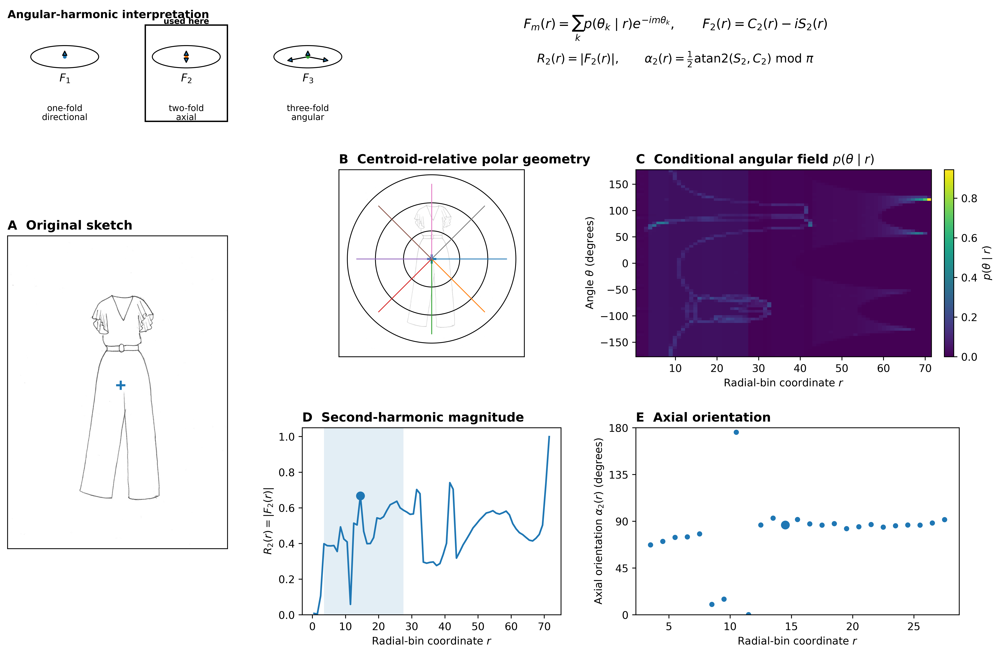
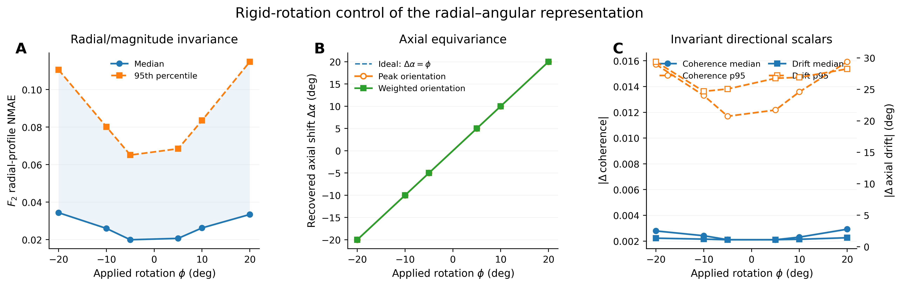

# Garment Sketches: Axial–Radial Geometry and Identity-Aware Validation

**Nitika Gupta**

Independent Researcher, Hyderabad, Telangana, India

Corresponding author: Nitika Gupta, nitikashimla14@gmail.com

> **Source-of-truth rule:** the files listed in `SECTIONS` above are the canonical IVC scientific sources. `CLO_SKET_IVC_Manuscript.md` is generated from them and should not be edited independently. Legacy `CLO_SKET_Final_*`, `CLO_SKET_IVC_Main.md`, the standalone `CLO_SKET_IVC_*_Experiment_07.md` fragments, and files under `Reserve/` are retained only for provenance and comparison.

---

# Abstract

Garment sketches encode more than global outline shape: their foreground evidence is distributed across radial position and undirected orientation. We capture this structure with a compact 14-dimensional axial–radial representation derived from shell-conditioned second-harmonic magnitude and doubled-angle axial orientation.

We evaluate the representation on all 2,300 CLO-SKET sketches from 23 garment categories while treating the 230 recovered source garments—not individual image files—as the unit of validation. Under category-balanced, garment-identity-disjoint evaluation, a frozen 135-dimensional morphology representation achieved macro-F1 0.2978 and balanced accuracy 0.2983. Adding the axial–radial representation increased performance to 0.3358 and 0.3361, corresponding to gains of +0.0380 and +0.0378. Category-stratified garment-identity bootstrap intervals excluded zero, the macro-F1 increment remained positive across all 10 repeated grouped partitions, and radial descriptors accounted for most of the directly observed gain.

Predictive improvement alone does not determine whether the added information is tied to the exact same garment instance. In 2,000 within-category identity-block permutations preserving category and block-size structure, the correctly aligned increment was not exceptional (empirical \(p=0.763\) for macro-F1 and \(p=0.730\) for balanced accuracy). The Experiment-06 evidence therefore supports reproducible category-conditioned geometric information beyond morphology, but not uniquely garment-specific complementarity.

A subsequent fresh reproducibility audit narrowed the transformation-validity claim: its prespecified raster harmonic-magnitude mechanical gate failed. Later Experiment-08 learned-feature comparisons are therefore post-outcome and exploratory. The overall contribution is both representational and methodological: an explicit axial–radial description of garment-sketch geometry together with an identity-aware evaluation framework that separates predictive increment from instance-specific correspondence.

**Keywords:** garment sketches; axial–radial geometry; second harmonic; morphology; grouped cross-validation; identity-aware validation

---

# 1. Introduction

Consider a garment sketch. Different regions of the drawing contribute different amounts of foreground evidence and may exhibit different directional organization. A narrow central region, a laterally extending structure, or a broad lower silhouette can therefore leave distinct geometric signatures.

A natural way to describe this variation is to organize the sketch radially. Imagine concentric shells placed around the sketch centroid. Within each shell, the foreground strokes define an angular distribution. Some shells contain little directional organization; others exhibit a pronounced undirected axis.

This leads to two local geometric questions: **how strongly is the sketch organized directionally at a given radial location, and along which axis is that organization expressed?**

We describe these quantities using the second circular harmonic of the shell-conditioned angular distribution. For shell \(r\), let \(p(\theta\mid r)\) denote the normalized angular distribution of foreground evidence. We define

\[
F_2(r)=\sum_k p(\theta_k\mid r)e^{-2\mathrm{i}\theta_k}.
\]

Its magnitude,

\[
R_2(r)=|F_2(r)|,
\]

measures the strength of second-harmonic directional organization, while its half-phase gives the corresponding undirected axial orientation,

\[
\alpha_2(r)
=
-\tfrac12\arg F_2(r)\pmod{\pi}
=
\tfrac12\operatorname{atan2}\!\left(S_2(r),C_2(r)\right)\pmod{\pi},
\]

under the adopted negative-exponential convention \(F_2=C_2-\mathrm{i}S_2\).

The use of the second harmonic follows directly from the geometry. A garment axis is undirected: an orientation at angle \(\theta\) is equivalent to one at \(\theta+\pi\). The second harmonic is the lowest non-zero circular harmonic that respects this \(180^\circ\) equivalence. The mathematics therefore follows the structure we want to describe rather than being selected retrospectively for classification performance.

Across radial shells, \(R_2(r)\) tells us **where directional organization is strong**, while \(\alpha_2(r)\) tells us **how that organization is oriented**.

**sketch → concentric shells → angular evidence → \(R_2(r)\): strength | \(\alpha_2(r)\): axis**

The resulting shell field is summarized by a compact 14-dimensional representation: eight coordinates describe the radial distribution of second-harmonic magnitude and six describe axial organization using doubled-angle coordinates. The representation is explicit, low-dimensional, and geometrically interpretable rather than learned as a latent embedding.

The next question is whether this geometric description carries information that is useful beyond conventional morphology.

CLO-SKET provides an important setting in which to ask that question. The dataset contains 2,300 sketches from 23 garment categories, but these are not 2,300 independent garment instances. They correspond to 230 recoverable source-garment identities, with repeated sketches associated with each garment. Treating individual image files as independent could therefore place different drawings of the same garment in both training and test data.

We instead treat the complete source-garment identity as the indivisible unit of train/test separation, uncertainty resampling, and permutation. Validation therefore asks whether a representation transfers to **unseen recovered garments**, rather than merely to unseen image files.

With this dependency respected, the central predictive question becomes simple:

**Does axial–radial geometry add garment-category information beyond morphology when complete garment identities are withheld?**

Let \(\mathbf z_M\) denote the frozen 135-dimensional morphology representation and \(\mathbf z_{RA}\) the 14-dimensional axial–radial representation. For evaluation score \(\mathcal S\), the prespecified increment is

\[
\Delta_{RA}
=
\mathcal S(\mathbf z_M\oplus\mathbf z_{RA})
-
\mathcal S(\mathbf z_M).
\tag{1}
\]

A positive \(\Delta_{RA}\) shows that axial–radial geometry contributes predictive information under the tested protocol.

But predictive improvement raises a subtler question.

Suppose adding axial–radial geometry improves category discrimination. Does the improvement depend on pairing the geometry with the **exact same garment**, or could the representation mainly carry category-conditioned structure that remains useful when paired with another garment from the same category?

Ordinary feature concatenation cannot distinguish these possibilities.

We therefore deliberately break exact garment-level correspondence while preserving garment category and repeated-observation structure. Complete axial–radial identity blocks are reassigned within category, giving the comparison

\[
\mathcal S(\mathbf z_{M,i},\mathbf z_{RA,i})
\quad \text{versus} \quad
\mathcal S(\mathbf z_{M,i},\mathbf z_{RA,\pi(i)}).
\tag{2}
\]

If exact garment-level pairing contributes additional predictive information, the correctly aligned representation should outperform this category-preserving misalignment.

The study consequently unfolds as a sequence of connected questions. First, can radial and directional organization in garment sketches be represented explicitly? Second, does that geometry add predictive information beyond morphology when garment identities are respected during validation? Third, where does the added information arise, and does it depend on pairing the geometry with the exact same garment?

The experiments follow this progression. We first construct and characterize the axial–radial representation. We then evaluate its incremental predictive value under garment-identity-disjoint validation, examine radial and axial ablations, and assess its behavior across repeated grouped partitions. Finally, a category-preserving identity-block permutation separates predictive usefulness from exact garment-level correspondence. Rotation, reconstruction, discretization, harmonic, and phase-conditioning analyses provide complementary diagnostics of how the measurement behaves and where its numerical limits lie.

The evidence supports a correspondingly focused interpretation. The axial–radial representation contributes reproducible **category-conditioned geometric information beyond morphology**, while the correspondence control does not support the stronger claim that this advantage depends uniquely on exact garment-level pairing. A subsequent fresh reproducibility audit identified a limitation in raster harmonic-magnitude stability, narrowing the transformation-validity claim while leaving the separately frozen Experiment-06 predictive evidence unchanged.

The contribution is therefore both representational and methodological: an explicit description of **where directional organization occurs in a garment sketch and how it is oriented**, together with an identity-aware evaluation framework that distinguishes **predictive increment** from **instance-specific correspondence**.

---

# 2. Related Work

## 2.1 From garment sketches to explicit geometry

Garment sketches already serve as computational representations in a wide range of fashion tasks. Sparse drawings have been mapped to garment meshes, sewing-pattern parameters, and simulation variables (Yasseen et al., 2013; Wang et al., 2018), and more recent systems use sketches to guide retrieval, editing, synthesis, and sewing-pattern reconstruction (Baldrati et al., 2023; Zhang et al., 2024; Huang et al., 2025). Together, these studies show that a sketch contains information that can support sophisticated downstream inference.

Our interest begins one step earlier: **what geometric organization is present in the sketch itself?**

Explicit shape descriptions provide a natural language for this question. Fourier descriptors and geometric morphometrics have long represented periodic outlines, curves, and shape variation numerically (Zahn and Roskies, 1972; Bookstein, 1997; McCane, 2013), including applications to fashion-flat classification (An and Li, 2014). These approaches motivate representing shape through quantities whose geometric meaning remains visible rather than only through downstream prediction.

The axial–radial representation developed here follows this tradition but changes the object being summarized. Rather than applying a harmonic descriptor only to an external contour, we condition foreground sketch evidence on radial distance from the centroid and examine its angular organization within each shell. The resulting description therefore asks not only **what direction is present**, but also **where in the sketch that directional organization occurs**.

## 2.2 Axial organization as a circular-geometry problem

Directional structure in a garment sketch is naturally axial. An undirected orientation at angle \(\theta\) is equivalent to one at \(\theta+\pi\), so the geometry is periodic over \(180^\circ\) rather than \(360^\circ\). The second circular harmonic is the lowest non-zero Fourier order that respects this equivalence.

Within a radial shell, its magnitude \(R_2(r)\) describes the strength of second-harmonic directional organization, while its half-phase \(\alpha_2(r)\) describes the corresponding undirected axis. Doubled-angle coordinates \((\cos 2\alpha,\sin 2\alpha)\) then provide a continuous Euclidean representation of axial orientation without treating opposite directions as distinct.

This explicit construction also makes the expected behavior of the representation inspectable. Under rigid image rotation, harmonic magnitude and axial phase have different transformation roles; localized radial summaries can depend on discretization; and phase becomes unstable when directional organization is weak. Rotation, reconstruction, discretization, harmonic-order, and phase-conditioning analyses therefore serve as geometric diagnostics of the representation itself. They answer a different question from classification performance: whether the measured quantities behave in ways consistent with their intended interpretation.

## 2.3 From predictive increment to garment-level correspondence

A second issue arises from the structure of the observations rather than from the descriptor. CLO-SKET contains repeated sketches associated with recovered source-garment identities. Different drawings of the same garment are related observations, so an image-level train/test split can place evidence from one garment on both sides of the validation boundary.

Grouped evaluation addresses this dependency by treating the complete garment identity as the indivisible unit of train/test separation. The same principle extends naturally to uncertainty estimation and repeated validation: if the scientific unit is the garment, resampling and repartitioning should operate at the garment level rather than at the individual image level.

There is also a subtler issue when two representations are combined. If axial–radial features improve prediction when appended to morphology, the result shows that the added representation carries useful information under the tested protocol. It does not yet tell us whether that information must come from the **exact same garment**.

We therefore distinguish predictive increment from garment-level correspondence. Complete axial–radial identity blocks can be reassigned within garment category while preserving category membership and repeated-observation structure. This retains category-conditioned information while deliberately breaking exact morphology–axial–radial pairing. The comparison asks whether correct garment-level alignment contributes information beyond what remains after this controlled misalignment.

Together, these strands motivate the evaluation framework used in the remainder of the paper: explicit axial–radial measurement, garment-identity-aware prediction, and a separate test of exact garment-level correspondence.

---

# 3. Methods

## 3.1 Study design and scope

The study was organized around two complementary questions: **how does the axial–radial representation describe garment-sketch geometry, and does that geometry contribute predictive information beyond morphology when complete source garments are withheld?**

The first part characterizes the representation itself. Foreground sketch evidence is expressed relative to the sketch centroid, organized into radial shells, and summarized through shell-conditioned second-harmonic magnitude and axial orientation. These shell-wise quantities are reduced to a compact 14-dimensional vector containing eight radial and six axial descriptors. Rotation, reconstruction, discretization, harmonic-order, phase-conditioning, and sensitivity analyses are used to examine how these measurements behave and where their numerical limits arise.

The second part evaluates predictive contribution. A frozen 135-dimensional morphology representation is compared with the same representation augmented by the 14-dimensional axial–radial vector. All feature sets use the same category-balanced, garment-identity-disjoint folds, preprocessing, and fixed classifier. The primary estimand is the change in macro-F1 obtained by adding the complete axial–radial representation to morphology; radial-only and axial-only additions are used as ablations to locate the source of any increment.

The compact representation is constructed directly from explicit geometric measurements. It does not use principal-component analysis, a learned embedding, semantic segmentation, von Mises fitting, or reconstruction of the complete angular density.

Finally, predictive increment and exact garment-level correspondence are evaluated separately. A category-preserving identity-block permutation reassigns complete axial–radial garment blocks within category while preserving repeated-observation structure. This comparison tests whether any predictive advantage depends on pairing morphology with axial–radial geometry from the exact same garment rather than only on category-conditioned geometric information.

---

## 3.2 Dataset and garment-identity reconstruction

The analysis used all 2,300 images in the CLO-SKET dataset across 23 garment categories. Source-garment identity was reconstructed from the category-qualified source identifier encoded in each filename, while the accompanying replicate identifier denoted the repeated sketch associated with that garment.

This procedure recovered

\[
N_{\mathrm{id}}=230
\]

garment identities, exactly 10 within each category. Individual identities contained 9–11 sketches because of irregular filename records.

All 2,300 file paths were unique. SHA-256 hashing detected no repeated raw files, and hashing of decoded pixel arrays detected no repeated decoded images. Perceptual hashing was used only to identify visually similar candidate pairs and was not interpreted as evidence of file duplication or shared lineage.

Recovered garment identity was treated as the indivisible clustering unit for cross-validation, bootstrap resampling, and prespecified association analysis. The resulting inference concerns these recovered garment identities; extension to a wider population assumes that they can be treated as independent sampling units.

---

## 3.3 Raw-image radial–angular construction

The radial–angular representation was constructed directly from the original grayscale TIFF images at native spatial resolution. Rather than first extracting a binary contour, the construction retains continuous foreground darkness. No thresholding, binarization, resizing, rotation, straightening, or principal-axis alignment was applied.

For sketch \(i\), let \(I_{ip}\in[0,255]\) denote the grayscale intensity of pixel \(p\). Continuous foreground darkness was defined as

\[
w_{ip}
=
\max\left(255-I_{ip},\,0\right).
\]

Thus each sketch is treated as a spatial distribution of foreground mass: darker pixels contribute more weight, while white background pixels contribute zero.

For an image of width \(W_i\) and height \(H_i\), a common isotropic scale was defined as

\[
S_i
=
\max(W_i,H_i).
\]

Pixel coordinates \((u_{ip},v_{ip})\) were mapped to an aspect-ratio-preserving isotropic coordinate system,

\[
x_{ip}
=
\frac{u_{ip}-(W_i-1)/2
}{
S_i
},
\qquad
y_{ip}
=
\frac{
v_{ip}-(H_i-1)/2
}{
S_i
}.
\]

The same scale factor was used for both axes, preserving the image aspect ratio rather than stretching \(x\) and \(y\) independently. This normalization expresses position relative to the native image canvas; it does not impose physical scale invariance.

The darkness-weighted centroid was

\[
c_{x,i}
=
\frac{
\sum_p w_{ip}x_{ip}
}{
\sum_p w_{ip}
},
\qquad
c_{y,i}
=
\frac{
\sum_p w_{ip}y_{ip}
}{
\sum_p w_{ip}
}.
\]

Centroid-relative coordinates were then

\[
\widetilde x_{ip}
=
x_{ip}-c_{x,i},
\qquad
\widetilde y_{ip}
=
y_{ip}-c_{y,i},
\]

with Euclidean radius

\[
R_{ip}
=
\sqrt{
\widetilde x_{ip}^{\,2}
+
\widetilde y_{ip}^{\,2}
},
\]

and polar angle

\[
\theta_{ip}
=
\operatorname{atan2}
\left(
\widetilde y_{ip},
\widetilde x_{ip}
\right).
\]

Radial position was then expressed relative to the maximum centroid-relative foreground extent within each sketch. This converts absolute canvas-relative radius into a within-sketch normalized coordinate while leaving the preprocessing convention itself unchanged:

\[
R_{i,\max}
=
\max_p R_{ip},
\]

\[
\rho_{ip}
=
\frac{
R_{ip}
}{
R_{i,\max}
},
\qquad
0\leq\rho_{ip}\leq1.
\]

The normalized radial coordinate was divided into 72 equal-width bins with edges

\[
e_j^{(r)}
=
\frac{j}{72},
\qquad
j=0,\ldots,72.
\]

The corresponding normalized radial-bin centres were

\[
\rho_j
=
\frac{
j+\tfrac12
}{
72
},
\qquad
j=0,\ldots,71.
\]

For reporting and descriptor construction, these centres were expressed in shell-coordinate units,

\[
r_j
=
72\rho_j
=
j+\frac12,
\]

so that the full radial grid is

\[
r_j
=
0.5,1.5,\ldots,71.5.
\]

Angular position was divided into 72 equal-width bins over

\[
[-\pi,\pi],
\]

with edges

\[
e_k^{(\theta)}
=
-\pi
+
k\frac{2\pi}{72},
\qquad
k=0,\ldots,72.
\]

Each angular bin therefore spans

\[
5^\circ.
\]

Let

\[
H_i(r_j,\theta_k)
\]

denote the accumulated darkness mass of pixels assigned jointly to radial bin \(j\) and angular bin \(k\):

\[
H_i(r_j,\theta_k)
=
\sum_p
w_{ip}
\,
\mathbf 1
\left[
\rho_{ip}\in B_j^{(r)}
\right]
\mathbf 1
\left[
\theta_{ip}\in B_k^{(\theta)}
\right].
\]

Pixels with \(\rho_{ip}=1\) were retained in the final radial bin.

For radial shell \(r_j\), define its accumulated darkness mass as

\[
M_i(r_j)
=
\sum_{k=1}^{72}
H_i(r_j,\theta_k).
\]

For nonempty shells,

\[
M_i(r_j)>10^{-14},
\]

the conditional angular distribution was

\[
p_i(\theta_k\mid r_j)
=
\frac{
H_i(r_j,\theta_k)
}{
M_i(r_j)
},
\]

so that

\[
\sum_{k=1}^{72}
p_i(\theta_k\mid r_j)
=
1.
\]

Empty radial shells were represented by zeros.

Conditioning within each shell separates **how foreground evidence is distributed angularly** from **how much foreground mass the shell contains**. A shell with more ink therefore does not dominate the angular statistic merely because it carries more total intensity.

The \(10^{-14}\) criterion is an empty-shell numerical guard rather than a substantive foreground-support threshold. To assess whether shell conditioning or peak selection was being driven by numerically nonempty but negligibly supported shells, a post hoc source-image support audit was performed over the frozen 25-shell primary domain. For each sketch, shell darkness mass was expressed as a fraction of total sketch darkness mass. Audit-only minimum relative shell-mass thresholds from \(10^{-5}\) to \(5\times10^{-3}\) were then applied without altering the locked representation or Experiment 06.

---

## 3.4 Angular harmonics and axial orientation

Once the angular distribution has been normalized within each shell, its directional organization can be summarized through circular harmonics. For harmonic order \(m\), the complex angular moment at radial shell \(r_j\) was

\[
F_{m,i}(r_j)
=
\sum_{k=1}^{72}
p_i(\theta_k\mid r_j)
e^{-\mathrm{i}m\theta_k}.
\]

The negative exponential follows the discrete Fourier-transform convention used throughout the implementation.

For the axial geometry considered here, the primary analysis uses \(m=2\):

\[
F_{2,i}(r_j)
=
C_{2,i}(r_j)
-
\mathrm{i}S_{2,i}(r_j),
\]

where

\[
C_{2,i}(r_j)
=
\sum_k
p_i(\theta_k\mid r_j)
\cos(2\theta_k),
\]

and

\[
S_{2,i}(r_j)
=
\sum_k
p_i(\theta_k\mid r_j)
\sin(2\theta_k).
\]

The second-harmonic magnitude is

\[
R_{2,i}(r_j)
=
|F_{2,i}(r_j)|
=
\sqrt{
C_{2,i}(r_j)^2+
S_{2,i}(r_j)^2
}.
\]

For later descriptor construction, we use the shorthand

\[
m_i(r_j)
\equiv
R_{2,i}(r_j).
\]

The associated axial orientation is

\[
\alpha_{2,i}(r_j)
=
\frac12
\operatorname{atan2}
\left(
S_{2,i}(r_j),
C_{2,i}(r_j)
\right)
\pmod{\pi}.
\]

Because the orientation describes an axis rather than a directed vector, opposite directions represent the same orientation:

\[
\alpha
\equiv
\alpha+\pi.
\]

Axial angular distance was therefore defined as

\[
d_{\mathrm{ax}}(a,b)
=
\min
\left[
|a-b|\bmod\pi,\,
\pi-(|a-b|\bmod\pi)
\right],
\]

which lies on

\[
[0,\pi/2].
\]

Reported angular errors are expressed on the equivalent interval

\[
[0^\circ,90^\circ].
\]

---

## 3.5 Why the second harmonic is the primary angular statistic

The choice \(m=2\) follows directly from the symmetry of the quantity being represented. Garment orientation is treated as axial: an axis at angle \(\theta\) is equivalent to the same axis at \(\theta+\pi\). The harmonic order is therefore determined by the geometry rather than selected retrospectively from predictive performance.

Under a \(180^\circ\) reversal,

\[
\theta
\mapsto
\theta+\pi.
\]

For harmonic order \(m\),

\[
e^{-\mathrm{i}m(\theta+\pi)}
=
e^{-\mathrm{i}m\theta}
e^{-\mathrm{i}m\pi}
=
(-1)^m
e^{-\mathrm{i}m\theta}.
\]

Hence

\[
F_m(\theta+\pi)
=
(-1)^mF_m(\theta).
\]

Odd harmonics change sign under axial reversal, whereas even harmonics are invariant. Consequently,

\[
m=2
\]

is the lowest non-zero harmonic compatible with this axial equivalence.

The higher even harmonic \(m=4\) is also axially invariant but represents finer angular organization. Harmonics \(m=1\) and \(m=3\) were used as directional controls and \(m=4\) as a higher-order axial control; these comparisons were descriptive and did not redefine the primary \(m=2\) representation.

---

## 3.6 Primary radial domain and peak quantities

The reported shell coordinate \(r_j=j+\tfrac12\) is a dimensionless bin-coordinate representation of the sketch-normalized radius \(\rho_j=(j+\tfrac12)/72\); it is not a physical pixel distance.

The shell field was summarized over a fixed primary radial domain containing 25 shell centers,

\[
\mathcal R
=
\{3.5,4.5,\ldots,27.5\}.
\]

For sketch \(i\), the observed peak shell was

\[
j_i^\star
=
\arg\max_{j:r_j\in\mathcal R}
m_i(r_j),
\]

with peak radius

\[
r_i^\star
=
r_{j_i^\star},
\]

and peak magnitude

\[
m_i^\star
=
m_i(r_i^\star).
\]

Because

\[
m_i(r)=R_{2,i}(r)=|F_{2,i}(r)|,
\]

the peak magnitude can equivalently be written as

\[
m_i^\star
=
R_{2,i}(r_i^\star)
=
|F_{2,i}(r_i^\star)|.
\]

These expressions denote the same measured quantity rather than separate features.

The peak radius identifies where second-harmonic organization is strongest within the chosen radial window. Because it is a discrete argmax on a finite domain, its boundary occupancy and radial-domain sensitivity were evaluated separately.

---

## 3.7 Eight radial-magnitude descriptors

The radial component of RA14 summarizes **how second-harmonic magnitude is distributed across radius**. Let

\[
m_i(r)=R_{2,i}(r)
\]

over the primary domain \(\mathcal R\). Integrals were evaluated using the trapezoidal rule at radial-shell centers. Their units are radial-bin-coordinate units rather than physical distance, and the integrated magnitude is not interpreted as Fourier energy.

### Integrated magnitude

\[
I_i
=
\int_{\mathcal R}
m_i(r)\,dr.
\]

### Magnitude-weighted radial centroid

\[
\bar r_i
=
\frac{
\int_{\mathcal R}
r\,m_i(r)\,dr
}{
I_i
}.
\]

### Magnitude-weighted radial spread

\[
s_{r,i}
=
\sqrt{
\frac{
\int_{\mathcal R}
(r-\bar r_i)^2m_i(r)\,dr
}{
I_i
}
}.
\]

### Peak concentration

With \(r_i^\star\) denoting the discrete peak location, radial concentration was defined as the fraction of integrated magnitude within four shell-coordinate units of the peak,

\[
q_i
=
\frac{
\int_{
\mathcal R\cap
[r_i^\star-4,r_i^\star+4]
}
m_i(r)\,dr
}{
I_i
}.
\]

### Support onset and termination

Let

\[
\tau_i
=
0.10\,m_i^\star.
\]

The support onset and termination radii were

\[
r_i^{\mathrm{on}}
=
\min
\{
r\in\mathcal R:
m_i(r)\geq\tau_i
\},
\]

and

\[
r_i^{\mathrm{off}}
=
\max
\{
r\in\mathcal R:
m_i(r)\geq\tau_i
\}.
\]

Together, these quantities describe total radial magnitude, its location and spread, concentration around the strongest shell, threshold-defined support, and the observed peak. The eight radial features were therefore

\[
\mathbf x_i^{(F_2)}
=
[
I_i,\,
\bar r_i,\,
s_{r,i},\,
q_i,\,
r_i^{\mathrm{on}},\,
r_i^{\mathrm{off}},\,
r_i^\star,\,
m_i^\star
]
\in\mathbb R^8.
\]

Radial extent,

\[
r_i^{\mathrm{off}}
-
r_i^{\mathrm{on}},
\]

was not added separately because it is exactly determined by the retained onset and termination coordinates.

---

## 3.8 Six axial descriptors

The axial component summarizes **how the dominant undirected orientation changes across radius**. The peak axial orientation was

\[
\alpha_i^\star
=
\alpha_{2,i}(r_i^\star).
\]

To obtain a single mean axis while respecting \(180^\circ\) equivalence, a magnitude-weighted doubled-angle resultant was constructed as

\[
Z_i
=
\sum_{r_j\in\mathcal R}
m_i(r_j)
e^{\mathrm{i}2\alpha_{2,i}(r_j)},
\]

with

\[
\bar\alpha_i
=
\frac12
\arg(Z_i)
\pmod{\pi}.
\]

Axial coherence was

\[
\kappa_i
=
\frac{
|Z_i|
}{
\sum_{r_j\in\mathcal R}
m_i(r_j)
},
\qquad
0\leq\kappa_i\leq1.
\]

Orientation drift across the primary radial domain was

\[
\delta_i
=
d_{\mathrm{ax}}
\left[
\alpha_{2,i}(3.5),
\alpha_{2,i}(27.5)
\right].
\]

Raw axial angles were not entered directly into the Euclidean feature vector because ordinary angles would incorrectly distinguish opposite directions of the same axis. Peak and mean orientations were instead encoded in doubled-angle Cartesian form:

\[
\mathbf x_i^{(\alpha_2)}
=
[
\cos(2\alpha_i^\star),\,
\sin(2\alpha_i^\star),\,
\cos(2\bar\alpha_i),\,
\sin(2\bar\alpha_i),\,
\kappa_i,\,
\delta_i
]
\in\mathbb R^6.
\]

This encoding is invariant under

\[
\alpha
\mapsto
\alpha+\pi.
\]

Additional persistence and weighted-dispersion summaries were not retained because they were redundant with the selected coordinates. Algebraically reconstructed quantities were used only for numerical consistency checks and were not added as separate features.

---

## 3.9 Primary 14-dimensional representation

The radial and axial summaries together define the final sketch-level axial–radial representation:

\[
\mathbf x_i
=
\left[
\mathbf x_i^{(F_2)}
\mid
\mathbf x_i^{(\alpha_2)}
\right]
\in
\mathbb R^{14}.
\]

The representation matrix therefore had dimensions

\[
2300\times14.
\]

The eight radial and six axial coordinates were concatenated in the order defined above. An independent reconstruction of both feature blocks reproduced the stored 14-dimensional representation exactly: the maximum absolute numerical difference was zero, and all values were finite.

---

## 3.10 Rigid-image rotation control of the 14-dimensional representation

Before testing predictive value, we examined how the completed 14-dimensional representation behaves when the input sketch itself is rigidly rotated and the full radial–angular measurement is recomputed. This image-domain perturbation complements the later analytic coordinate-frame controls by testing the representation after image interpolation, padding, and complete remeasurement. The control is descriptive; the separate prospectively gated mechanical audit is reported in Section 3.18.

All 2,300 sketches were evaluated at the physical rotation angles

\[
\phi
\in
\{-20^\circ,-10^\circ,-5^\circ,0^\circ,5^\circ,10^\circ,20^\circ\}.
\]

This control was label-free and did not fit or refit any predictive model.

To prevent clipping of the original rectangular sketch under rotation, each grayscale image was first embedded in a square white canvas whose side length was at least the diagonal of the original image,

\[
L_i
=
\left\lceil
\sqrt{H_i^2+W_i^2}
\right\rceil,
\]

with a one-pixel parity adjustment where required to maintain centered embedding. The same padded canvas was used for the reference condition and every rotated condition.

For non-zero \(\phi\), the padded grayscale image was rotated using bilinear interpolation with fixed canvas size,

\[
\texttt{expand=False},
\]

and white background fill,

\[
\texttt{fillcolor}=255.
\]

The \(0^\circ\) condition used the same padded canvas without interpolation.

After rotation, the complete radial-angular construction was rerun from the rotated grayscale image using the same frozen measurement procedure as for the primary representation. No descriptor definition, radial domain, angular discretization, or post-processing rule was changed for the rotation control.

For second-harmonic magnitude, a rigid physical rotation ideally satisfies

\[
F_2'(r)
=
e^{-i2\phi}F_2(r),
\]

so that

\[
R_2'(r)
=
R_2(r).
\]

Accordingly, radial and magnitude-derived quantities were evaluated as approximately rotation-invariant numerical descriptors.

For an axial orientation \(\alpha\),

\[
\alpha'
=
\alpha+\phi
\pmod{\pi}.
\]

Its doubled-angle Cartesian representation therefore transforms as

\[
\begin{bmatrix}
\cos 2\alpha'\\
\sin 2\alpha'
\end{bmatrix}
=
\begin{bmatrix}
\cos 2\phi & -\sin 2\phi\\
\sin 2\phi & \cos 2\phi
\end{bmatrix}
\begin{bmatrix}
\cos 2\alpha\\
\sin 2\alpha
\end{bmatrix}.
\]

Thus, the peak-orientation and magnitude-weighted mean-orientation coordinate pairs were evaluated as axial-equivariant quantities under the expected \(R(2\phi)\) action.

Axial coherence,

\[
\kappa_i,
\]

and orientation drift,

\[
\delta_i,
\]

were treated as rotation-invariant scalar descriptors because they depend on relative rather than absolute axial orientation.

Numerical stability of the radial-magnitude field was summarized by the normalized mean absolute error of the primary-domain \(R_2(r)\) profile relative to the \(0^\circ\) reference. Axial equivariance was evaluated by decoding the rotated doubled-angle orientation pairs and comparing the observed orientation shift with the imposed physical rotation. Coherence and orientation drift were evaluated by their absolute changes from the reference condition.

The rotation control therefore characterizes empirical behavior over the tested angle range. Exact transformation behavior is examined separately by the analytic and prospectively gated controls described later.

---

## 3.11 Prespecified incremental representation-value experiment

Experiment 06 asked the central predictive question: does the frozen compact axial–radial representation add garment-category information beyond the frozen 135-dimensional morphology representation? Seven prespecified feature sets separated standalone, ablation, and augmented comparisons: (R), (A), (R+A), (M), (M+R), (M+A), and (M+R+A), with dimensions 8, 6, 14, 135, 143, 141, and 149. The primary contrast was

\[
\Delta F_1=F_1^{\mathrm{macro}}(M+R+A)-F_1^{\mathrm{macro}}(M),
\]

with \(\Delta BA=BA(M+R+A)-BA(M)\) secondary. Radial-only and axial-only additions were mechanistic ablations and could not replace the primary contrast.

The compact 14-dimensional experiment was prespecified and locked before its own outcome was computed. An earlier broader 28-dimensional radial–angular representation had already produced a positive result (macro-F1 increment +0.070984; balanced-accuracy increment +0.073043), so Experiment 06 was not historically blind to the possibility of improvement. That prior exposure was recorded in the design lock. The compact representation itself, its primary contrast, estimator, validation unit, bootstrap count, repeated-partition count, and alignment-permutation count were frozen before any compact-representation outcome was computed.

## 3.12 Locked estimator and grouped validation

Every feature set used training-fold `StandardScaler` followed by `LogisticRegression` with L2 penalty, \(C=1.0\), `solver=lbfgs`, `max_iter=5000`, `class_weight=None`, and `random_state=20260820`. No hyperparameter search or feature-set-specific classifier change was performed.

Five deterministic category-balanced folds were constructed over the 230 garment identities. Each fold held out exactly two complete identities from each of 23 categories (46 test identities; 184 train identities), with zero identity overlap. Every sketch appeared in exactly one test fold; test-row counts were 459, 460, 462, 460, and 459 sketches because identity block sizes varied slightly. Macro-F1 (primary) and balanced accuracy (secondary) were computed from pooled out-of-fold predictions.

## 3.13 Paired garment-identity bootstrap

Primary-effect uncertainty was estimated from paired frozen out-of-fold predictions using 5,000 complete-garment-identity bootstrap replicates (random state 20260820). Sampling an identity included all its sketches for both models.

The prespecified unrestricted bootstrap was retained as the primary resampling analysis. Because some replicates omitted an entire category, a category-stratified robustness analysis was added without model refitting or feature changes. It sampled 10 identities with replacement within each of the 23 categories, preserving every category in every replicate. Percentile 95% confidence intervals were the 2.5th and 97.5th percentiles of paired metric differences. Fraction-positive values were reported descriptively rather than interpreted as permutation probabilities.

## 3.14 Repeated grouped-partition stability

Ten complete repetitions of five-fold category-balanced grouped cross-validation used seeds 20260820 through 20260829. Within each repeat, every category again contributed exactly two identities to each test fold. The estimator, preprocessing, features, and outcomes remained fixed.

The repeated analysis evaluated (M), (M+R), and (M+R+A). For every repeat, pooled out-of-fold macro-F1 and balanced accuracy were computed and the full augmented-minus-morphology difference retained; the (M+R-M) macro-F1 difference was retained as radial-ablation stability. All 10 repeats and all 50 constituent folds were retained.

## 3.15 Category-preserving identity-alignment permutation

A separate control tested whether augmented-model utility required exact garment-level pairing. Complete (R+A) identity blocks were reassigned within garment category while also matching identity block size. Thus category composition and 9-, 10-, or 11-sketch repeated-measure structure were preserved while exact morphology–axial–radial correspondence was disrupted.

Dress, Harem, and Jumpsuit each contained singleton 9-sketch and 11-sketch category-by-size strata, so those six identities necessarily self-mapped. The audited null retained the same identity for 2.6087% of rows and misaligned 97.3913% in every permutation.

For each of 2,000 permutations, the same five frozen grouped folds, fold-local standardization, and locked logistic-regression specification were used to fit and evaluate (M+R+A_{\pi}). The null statistic was its performance increment over the frozen morphology baseline. The one-sided corrected empirical probability was

\[
p=\frac{1+\sum_{b=1}^{B}\mathbf 1[\Delta_b^{\mathrm{null}}\geq\Delta_{\mathrm{obs}}]}{B+1},
\qquad B=2000.
\]

The test was evaluated for macro-F1 and balanced accuracy. Its target is specific: whether **correct garment-level alignment is more useful than category-preserving misalignment**. Incremental predictive utility itself is established by the augmented-minus-morphology comparison above.

## 3.16 Claim hierarchy for Experiment 06

Experiment 06 separates three levels of evidence. Standalone (R), (A), or (R+A) performance shows that the corresponding representation carries discriminative information. A positive (M+R+A-M) contrast supported by garment-identity bootstrap uncertainty and repeated grouped partitions supports reproducible **incremental predictive utility** beyond morphology. The radial and axial ablations then indicate where that observed increment is concentrated. A distinct **garment-specific correspondence** claim requires the correctly aligned effect to exceed the category-preserving, block-size-matched misalignment null.

Accordingly,

\[
\text{incremental utility}\not\Rightarrow\text{garment-specific correspondence}.
\]

The interpretation therefore distinguishes predictive increment from exact garment-level correspondence; broader semantic or causal interpretations are outside the tested design.

## 3.17 Secondary conventional-image-descriptor baseline (Experiment 07)

To address the reviewer-facing question of whether the compact axial–radial representation adds predictive information beyond a conventional image descriptor, a secondary post-audit baseline was frozen before any Experiment 07 outcome was computed. This analysis did not alter Experiment 06, its features, folds, estimator, or claims.

The conventional descriptor was histogram of oriented gradients (HOG). Each native grayscale TIFF sketch was converted to an aspect-ratio-preserving 256×256 representation by isotropic bilinear resizing followed by centered white padding; images were not geometrically stretched. Pixel values were scaled to [0,1]. HOG used 9 orientations, 16×16-pixel cells, 2×2-cell blocks, L2-Hys block normalization, `transform_sqrt=False`, `feature_vector=True`, and no channel axis, producing 8,100 features per sketch. No HOG hyperparameter search, PCA, feature selection, augmentation, or outcome-dependent preprocessing was performed.

The exact 2,300×14 axial–radial matrix, category labels, garment identities, and row-level fold assignment were recovered from the frozen Experiment 06 checkpoint. The checkpoint fold map was adopted as authoritative because it reproduced the locked Experiment 06 pooled results to numerical precision: morphology macro-F1 0.297788 and balanced accuracy 0.298261; morphology plus the complete axial–radial block macro-F1 0.335765 and balanced accuracy 0.336087. The authoritative Experiment 07 test-fold sizes were 459, 460, 462, 460, and 459 sketches, with 46 held-out garment identities per fold, 184 training identities, and zero train/test garment-identity overlap in every fold.

Row order was bridged independently to the archived runtime image paths. Category labels matched exactly; the eight-dimensional radial block reproduced the archived runtime radial matrix exactly; and the six-dimensional axial block reproduced the archived runtime axial descriptors exactly. The frozen HOG matrix had shape 2,300×8,100, contained only finite values, and was hashed before classification.

Two feature sets were then evaluated under the same fold-local preprocessing and classifier specification used in Experiment 06:

\[
\mathrm{HOG}_{8100}
\]

and

\[
\mathrm{HOG}_{8100}\oplus\mathbf z_{RA,14}.
\]

For each fold, `StandardScaler` was fitted on the training partition only, followed by `LogisticRegression` with L2 penalty, \(C=1.0\), `solver=lbfgs`, `max_iter=5000`, `class_weight=None`, and `random_state=20260820`. The primary Experiment 07 contrast was pooled out-of-fold macro-F1 for HOG+RA14 minus HOG; balanced accuracy was secondary. No model or descriptor setting was changed after outcomes were observed.

Uncertainty for the final HOG+RA14-minus-HOG contrast was quantified without model refitting by a paired bootstrap over the 230 garment identities. Complete garment identities were sampled with replacement for 5,000 replicates using seed 20260820, and all sketches and both paired out-of-fold prediction sets for a sampled identity were retained together. Percentile 95% intervals were defined by the 2.5th and 97.5th percentiles of the paired metric-difference distribution. Because an unrestricted identity bootstrap can omit all true examples of a category in occasional replicates, these intervals are reported as identity-level paired bootstrap intervals rather than as a separate permutation test.

Experiment 07 is interpreted strictly as a secondary conventional-descriptor comparator. It tests whether the explicit 14-dimensional axial–radial representation supplies measurable incremental predictive benefit after a high-dimensional local-gradient representation is already present; it is not a new primary hypothesis and does not replace the prespecified Experiment 06 comparison against morphology.

## 3.18 Fresh reproducibility audit: Experiment 08

After the frozen Experiment 06 and Experiment 07 analyses, Experiment 08 provided a fresh executable audit of RA14 under a prospectively frozen mechanical gate and a frozen learned-feature comparison. It used the same 2,300 sketches, 230 recovered garment identities, and frozen 14-dimensional RA14 representation, together with independently frozen DINOv2 ViT-S/14 features. Two additional predictive controls were specified later, after Experiment 08 had already entered a post-outcome exploratory phase, and were committed before their own execution.

The mechanical gate determined whether the subsequent predictive comparison could be interpreted confirmatorily. Analytic harmonic rotation checks passed, and raster axial-angle errors satisfied their locked criteria. The raster harmonic-magnitude criterion did not: median relative magnitude error was 1.3132%, while the 95th percentile was 21.332%, exceeding the prespecified 15% threshold. The overall frozen mechanical gate therefore failed.

Predictive analysis was subsequently completed, but all Experiment-08 predictive results are interpreted as **post-outcome / exploratory**. The frozen DINOv2 comparison and the later correspondence and repeated-partition controls are reported within that exploratory status and do not change the failed mechanical-gate result.

---

## 3.19 Representation diagnostics

A complementary diagnostic analysis examined how the shell-level second-harmonic field behaves under reconstruction, coordinate-frame changes, discretization choices, neighbouring harmonic orders, and phase perturbation. These analyses characterize the measurement itself and are distinct from the prespecified Experiment-06 predictive contrast and the separately prospectively gated Experiment-08 audit.

### 3.19.1 Garment-identity-disjoint shell-field reconstruction

The observed shell field was examined through out-of-fold reconstruction of its Cartesian second-harmonic components. For sketch \(i\) and primary-domain shell \(r_j\), the predictor vector was

\[
\mathbf z_{ij}
=
\left[
r_j,\,
R_{2,i}(r_j)
\right].
\]

Separate fixed regression models estimated

\[
\widehat C_{2,i}(r_j)
=
f_C(\mathbf z_{ij}),
\qquad
\widehat S_{2,i}(r_j)
=
f_S(\mathbf z_{ij}).
\]

Five category-balanced folds withheld complete recovered garment identities, so every sketch-shell row received an out-of-fold prediction from a model trained without that garment identity. Reconstruction was treated as a shared-source consistency diagnostic because \(R_2\), \(C_2\), and \(S_2\) all derive from the same conditional angular distribution; it was not interpreted as recovery of an independent physical or semantic target.

### 3.19.2 Coordinate-frame controls

Two analytic controls examined the dependence of reconstruction on the common image coordinate frame. First, the observed harmonic field was subjected to global physical rotations in doubled-angle space, preserving \(R_2\) while rotating \(C_2\) and \(S_2\). The same predictors, estimator specification, garment-identity-disjoint folds, and coordinate-free reconstruction metrics were retained.

Second, common absolute orientation was disrupted while preserving garment identity and repeated-sketch structure. One angle

\[
\phi_g
\sim
\operatorname{Uniform}(0,\pi)
\]

was assigned independently to each recovered garment identity \(g\), and all sketches belonging to that identity received the same rotation. Ten such randomizations were evaluated. This control preserves radius, \(R_2\), garment identity, repeated-sketch structure, category labels, and validation folds while removing shared absolute orientation across garment identities.

These analytic controls complement the earlier raster-image rotation experiment in Section 3.10, which recomputed the complete 14-dimensional representation after physical image rotation.

### 3.19.3 Parameter and discretization sensitivity

Sensitivity analyses varied fixed construction choices one at a time without redefining the primary representation. The tested factors included the radial-support threshold, concentration half-width, radial-domain boundaries, angular resolution, and radial resolution.

Angular and radial coarsening were performed by exact aggregation of the canonical 72-bin mass fields rather than by image interpolation. Radial-resolution comparisons additionally used a common normalized physical interval so that changes due to resolution could be separated from changes in radial-domain extent.

These analyses were used to distinguish globally aggregated descriptors from localized quantities whose values depend more strongly on the finite radial window or discretization. They were not used to select or optimize the primary parameterization.

### 3.19.4 Low-order harmonic control

The primary second harmonic was compared descriptively with neighbouring low-order harmonics

\[
m\in\{1,2,3,4\}
\]

computed from the same canonical shell-conditioned angular distributions.

The comparison was not a search for the empirically best harmonic order. Section 3.5 defines \(m=2\) from the axial symmetry of the represented orientation. The low-order analysis instead examined whether the second harmonic constituted a substantial and non-redundant component of the observed angular field.

### 3.19.5 Phase conditioning and garment-level association

Axial phase becomes poorly conditioned when the magnitude of its underlying Cartesian harmonic vector is small. For

\[
\alpha_2
=
\frac12
\operatorname{atan2}(S_2,C_2),
\]

the first-order differential is

\[
d\alpha_2
=
\frac{
C_2\,dS_2-S_2\,dC_2
}{
2R_2^2
},
\]

and therefore

\[
|d\alpha_2|
\leq
\frac{
\sqrt{dC_2^2+dS_2^2}
}{
2R_2
}.
\]

For the out-of-fold reconstruction, the Cartesian perturbation norm was

\[
E_{CS}
=
\sqrt{
(\widehat C_2-C_2)^2+
(\widehat S_2-S_2)^2
},
\]

giving the empirical conditioning quantity

\[
B_\alpha
=
\frac{E_{CS}}{2R_2}.
\]

Repeated sketches were reduced to garment-identity medians before the principal association summaries were calculated. Spearman associations compared median axial reconstruction error with observed peak-shell \(R_2\), Cartesian reconstruction error, and the combined conditioning quantities. Peak radius was retained only as a secondary sensitivity-qualified quantity because its definition depends on an argmax over a finite radial domain.

Detailed estimator settings, validation-unit comparisons, garment-cluster bootstrap procedures, category-stratified permutation inference, parameter grids, magnitude-stratified conditioning, outcome-defined error bands, and the algebraically coupled calibration diagnostic are reported in the Supplementary Methods.

---

# 4. Results

## 4.1 Study population and locked representations

All 2,300 CLO-SKET sketches were retained. Filename grammar and one explicitly recovered exceptional filename yielded 230 garment identities, exactly 10 identities in each of 23 garment categories. Complete garment identities contained 9–11 repeated sketches and were used as the indivisible validation and resampling units.

The independently frozen morphology matrix contained 135 coordinates. The manuscript-defined axial–radial representation contained eight radial and six axial coordinates,

\[
\mathbf z_{RA}=\mathbf z_R\oplus\mathbf z_A\in\mathbb R^{14}.
\]

The eight-dimensional radial block excluded radial extent because the stored quantity was exactly termination radius minus onset radius. Peak and magnitude-weighted axial orientations were encoded by doubled-angle cosine/sine pairs. The resulting 14-dimensional matrix reproduced the previously locked representation hash exactly. Seven feature sets entered the downstream experiment without outcome-dependent modification: \(R\), \(A\), \(R+A\), \(M\), \(M+R\), \(M+A\), and \(M+R+A\).

The five primary folds were category-balanced and garment-identity-disjoint. Every test fold contained 46 identities—two from each category—and every identity appeared in exactly one test fold. Train/test identity overlap was zero.

---

## 4.2 The compact axial–radial representation added predictive utility beyond morphology

Under the locked out-of-fold classifier, morphology alone achieved macro-F1 \(0.297788\) and balanced accuracy \(0.298261\). The complete compact axial–radial representation alone achieved macro-F1 \(0.219993\) and balanced accuracy \(0.231304\). When the 14 axial–radial coordinates were added to morphology, performance increased to macro-F1 \(0.335765\) and balanced accuracy \(0.336087\).

Thus, the prespecified and outcome-locked primary contrast was

\[
\Delta_{RA}^{F_1}
=
0.335765-0.297788
=
+0.037977,
\]

with corresponding balanced-accuracy increment

\[
\Delta_{RA}^{BA}
=
0.336087-0.298261
=
+0.037826.
\]

The macro-F1 increment was positive in all five primary folds, ranging from \(+0.011157\) to \(+0.085268\). Balanced-accuracy differences were likewise positive in all five folds.

**Table 1. Locked pooled out-of-fold category-discrimination performance.**

| Feature set | Dimensions | Macro-F1 | Balanced accuracy |
|---|---:|---:|---:|
| \(R\) | 8 | 0.206831 | 0.224348 |
| \(A\) | 6 | 0.081165 | 0.106522 |
| \(R+A\) | 14 | 0.219993 | 0.231304 |
| \(M\) | 135 | 0.297788 | 0.298261 |
| \(M+R\) | 143 | 0.324540 | 0.325217 |
| \(M+A\) | 141 | 0.300087 | 0.300435 |
| **\(M+R+A\)** | **149** | **0.335765** | **0.336087** |

The observed improvement therefore establishes incremental predictive utility for the complete compact representation under the locked task. It does not by itself establish statistical independence or garment-specific complementarity.

---

## 4.3 Mechanistic ablation localized most direct utility to the radial block

The eight-dimensional radial representation was substantially more discriminative on its own than the six-dimensional axial representation: macro-F1 was \(0.206831\) for \(R\) compared with \(0.081165\) for \(A\). Their concatenation reached \(0.219993\).

The same pattern appeared when the blocks were added to morphology. The radial increment was

\[
\Delta_R^{F_1}
=
0.324540-0.297788
=
+0.026752,
\]

whereas the axial increment was

\[
\Delta_A^{F_1}
=
0.300087-0.297788
=
+0.002299.
\]

For balanced accuracy, the corresponding increments were \(+0.026957\) and \(+0.002174\). Adding the complete \(R+A\) block produced a larger macro-F1 increment, \(+0.037977\), than either component alone.

These ablations indicate that radial organization carries most of the direct incremental signal in this classifier, while the axial block alone adds little to morphology. The fact that \(M+R+A\) exceeded \(M+R\) descriptively does not constitute a separately prespecified significance test for the axial contribution conditional on \(R\).

---

## 4.4 Identity-cluster uncertainty supported a positive incremental effect

A category-stratified bootstrap resampled complete garment identities within each garment category while preserving the paired predictions from \(M\) and \(M+R+A\). Across 5,000 replicates, the mean macro-F1 increment was \(+0.037909\), with percentile 95% confidence interval

\[
[+0.020242,\,+0.055852].
\]

All 5,000 bootstrap replicates produced a positive macro-F1 difference. Balanced accuracy showed a mean increment of \(+0.037968\) with 95% interval

\[
[+0.020000,\,+0.056239],
\]

again with no non-positive replicate.

An unrestricted identity-cluster bootstrap, retained as an audit analysis, produced closely similar intervals: \([+0.019230,+0.055573]\) for macro-F1 and \([+0.019221,+0.057648]\) for balanced accuracy. The category-stratified analysis is emphasized because unrestricted resampling occasionally omitted an entire category.

**Table 2. Category-stratified garment-identity bootstrap for the primary contrast.**

| Metric | Observed \(\Delta\) | Bootstrap mean \(\Delta\) | 95% CI | Positive replicates |
|---|---:|---:|---:|---:|
| Macro-F1 | +0.037977 | +0.037909 | [+0.020242, +0.055852] | 5000 / 5000 |
| Balanced accuracy | +0.037826 | +0.037968 | [+0.020000, +0.056239] | 5000 / 5000 |

The bootstrap fraction positive is descriptive and is not interpreted as a permutation probability.

---

## 4.5 The incremental effect reproduced across repeated grouped partitions

The locked comparison was repeated across 10 category-balanced grouped five-fold partitions. The full axial–radial increment was positive in every repeat.

For macro-F1,

\[
\overline{\Delta}_{RA}
=
+0.032253,
\qquad
SD=0.006805,
\]

with repeat-level values ranging from \(+0.020620\) to \(+0.043275\). Balanced-accuracy increments were also positive in all 10 repeats, with mean \(+0.031565\), standard deviation \(0.007362\), and range \(+0.019565\) to \(+0.043913\).

At the individual-fold level, 44 of 50 macro-F1 differences were positive and six were negative. The radial increment was positive in all 10 repeated partitions, with mean macro-F1 increment \(+0.028850\).

**Table 3. Stability of the primary increment across repeated garment-identity partitions.**

| Quantity | Mean | SD | Minimum | Maximum | Positive repeats |
|---|---:|---:|---:|---:|---:|
| \(\Delta_{RA}\), Macro-F1 | +0.032253 | 0.006805 | +0.020620 | +0.043275 | 10 / 10 |
| \(\Delta_{RA}\), balanced accuracy | +0.031565 | 0.007362 | +0.019565 | +0.043913 | 10 / 10 |
| \(\Delta_R\), Macro-F1 | +0.028850 | — | — | — | 10 / 10 |

The positive effect was therefore not confined to the single deterministic five-fold partition used for the primary pooled estimate.

---

## 4.6 Category-preserving misalignment did not support garment-specific correspondence

The strongest interpretive test produced a different result. In 2,000 permutations, complete axial–radial identity blocks were reassigned within garment category while matching block size exactly. This preserved category-conditioned axial–radial structure but broke exact morphology–axial–radial correspondence for 97.3913% of sketch rows.

For macro-F1, the correctly aligned observed increment was

\[
\Delta_{RA,\mathrm{obs}}=+0.037977.
\]

The category-preserving misalignment null had mean

\[
\mathbb E(\Delta_{RA,\mathrm{null}})=+0.042896,
\]

standard deviation \(0.007141\), and 2.5th, 50th, and 97.5th percentiles \(+0.029088\), \(+0.043094\), and \(+0.056838\), respectively. A total of 1,525 of 2,000 null permutations equalled or exceeded the observed increment, giving

\[
p_{\mathrm{align}}=0.762619.
\]

Balanced accuracy gave the same conclusion: observed increment \(+0.037826\), null mean \(+0.042258\), and empirical \(p_{\mathrm{align}}=0.729635\).

**Table 4. Category-preserving garment-identity alignment control.**

| Metric | Observed \(\Delta\) | Null mean | Null SD | Null 2.5% | Null 97.5% | Empirical \(p\) |
|---|---:|---:|---:|---:|---:|---:|
| Macro-F1 | +0.037977 | +0.042896 | 0.007141 | +0.029088 | +0.056838 | 0.762619 |
| Balanced accuracy | +0.037826 | +0.042258 | 0.007145 | +0.028261 | +0.056522 | 0.729635 |

The observed gain therefore did **not** exceed what was obtained after destroying almost all exact garment-level correspondence while retaining category-level structure. Experiment 06 consequently supports reproducible incremental predictive utility but does not support the stronger claim that the utility arises from garment-specific morphology–axial–radial complementarity.

The null mean being slightly larger than the observed aligned effect should not be interpreted as evidence that misalignment is intrinsically beneficial. The permutation experiment was designed to test whether correct alignment produces an unusually large increment; it did not. The scientifically supported localization is therefore conservative: the useful axial–radial signal is compatible with category-conditioned distributional structure and is not shown to require exact garment-level pairing.

---

## 4.7 Visualizing the axial–radial representation

The construction is easiest to see before considering its downstream behavior. Starting from the grayscale sketch, foreground evidence is expressed relative to the intensity-weighted centroid, accumulated over radius and angle, and normalized within each radial shell to form \(p(\theta\mid r)\). The second harmonic then provides a shell-wise magnitude \(R_2(r)\), describing the strength of axial organization, and an undirected orientation \(\alpha_2(r)\).

**Figure 1. Radial–angular construction and second-harmonic interpretation.** (A) Representative CLO-SKET sketch with intensity-weighted centroid. (B) Centroid-relative polar geometry used to accumulate foreground intensity by radius and angle. (C) Conditional angular distribution \(p(\theta\mid r)\); the shaded interval marks the 25-shell primary radial domain \(r=3.5,\ldots,27.5\). (D) Second-harmonic magnitude \(R_2(r)=|F_2(r)|\), with the selected observed peak shell marked. (E) Axial orientation \(\alpha_2(r)\) over the primary domain. The second harmonic represents axial orientation because \(\alpha\equiv\alpha+\pi\).

Across the primary radial domain, eight descriptors summarize where second-harmonic magnitude is concentrated and how it is distributed, while six axial descriptors summarize peak and mean orientation, coherence, and orientation drift. Together they form the compact 14-dimensional representation used in Experiment 06.

**Figure 2. Fourteen-dimensional radial–angular representation.** The radial block comprises integrated second-harmonic magnitude, radial centroid, radial spread, radial concentration, onset radius, termination radius, peak radius, and peak magnitude. The axial block represents peak and magnitude-weighted mean orientations through doubled-angle cosine/sine coordinates together with axial coherence and orientation drift. Radial extent is excluded because it is exactly termination radius minus onset radius.

---

## 4.8 Geometric and numerical diagnostics

The representation was examined through complementary image-domain, analytic, sensitivity, harmonic, reconstruction, and phase-conditioning controls. These analyses characterize how the measurement behaves; they are separate from the primary Experiment-06 predictive contrast.

An earlier rigid-image rotation control recomputed the full representation after rotating all 2,300 raster sketches through \(-20^\circ\) to \(+20^\circ\). The doubled-angle orientation coordinates followed the expected axial transformation closely. Across the tested rotations, the largest 95th-percentile transformation error was \(4.87^\circ\) for peak orientation and \(0.85^\circ\) for the magnitude-weighted mean orientation. The radial-magnitude field showed small median raster perturbations that increased toward the largest tested rotations, consistent with interpolation and finite-bin effects rather than exact raster-level invariance.

**Figure 3. Rigid-rotation control of the CLO-SKET radial–angular representation.** (A) The same canonical sketch after rigid raster rotations of \(-20^\circ\), \(0^\circ\), and \(+20^\circ\). (B) Stability of the primary-domain second-harmonic radial-magnitude profile relative to the \(0^\circ\) reference. (C) Peak and magnitude-weighted axial orientations follow the expected \(\Delta\alpha=\phi\) transformation over the tested range. (D) Axial coherence remains numerically stable, while orientation drift shows small median changes with a wider upper-tail response. This earlier control is descriptive; the separately prospectively gated Experiment-08 mechanical audit is reported in Section 4.10.

Analytic coordinate-frame controls separated intrinsic behavior from the orientation of the common image axes. Global rotations of the complete harmonic field left coordinate-free reconstruction metrics essentially unchanged: across \(0^\circ,22.5^\circ,45^\circ,67.5^\circ,\) and \(90^\circ\), vector RMSE varied by only 0.000103 and median peak-shell axial error by \(0.0556^\circ\). At \(45^\circ\), the \(C_2\) and \(S_2\) component errors exchanged to numerical precision, confirming that their apparent asymmetry is coordinate-dependent. In contrast, assigning an independent physical rotation to each recovered garment identity drove median axial reconstruction error to \(44.675^\circ\), close to the \(45^\circ\) expectation for unrelated axial orientations. Radius and \(R_2\) therefore do not determine phase by themselves; the strong upright-data phase reconstruction depends substantially on population-level orientation relative to the common image frame.

Sensitivity analyses showed a similar distinction between global and localized radial summaries. Second-harmonic magnitude was highly stable to angular coarsening from 72 to 36 and 24 bins, with rank correlations of 0.9992 and 0.9971 relative to the canonical field. Integrated magnitude, radial centroid, and radial spread were also comparatively stable under radial-domain and resolution perturbations. Localized quantities were more sensitive: at the widest tested radial domain, rank correlation with the primary specification fell to 0.511 for peak radius, 0.476 for concentration, and 0.471 for onset radius. Peak radius and support-boundary descriptors are therefore interpreted as measurements conditional on the fixed radial window rather than universally invariant locations.

The use of the second harmonic was determined by axial symmetry before the empirical spectrum was examined. Within the subsequent low-order control, \(m=2\) had the largest median integrated magnitude (7.8911) and peak magnitude (0.6604) among \(m=1,\ldots,4\). Its integrated magnitude was only weakly associated with \(m=1\) (\(\rho=0.116\)) and \(m=3\) (\(\rho=0.185\)), and moderately associated with the higher-order axial harmonic \(m=4\) (\(\rho=0.490\)). The control therefore supports \(m=2\) as a substantial, non-redundant lowest-order axial statistic without treating empirical dominance as the reason for choosing it.

Finally, the reconstruction analyses exposed a geometric source of axial instability. For

\[
\alpha_2
=
\frac12\operatorname{atan2}(S_2,C_2),
\]

the first-order perturbation satisfies

\[
|d\alpha_2|
\leq
\frac{\sqrt{dC_2^2+dS_2^2}}{2R_2}.
\]

Axial phase is therefore increasingly sensitive to Cartesian perturbation as harmonic magnitude becomes small. The observed garment-level results followed this geometry: median peak \(R_2\) was negatively associated with axial reconstruction error (\(\rho=-0.356\)), whereas the combined conditioning quantity \(\|\Delta(C_2,S_2)\|/(2R_2)\) showed a stronger positive association (\(\rho=0.789\)). Thus weak harmonic magnitude increases angular sensitivity, but \(R_2\) alone does not determine reconstruction error because the Cartesian perturbation also varies.

Full reconstruction results, validation-unit comparisons, cluster-aware uncertainty, rotation controls, parameter and discretization sensitivity, low-order harmonic summaries, garment-level association inference, outcome-defined error-band analyses, and the algebraically coupled calibration diagnostic are retained in the Supplementary Results.

---

## 4.9 Conventional HOG baseline showed negligible incremental benefit from RA14

The frozen conventional-image-descriptor baseline substantially outperformed the lower-dimensional morphology baseline on the same garment-identity-disjoint folds. HOG alone achieved pooled out-of-fold macro-F1

\[
0.648242
\]

and balanced accuracy

\[
0.650435.
\]

Appending the unchanged 14-dimensional axial–radial representation yielded macro-F1

\[
0.649135
\]

and balanced accuracy

\[
0.651304.
\]

The resulting secondary contrasts were therefore

\[
\Delta_{\mathrm{HOG}+RA}^{F_1}
=
+0.000894
\]

and

\[
\Delta_{\mathrm{HOG}+RA}^{BA}
=
+0.000870.
\]

Fold-level macro-F1 values for HOG were 0.637525, 0.661015, 0.615841, 0.660780, and 0.643949; the corresponding HOG+RA14 values were 0.637661, 0.656870, 0.621629, 0.663732, and 0.644240. Thus, the very small pooled positive contrast was not uniformly positive across folds.

A paired bootstrap over complete garment identities used 5,000 replicates without refitting either model. For macro-F1, the bootstrap mean contrast was +0.000961 with percentile 95% identity-level interval

\[
[-0.002152,\,+0.004342],
\]

and 72.82% of replicates were positive. For balanced accuracy, the bootstrap mean contrast was +0.000912 with interval

\[
[-0.002238,\,+0.004272],
\]

and 71.10% of replicates were positive.

**Table 5. Secondary conventional HOG baseline under the authoritative Experiment 06 garment-identity folds.**

| Feature set | Dimensions | Macro-F1 | Balanced accuracy |
|---|---:|---:|---:|
| HOG | 8,100 | 0.648242 | 0.650435 |
| HOG + RA14 | 8,114 | 0.649135 | 0.651304 |

**Table 6. Paired garment-identity bootstrap for the HOG+RA14-minus-HOG contrast.**

| Metric | Observed \(\Delta\) | Bootstrap mean \(\Delta\) | 95% identity-level interval | Positive replicates |
|---|---:|---:|---:|---:|
| Macro-F1 | +0.000894 | +0.000961 | [−0.002152, +0.004342] | 3641 / 5000 |
| Balanced accuracy | +0.000870 | +0.000912 | [−0.002238, +0.004272] | 3555 / 5000 |

Both intervals included zero. Experiment 07 therefore provides no clear evidence that appending the compact axial–radial vector yields additional predictive benefit once the high-dimensional HOG descriptor is already present. This negative result is retained without changing the HOG configuration, axial–radial representation, classifier, or validation design.

The result does not contradict Experiment 06. Rather, it shows that the incremental value of the axial–radial representation is baseline-dependent: the same 14 coordinates produced a substantially larger gain when appended to the frozen 135-dimensional morphology representation, whereas their additional contribution over HOG was negligible under the tested protocol.

## 4.10 Fresh Experiment-08 audit narrowed the transformation-validity claim

Experiment 08 subjected the frozen RA14 representation to a separately prospectively specified mechanical gate. Analytic harmonic-rotation checks passed to numerical precision, and the locked raster axial-angle criteria passed. The raster harmonic-magnitude criterion did not: median relative magnitude error was 1.3132%, whereas the 95th percentile was 21.332%, exceeding the prespecified 15% threshold. The overall frozen mechanical gate therefore failed.

Predictive analysis was subsequently completed, but all Experiment-08 predictive results are interpreted as **post-outcome / exploratory**. For the frozen DINOv2 comparison, pooled out-of-fold macro-F1 was 0.738020 for DINOv2 alone and 0.738967 after appending RA14, an exploratory increment of +0.000947; the category-stratified garment-identity bootstrap interval crossed zero.

The corrected compactness comparison gave a paired difference of \(-0.493309\) with 95% bootstrap interval \([-0.532260,-0.453164]\), and the prespecified non-inferiority criterion was false. Earlier compactness bootstrap intervals and non-inferiority inference produced by the multiplicity-destroying bootstrap implementation are superseded; the point-estimate workflow itself is not invalidated solely by that bootstrap defect.

A later post-outcome correspondence control used 1,000 within-category, block-size-preserving garment-identity permutations. The correctly aligned exploratory increment (+0.000947) was not unusually high under this restricted control distribution (upper-tail empirical \(p=0.999001\)). Because category structure was preserved, this control addresses garment-instance correspondence rather than removal of all category-associated RA14 information.

Across 20 additional garment-identity-grouped partitions, the exploratory additive increment had mean +0.003927, median +0.002581, minimum \(-0.005814\), and maximum +0.014055. Seventeen repeats were positive and three were negative. These summaries are descriptive rather than a formal confidence interval: the effect was **small and partition-sensitive; three of 20 repeats were negative**.

The Experiment-08 predictive analyses therefore remain exploratory and do not alter the failed mechanical-gate result. The fresh audit narrows the transformation-validity claim while leaving the separately frozen Experiment-06 predictive evidence unchanged.

---

# 5. Discussion

## 5.1 A compact geometric representation adds information beyond morphology

The main result is simple: the axial–radial representation contributes reproducible category-discriminative information beyond the frozen morphology baseline under garment-identity-disjoint validation.

Morphology alone achieved macro-F1 \(0.297788\), whereas morphology augmented by the complete 14-dimensional axial–radial representation achieved \(0.335765\), giving the locked increment

\[
\Delta F_1=+0.037977.
\]

Balanced accuracy increased by \(+0.037826\). Category-stratified garment-identity bootstrap intervals excluded zero for both metrics, and the macro-F1 increment remained positive across all 10 repeated grouped partitions.

This result matters because the added representation is small and explicit. Its 14 coordinates describe where second-harmonic directional organization occurs radially, how strongly it is expressed, and how its undirected orientation is arranged. The gain therefore shows that this geometric description contains category-relevant structure not fully captured by the 135-dimensional morphology representation.

The result therefore identifies a specific role for RA14: an explicit geometric summary that contributes useful information beyond morphology under dependency-aware evaluation.

## 5.2 Most of the directly observed increment lies in radial organization

The ablations make the source of that gain more interpretable.

The eight-dimensional radial block achieved standalone macro-F1 \(0.206831\), compared with \(0.081165\) for the six-dimensional axial block. Added to morphology, the radial block increased macro-F1 by \(+0.026752\), while the axial block alone increased it by \(+0.002299\). The complete axial–radial representation produced the largest observed increment, \(+0.037977\).

This pattern is consistent with the geometry being summarized. The radial coordinates encode where second-harmonic angular organization is distributed relative to the sketch centroid through integrated magnitude, centroid, spread, concentration, support limits, peak location, and peak strength. Such quantities can vary systematically across garment categories even when exact garment-level correspondence is unnecessary.

The axial block has a different role. Peak and magnitude-weighted orientations are equivariant quantities defined relative to the common image frame, and the rotation experiments show substantial orientation structure in the upright CLO-SKET population. The complete representation also descriptively exceeded \(M+R\). However, Experiment 06 did not prespecify a separate conditional test of the axial block given \(M+R\), so the evidence supports a radial-dominant incremental effect rather than a separately established axial contribution.

## 5.3 The HOG comparator reveals representation-dependent complementarity

Experiment 07 provides an important second view of the same question.

HOG alone achieved macro-F1 \(0.648242\), and appending RA14 increased this only to \(0.649135\). The corresponding paired garment-identity bootstrap interval crossed zero. Thus the large gain observed relative to morphology was not reproduced when a high-dimensional local-gradient representation was already present.

This makes the contribution more specific, not weaker.

RA14 should not be understood as a general-purpose accuracy booster. Instead, its additional value depends on what information the baseline already represents. The morphology baseline leaves useful radial–angular structure unexploited, whereas HOG appears to encode much of the same category-relevant edge and orientation information in a far higher-dimensional form.

The distinction is important. HOG provides a dense local-gradient description; RA14 compresses a targeted second-harmonic radial–axial measurement into only 14 interpretable coordinates. Their predictive roles overlap, but their representational purposes are different.

The combined Experiment-06 and Experiment-07 evidence therefore supports **representation-dependent complementarity**: RA14 contributes information beyond morphology, while much of that information is already available to the HOG representation.

## 5.4 Predictive increment and garment-specific correspondence are different questions

The alignment experiment asks a stronger question than whether RA14 improves prediction.

Let \(M_i\) denote morphology for sketch \(i\), \(Z_i\) the correctly aligned axial–radial representation, and \(Z_{\pi(i)}\) a category-preserving identity-level reassignment.

Experiment 06 established

\[
\operatorname{Perf}(M_i,Z_i)
>
\operatorname{Perf}(M_i)
\]

under the locked evaluation.

The alignment control instead asked whether the correctly paired representation performs unusually well compared with

\[
\operatorname{Perf}(M_i,Z_{\pi(i)}),
\]

where garment identity correspondence is disrupted while garment category and block-size structure are preserved.

The correctly aligned effect was not exceptional under that restricted null.

The empirical alignment probabilities were \(p=0.762619\) for macro-F1 and \(p=0.729635\) for balanced accuracy. The predictive increment is therefore reproducible, but the present evidence does not localize that increment to exact garment-level morphology–RA14 pairing.

This is the most useful interpretation of the control. Category-conditioned radial–angular organization can remain informative even when RA14 comes from another garment in the same category. The representation carries structured geometric information, but that information need not behave as a unique residual tied to one particular morphology vector.

More broadly, feature concatenation and instance-specific complementarity should not be treated as equivalent. When grouped observations are available, restricted alignment controls provide a direct way to distinguish those two claims.

## 5.5 The second harmonic gives the representation a direct geometric meaning

The predictive experiments sit on top of a representation whose geometry is defined independently of classification performance.

For each radial shell,

\[
F_2(r)
=
\sum_k p(\theta_k\mid r)e^{-i2\theta_k}
=
C_2(r)-iS_2(r)
=
R_2(r)e^{-i2\alpha_2(r)}.
\]

Its magnitude,

\[
R_2(r)=\sqrt{C_2(r)^2+S_2(r)^2},
\]

measures the strength of second-order angular organization, while

\[
\alpha_2(r)
=
\frac12\operatorname{atan2}(S_2(r),C_2(r))
\pmod{\pi}
\]

gives the corresponding undirected axial orientation.

The use of \(m=2\) follows from the symmetry of an axis. Because

\[
\theta\equiv\theta+\pi,
\]

the second harmonic is the lowest non-zero Fourier order compatible with \(180^\circ\) equivalence. The observed low-order spectrum is consistent with this choice: among \(m=1,2,3,4\), the second harmonic had the largest median integrated and peak magnitude.

This gives RA14 an interpretable mathematical structure, but not a semantic one. A high \(R_2\) does not identify a sleeve, waistline, collar, flare, or other named design component. The coordinates measure harmonic organization rather than garment parts.

The same discipline applies algebraically. \(R_2=\sqrt{C_2^2+S_2^2}\) is an identity, not an independent confirmation among three variables, and radial extent was excluded because it is exactly termination radius minus onset radius. Axial directions were represented through \((\cos2\alpha,\sin2\alpha)\) so that the encoding respects axial periodicity.

## 5.6 Transformation behaviour separates intrinsic structure from coordinate-frame structure

Under an ideal physical rotation by \(\phi\),

\[
F_2'(r)=e^{-i2\phi}F_2(r),
\qquad
R_2'(r)=R_2(r),
\]

and

\[
\alpha_2'=\alpha_2+\phi\pmod{\pi}.
\]

The earlier rigid-image rotation experiment was broadly consistent with this organization over the tested perturbations. Radial-magnitude profiles changed only modestly at the median, and axial orientations followed the imposed rotations closely. Magnitude-weighted mean orientation had a maximum 95th-percentile transformation error below \(0.85^\circ\).

A different control reveals what is supplied by the common image frame. Global analytic rotations preserved coordinate-free reconstruction behaviour, whereas assigning different rotations to different garment identities increased median peak-shell axial reconstruction error from \(4.104^\circ\) to \(44.675^\circ\), close to the \(45^\circ\) chance expectation for axial orientation.

Thus radius and \(R_2\) do not intrinsically determine phase. Much of the strong phase regularity observed in the upright dataset depends on population-level orientation structure relative to the canonical frame.

The later Experiment-08 audit further narrows the transformation-validity claim. Its prospectively frozen raster harmonic-magnitude P95 criterion failed even though analytic harmonic rotation and raster axial-angle subchecks passed. The earlier image-rotation observations therefore remain useful descriptive diagnostics, but they are not treated as confirmatory mechanical validation of RA14.

## 5.7 Broad radial summaries are more stable than localized coordinates

The sensitivity analyses reveal a useful hierarchy within the representation.

Integrated magnitude, radial centroid, and radial spread were comparatively stable under changes in radial domain and discretization. Localized descriptors—particularly peak radius, onset, termination, and concentration—were more sensitive to analysis boundaries and resolution.

This is especially clear for peak location. Approximately 22% of sketches selected a peak at a boundary of the primary radial domain, and among sketches peaking at the upper boundary \(r=27.5\), 40.9% moved outward when the domain was expanded.

Peak radius is therefore best interpreted as a localization statistic defined relative to the locked measurement window rather than as an intrinsic physical scale.

The shell-mass audit shows that this sensitivity is not explained simply by vanishing foreground support. Selected peak shells exceeded the tested minimum-mass threshold, but stronger mass filtering, radial-domain changes, and radial coarsening still affect localized quantities.

The practical implication is that RA14 should be treated as a fixed measurement specification. The predictive experiment validates the usefulness of the block under that specification; it does not imply that every coordinate has equal numerical portability.

## 5.8 Harmonic magnitude explains part of axial uncertainty

The relation between harmonic magnitude and axial uncertainty follows directly from the geometry of phase estimation.

For

\[
\alpha_2
=
\frac12\operatorname{atan2}(S_2,C_2),
\]

a first-order perturbation gives

\[
d\alpha_2
=
\frac{C_2\,dS_2-S_2\,dC_2}{2R_2^2},
\]

and therefore

\[
|d\alpha_2|
\le
\frac{\sqrt{dC_2^2+dS_2^2}}{2R_2}.
\]

For a fixed Cartesian perturbation, smaller harmonic magnitude makes phase estimation less well conditioned.

The garment-level results follow this geometry. Median peak \(R_2\) was negatively associated with median axial error (\(\rho=-0.356\)), while Cartesian reconstruction-error magnitude showed a stronger association (\(\rho=+0.760\)). Their combined conditioning quantity,

\[
\frac{\|\Delta(C_2,S_2)\|}{2R_2},
\]

was more strongly associated still (\(\rho=+0.789\)). Median axial error decreased from \(5.988^\circ\) in the weakest-\(R_2\) quartile to \(2.918^\circ\) in the strongest.

The interpretation is geometric rather than causal: harmonic strength conditions angular sensitivity, while the actual reconstruction perturbation also matters.

## 5.9 Scope, contribution, and next steps

The effective experimental population is the 230 recovered garment identities. Identity-disjoint validation therefore tests transfer to unseen recovered garments within CLO-SKET rather than external generalization to another dataset, drawing population, or design source.

The grouping is itself an important part of the study. Sketch-level random splitting would allow repeated renderings of the same source garment to cross the training/test boundary. By grouping complete garment identities in validation, bootstrap resampling, and alignment permutation, the analysis preserves the strongest observable dependency structure in the dataset.

Several boundaries remain. Garment identities were reconstructed rather than supplied through an independent lineage table, so higher-level dependence among designers, collections, or templates cannot be excluded. Both morphology and RA14 derive from the same images, so incremental predictive utility does not imply statistical or information-theoretic independence. The common upright coordinate frame carries substantial orientation structure. Localized radial descriptors remain domain-sensitive. The second harmonic is a targeted axial summary rather than a complete angular representation. No garment-part annotations or independent physical measurements are available.

Within those boundaries, the contribution has two connected parts.

The first is representational: a compact, explicit 14-dimensional description of radial second-harmonic organization and axial orientation with defined geometric meaning and transformation behaviour.

The second is methodological: a dependency-aware evaluation strategy that distinguishes three progressively stronger statements—whether the representation carries category information, whether it adds predictive value beyond another representation, and whether that added value depends on exact garment-level correspondence.

Experiment 06 supports the first two statements relative to morphology. Experiment 07 shows that the additional value is baseline-dependent. The alignment control does not support the third. Experiment 08 narrows the mechanical transformation-validity claim without altering the frozen Experiment-06 result.

The next scientific step is therefore not to enlarge the present claim, but to test it elsewhere. External garment-sketch collections with explicit garment, designer, and collection identifiers would provide the clearest validation. Orientation-normalized or rotation-equivariant variants could separate intrinsic geometry from acquisition-frame structure. Prospective semantic annotations could test whether the geometric coordinates correspond to recognizable design concepts. Category-level prototypes or distributional summaries could also test what form of category-conditioned structure accounts for the alignment result.

Together, these directions move the representation from an internally validated geometric measurement toward a more general model of garment-sketch structure.

---

# 6. Conclusion

Garment sketches contain structured directional information that is not captured by outline morphology alone. We represent that structure with a compact 14-dimensional axial–radial description built from the second angular harmonic: eight coordinates summarize where and how strongly second-harmonic organization occurs radially, and six axial-safe coordinates describe its undirected orientation. The construction follows directly from the geometry of axial direction, for which \(\theta\equiv\theta+\pi\).

Under garment-identity-disjoint evaluation, this representation added reproducible predictive value to the frozen morphology baseline. Macro-F1 increased from \(0.297788\) to \(0.335765\), an increment of \(+0.037977\), and balanced accuracy increased by \(+0.037826\). Category-stratified garment-identity bootstrap intervals excluded zero, and the macro-F1 increment remained positive across all 10 repeated grouped partitions. Most of the directly observed gain was associated with the radial block. By contrast, appending RA14 to a high-dimensional HOG representation produced only a negligible increment with bootstrap intervals crossing zero, showing that the added value is representation-dependent rather than universal.

The alignment experiment further clarifies what that predictive gain means. Correctly aligned morphology and RA14 did not outperform a category-preserving garment-identity misalignment null unusually strongly (\(p=0.762619\) for macro-F1; \(p=0.729635\) for balanced accuracy). The supported interpretation is therefore that RA14 carries reproducible **category-conditioned geometric information beyond morphology**, not that its predictive advantage requires uniquely paired garment-level correspondence. The geometric controls reinforce this distinction: the common upright image frame contributes substantial phase regularity, localized radial coordinates are more measurement-window-sensitive than broad summaries, and the later Experiment-08 audit failed its frozen raster harmonic-magnitude P95 gate. Experiment-08 predictive analyses consequently remain post-outcome and exploratory and do not alter the frozen Experiment-06 evidence.

The contribution is therefore both representational and methodological. The study provides an explicit axial–radial measurement of sparse garment sketches and an identity-aware evaluation framework that separates **representation**, **predictive increment**, and **instance-specific correspondence**. This separation makes clear both what the representation contributes and the level at which that contribution is currently supported.

---

# Declarations

## Funding

No specific funding supported this research.

## Competing interests

The author declares no known competing financial interests or personal relationships that could have appeared to influence the work reported in this paper.

## Author contributions (CRediT)

Nitika Gupta: Conceptualization, Methodology, Software, Validation, Formal analysis, Investigation, Data curation, Visualization, Writing – original draft, Writing – review & editing.

## Acknowledgements

The author thanks the creators and maintainers of the publicly available CLO-SKET dataset.

## Ethics statement

This study analyzed a publicly available garment-sketch dataset and involved no human participants, animals, identifiable personal data, or intervention. Ethics approval and informed consent were therefore not applicable.

## Declaration of generative AI and AI-assisted technologies in the writing process

During preparation of this work, the author used ChatGPT and OpenAI Codex to assist with language editing, manuscript organization, and code and documentation review. The author reviewed and edited all resulting material and takes full responsibility for the content of the publication.

## Data and code availability

The image data analyzed in this study are from the publicly available CLO-SKET dataset released through Mendeley Data (Version 1; doi:10.17632/jt533nkhsf.1). The original images are not redistributed in this repository and should be obtained from the official dataset record.

Code, manuscript-supporting materials, and a compact reviewer-facing numerical evidence bundle are available in the public WeaveAI repository at https://github.com/nitikagupta1403/WeaveAI under `papers/CLO-SKET/`. The evidence bundle under `papers/CLO-SKET/evidence/` contains frozen Experiment 06 and Experiment 07 CSV/JSON results, fold-level summaries, out-of-fold predictions where applicable, identity-bootstrap records, manifests, provenance hashes, and `PUBLIC_EVIDENCE_MANIFEST.json` with byte sizes and SHA-256 hashes.

The public evidence bundle is intended for numerical audit and provenance verification rather than as a self-contained replacement for the original dataset or every frozen computational intermediate. The historical Experiment 06 runtime checkpoint and the 2,300 × 8,100 Experiment 07 HOG feature matrix are intentionally not redistributed through Git; the latter is a deterministic intermediate generated by the public Experiment 07 extraction code. No private image dataset or unpublished manual annotation is required for the reported analyses.

---

# References

An, L., Li, W., 2014. An integrated approach to fashion flat sketches classification. *International Journal of Clothing Science and Technology* 26(5), 346–366. https://doi.org/10.1108/IJCST-05-2013-0054.

Arnia, F., 2020. Clo-Sket. Mendeley Data, Version 1. https://doi.org/10.17632/jt533nkhsf.1.

Baldrati, A., Morelli, D., Cartella, G., Cornia, M., Bertini, M., Cucchiara, R., 2023. Multimodal garment designer: Human-centric latent diffusion models for fashion image editing. In: *Proceedings of the IEEE/CVF International Conference on Computer Vision (ICCV)*, pp. 23393–23402. https://doi.org/10.1109/ICCV51070.2023.02138.

Bookstein, F.L., 1997. Landmark methods for forms without landmarks: Morphometrics of group differences in outline shape. *Medical Image Analysis* 1(3), 225–243. https://doi.org/10.1016/S1361-8415(97)85012-8.

Bui, D.-D.-K., Pham, M.-T., Nguyen, T.V., Tran, M.-T., Le, T.-N., 2026. GarmentSketch: Large-scale sketch-to-fashion benchmark. arXiv:2606.14025. https://doi.org/10.48550/arXiv.2606.14025.

Cao, H.-N., Bui, L.-H., Vo, D.-K., Tran, M.-T., Le, T.-N., 2026. VietFashion: Benchmarking sketch-text composed image retrieval for cultural outfits. arXiv:2606.13427. https://doi.org/10.48550/arXiv.2606.13427.

Cao, X.-L., Lu, F.-N., Zhu, X., Weng, L.-B., Lu, S.-F., Gao, F., 2023. Sketch-based compatible clothing image generation. *Journal of Zhejiang University (Engineering Science)* 57(5), 939–947. https://doi.org/10.3785/j.issn.1008-973X.2023.05.010.

Fondevilla, A., Rohmer, D., Hahmann, S., Bousseau, A., Cani, M.-P., 2021. Fashion transfer: Dressing 3D characters from stylized fashion sketches. *Computer Graphics Forum* 40(6), 466–483. https://doi.org/10.1111/cgf.14390.

Huang, D., Wang, Y., Qu, J., Wang, A., Tang, Y., 2025. SketchTailor: Lightweight sketch-driven modeling for high-fidelity garment pattern reconstruction. *Computers & Graphics* 131, 104345. https://doi.org/10.1016/j.cag.2025.104345.

Jammalamadaka, S.R., SenGupta, A., 2001. *Topics in Circular Statistics*. World Scientific. https://doi.org/10.1142/4031.

Liang, X., Mo, H., Gao, C., 2023. Controllable garment image synthesis integrated with frequency domain features. *Computer Graphics Forum* 42(7), e14938. https://doi.org/10.1111/cgf.14938.

McCane, B., 2013. Shape variation in outline shapes. *Systematic Biology* 62(1), 134–146. https://doi.org/10.1093/sysbio/sys080.

Oh, J., Kim, S., 2026. Generation of body-fit garment patterns using a landmark matching algorithm. *Clothing and Textiles Research Journal* 44(1), 75–92. https://doi.org/10.1177/0887302X251340652.

Singh, A.K., Patras, I., 2024. FashionSD-X: Multimodal fashion garment synthesis using latent diffusion. arXiv:2404.18591. https://doi.org/10.48550/arXiv.2404.18591.

Tsuru, T., Sugahara, M., Nishimura, H., 2021. Silhouette classification of designer's collections in luxury fashion brands. *International Journal of Affective Engineering* 20(1), 33–40. https://doi.org/10.5057/ijae.IJAE-D-20-00002.

Wang, T.Y., Ceylan, D., Popović, J., Mitra, N.J., 2018. Learning a shared shape space for multimodal garment design. *ACM Transactions on Graphics* 37(6), 203:1–203:13. https://doi.org/10.1145/3272127.3275074.

Yasseen, Z., Nasri, A.H., Boukaram, W., Volino, P., Magnenat-Thalmann, N., 2013. Sketch-based garment design with quad meshes. *Computer-Aided Design* 45(2), 562–567. https://doi.org/10.1016/j.cad.2012.10.041.

Zahn, C.T., Roskies, R.Z., 1972. Fourier descriptors for plane closed curves. *IEEE Transactions on Computers* C-21(3), 269–281. https://doi.org/10.1109/TC.1972.5008949.

Zhang, Y., Zhang, T., Xie, H., 2024. TexControl: Sketch-based two-stage fashion image generation using diffusion model. In: *Proceedings of the 2024 NICOGRAPH International (NICOInt)*, pp. 64–68. https://doi.org/10.1109/NICOInt62634.2024.00021.
