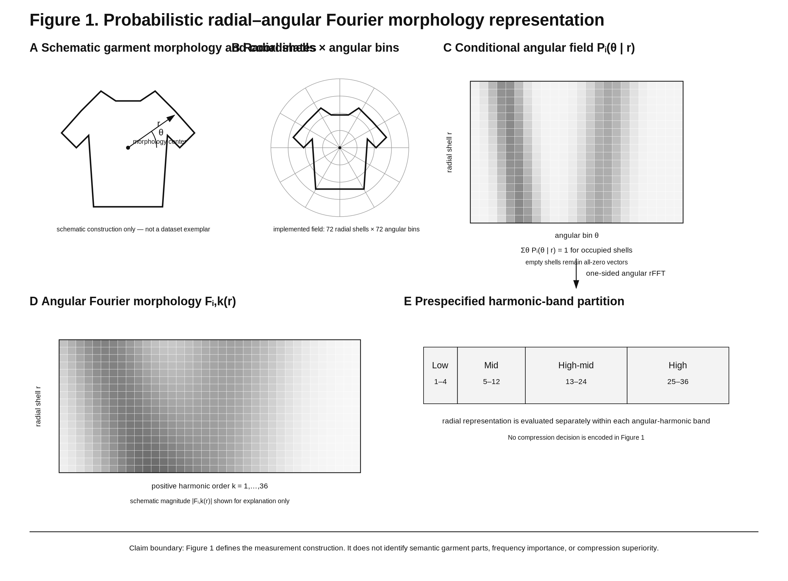
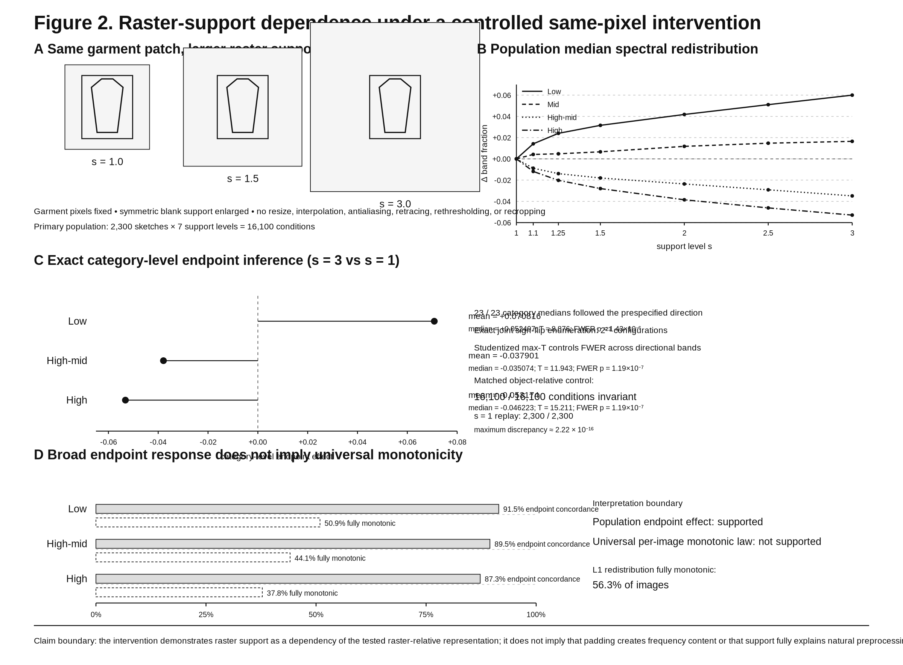
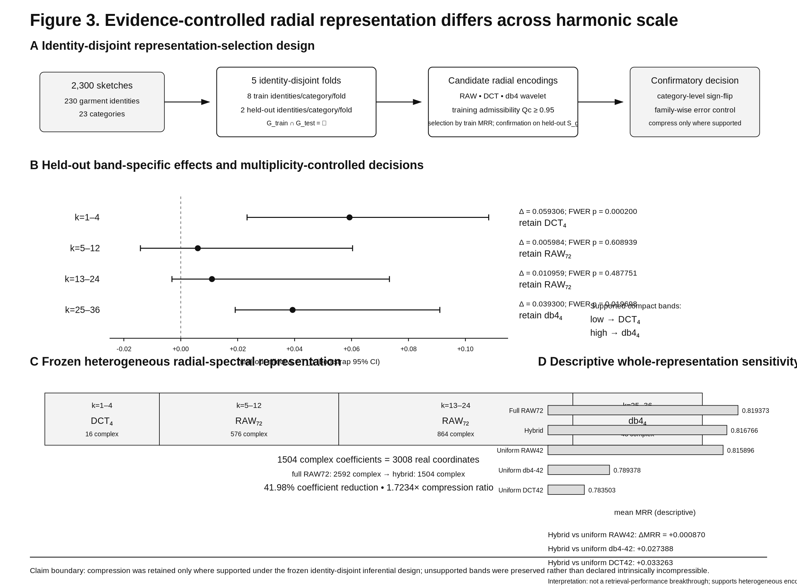
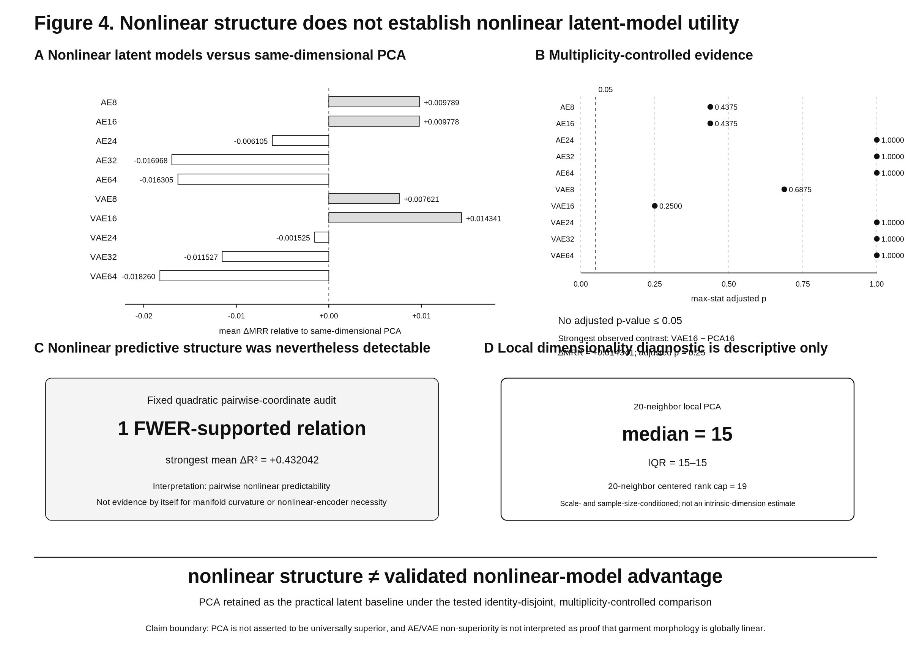
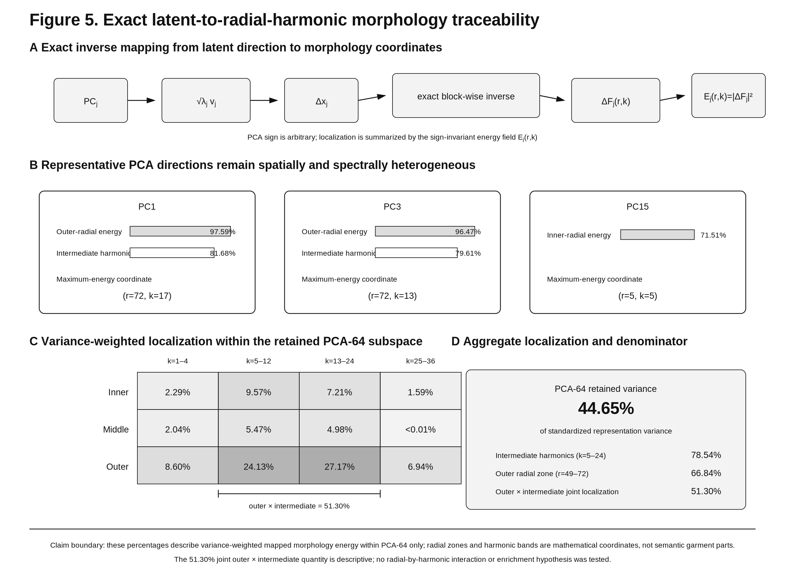

# Auditing and Allocating Representation Complexity in Radial–Spectral Garment Morphology

**Running title:** Audited Radial–Spectral Garment Morphology

## Abstract

Interpreting structured morphology representations requires distinguishing object-related structure from variation introduced by the observation frame. We study this problem in a radial–angular representation of garment sketches whose angular Fourier transform retains explicit radial harmonic functions. Using 2,300 sketches representing 230 garment identities across 23 categories, we first audited the historical raster-relative coordinate system. A controlled same-pixel intervention enlarged only the surrounding raster support, without resizing or resampling the garment patch. Under this intervention, angular spectral allocation changed systematically in the raster-relative representation, whereas a matched object-relative construction remained numerically invariant. Separately, the representation-selection analysis had already been frozen under the historical raster-relative coordinate system; it evaluated radial encoding across four prespecified angular harmonic bands using garment-identity-disjoint validation and multiplicity-controlled inference. Compact four-coefficient DCT and db4-wavelet encodings were supported for the lowest and highest tested harmonic bands, respectively, while complete 72-shell radial structure was preserved in the intermediate bands where tested compression was not supported. The resulting heterogeneous DCT/raw/raw/wavelet representation reduced coefficient count by 41.98% relative to the complete radial-harmonic field. Conditional on this historical hybrid, nonlinear AE/VAE alternatives did not establish a multiplicity-controlled task advantage over same-dimensional PCA, despite separately detectable nonlinear pairwise structure. Exact inverse mapping localized retained PCA variation back to radial–harmonic morphology. Together, the results motivate a three-stage analysis principle: audit the measurement frame, allocate representation complexity only where held-out evidence supports it, and keep retained latent variation traceable to explicit morphology coordinates.

---

**Keywords:** garment-sketch morphology; representation validity; raster support; evidence-controlled representation; radial–angular Fourier analysis; spectral compression; latent morphology; garment-identity-disjoint validation

---

---

# 1. Introduction

Representing garment sketches computationally requires more than choosing a descriptor. It requires deciding which observed structure belongs to the garment itself and which may depend on the coordinate frame in which the garment is measured.

This distinction becomes important in radial-angular spectral representations. Once sketch morphology is expressed as a conditional angular distribution

\[
P(\theta\mid r),
\]

angular organization can be decomposed into harmonic morphology functions

\[
F_k(r).
\]

The harmonic index \(k\) distinguishes angular scale, while the radial coordinate \(r\) retains where that angular structure occurs. The result is an explicit two-coordinate morphology field rather than an undifferentiated image embedding.

Fourier descriptors, polar coordinate systems, radial-angular basis functions, object centering, and scale normalization are all established ideas in shape analysis. The present study therefore does not ask whether spectral or polar representations can describe shape.

It asks two ordered questions.

First:

> **When garment morphology is encoded in raster-relative radial-angular coordinates, does changing only the surrounding raster support alter angular spectral allocation even when garment pixels are unchanged?**

Second:

> **Given the radial-angular Fourier field, should radial representation be imposed uniformly across angular harmonic orders, or selected conditionally on harmonic scale using held-out evidence?**

The ordering matters. A representation should be audited as a measurement system before its internal spectral allocation is optimized or interpreted.

The historical CLO-SKET representation normalized radial coordinates relative to the complete raster grid. This creates a potential coupling between garment geometry and the observation frame: if the raster support changes, the normalized radial coordinate assigned to an otherwise unchanged garment can also change.

To test whether this dependence was practically consequential, we performed a staged representation-validity audit. The historical preprocessing chain was first decomposed to localize where the previously observed spectral change entered. Candidate frame-related descriptors were then examined at image level and population level. Finally, a controlled same-pixel intervention enlarged only the surrounding raster support while preserving the garment rectangle exactly and prohibiting resize, interpolation, antialiasing, rethresholding, or crop recomputation.

A matched object-relative control was evaluated under the same intervention. Its role was not to introduce a new normalization method, but to provide a counterfactual measurement system in which coordinates were defined relative to the object rather than to the surrounding raster frame.

This validity audit changes the hierarchy of the manuscript, but not the original analysis.

The original representation-selection question remains important. A common response to high-dimensional spectral representations is to impose a single compression family or coefficient budget globally. That assumes radial information has comparable representational requirements across the angular spectrum. The opposite strategy—retaining every radial coefficient—avoids this assumption but preserves potentially unnecessary dimensionality.

Neither strategy asks whether compression is actually supported in a particular spectral regime.

We therefore formulate representation construction as an **evidence-controlled selection problem**. Candidate radial representations are evaluated separately within prespecified harmonic bands. Compact encoding is retained only when its held-out effect survives garment-identity-disjoint validation and multiplicity control; where such support is absent, complete radial structure is preserved.

Thus:

\[
\boxed{
\text{compress where supported; preserve otherwise.}
}
\]

This principle yields a heterogeneous representation

\[
\mathcal H
=
\bigoplus_b
\mathcal R_b
\left(
F_k(r)
\right),
\]

where the radial operator \(\mathcal R_b\) may differ across harmonic bands.

A third question arises after this radial-spectral structure has been frozen. High-dimensional morphology can contain nonlinear predictive relationships, but detectable nonlinearity does not itself establish that a nonlinear encoder offers better held-out utility. Autoencoders and variational autoencoders provide nonlinear latent mappings, whereas PCA supplies a simpler linear basis with an exact inverse path.

We therefore distinguish:

\[
\text{Is nonlinear predictive structure detectable?}
\]

from

\[
\text{Does a nonlinear latent model provide validated task advantage?}
\]

Conditional on the raster-relative hybrid representation, AE and VAE alternatives are compared directly with same-dimensional PCA representations under identity-disjoint validation and multiplicity-controlled inference. Nonlinear predictive structure is then audited separately so that evidence of a quadratic coordinate relation cannot retrospectively determine the model-selection decision.

A final requirement is traceability. Compact latent coordinates are useful only if their relation to the structured morphology can remain explicit. Because the hybrid representation retains an exact inverse path, a perturbation along PCA direction \(j\) can be mapped back to the Fourier morphology field,

\[
PC_j
\longrightarrow
\Delta F_j(r,k),
\]

and localized through the sign-invariant energy

\[
E_j(r,k)
=
\left|
\Delta F_j(r,k)
\right|^2.
\]

This provides mathematical localization rather than semantic disentanglement. A concentration of latent energy in a radial zone or harmonic range does not by itself identify a sleeve, hem, neckline, silhouette, or other garment concept.

We study these questions using CLO-SKET (Arnia, 2020), a controlled garment-sketch corpus containing 2,300 sketches representing 230 garment identities across 23 garment categories. The repeated-identity structure enables all main validation procedures to separate complete garment identities between training and held-out groups.

The study makes three main methodological contributions.

1. **Controlled representation-validity audit.**  
   We test whether surrounding raster support alone can change angular spectral allocation under the raster-relative coordinate system while garment pixels are held fixed, and we compare this response with a matched object-relative control.

2. **Harmonic-conditioned, evidence-controlled radial representation selection.**  
   We test radial compression separately across angular harmonic regimes and construct a heterogeneous representation in which compact bases are retained only where inferential support is established, while complete radial structure is preserved elsewhere.

3. **Exact latent-to-morphology traceability.**  
   We map retained PCA directions through the inverse hybrid representation into explicit radial-harmonic morphology fields without assigning unsupported semantic meaning.

The same evidential discipline is applied separately to latent-model complexity: PCA is compared with AE and VAE alternatives under identity-disjoint validation, while nonlinear predictive structure is audited independently so that evidence of nonlinearity does not retrospectively determine model selection.

The resulting experiments establish a layered result.

Under the raster-relative coordinate system, surrounding raster support is a demonstrated dependency of angular spectral allocation in the tested same-pixel intervention. The matched object-relative control remains numerically invariant under that intervention.

Within the historical representation in which the original analysis was performed, support for radial compression is not uniform across angular harmonic scale. Compact radial encodings are supported at the lowest and highest tested harmonic ranges, whereas complete radial structure is retained across the intermediate orders.

Nonlinear encoders subsequently do not establish a multiplicity-controlled task advantage over same-dimensional PCA despite separately detectable nonlinear predictive structure.

Finally, inverse mapping of retained PCA variation reveals structured but heterogeneous radial-harmonic localization.

The contribution is therefore **not** a new Fourier transform, polar coordinate system, normalization scheme, DCT, wavelet family, PCA method, or nonlinear latent model.

It is a study of:

\[
\boxed{
\text{representation validity}
+
\text{evidence-controlled representation allocation}
+
\text{traceable latent interpretation}.
}
\]

---

# 2. Related Work

## 2.1 Classical Fourier shape description and contour normalization

Fourier representations have a long history in quantitative shape analysis. Classical contour formulations represented closed boundaries through Fourier coefficients, including early Fourier contour descriptors and elliptic Fourier descriptors (Zahn and Roskies, 1972; Kuhl and Giardina, 1982).

These methods established several ideas that remain relevant here:

- shape can be represented compactly in a spectral basis;
- translation, scale, rotation, starting point, and contour parameterization can be normalized or otherwise controlled;
- spectral coefficients can support reconstruction and shape comparison.

Accordingly, Fourier shape description itself is not novel in this study.

Likewise, modern work on complete elliptic Fourier descriptor normalization continues to refine normalization under basic contour transformations (Wu et al., 2026). Such work provides important precedent for shape normalization but does not constitute a direct precedent for the same-pixel raster-support intervention examined here.

The present study therefore does not claim to introduce object centering, scale normalization, or invariant Fourier shape description.

---

## 2.2 Polar, radial-angular, and region-based spectral descriptors

Region-based polar methods retain spatial organization beyond a single contour sequence.

The Generic Fourier Descriptor applies a two-dimensional Fourier transform to a polar-raster representation of a shape, incorporating radial and angular frequency information within a common descriptor (Zhang and Lu, 2002).

The Angular Radial Transform similarly represents shape using radial and angular basis functions and has been used in MPEG-7 region-shape description and later extensions (Ricard et al., 2005).

Polar Harmonic Transforms provide further precedent for orthogonal bases defined directly in polar coordinates (Yap et al., 2010).

These studies establish that:

\[
\boxed{
\text{polar coordinates and radial-angular spectral analysis are prior art}.
}
\]

CLO-SKET uses a different decomposition for a different question. Angular morphology is normalized conditionally within each radial shell,

\[
P_i(\theta\mid r),
\]

and Fourier analysis over \(\theta\) produces an explicit complex radial function for each harmonic,

\[
F_{i,k}(r).
\]

The radial coordinate is therefore retained as an object of later representation analysis rather than immediately absorbed into a fixed two-dimensional transform basis.

This explicit radial dependence permits a separate question:

> Should the radial function attached to every angular harmonic be represented in the same way?

That representation-allocation question is distinct from introducing radial-angular spectral coordinates themselves.

---

## 2.3 Scale normalization, digital invariance, and implementation limits

Classical normalization theory often defines representations intended to be invariant to translation, scale, or rotation.

Digital implementation introduces additional complications. Discretization, rasterization, sampling density, boundary placement, interpolation, and noise can prevent mathematically intended invariance from being realized exactly in a sampled image representation.

Zernike-moment normalization studies provide a useful example: the mathematical normalization objective and its digital realization are not identical, because finite rasterization and discretization introduce implementation error (Yang and Fang, 2010).

This distinction is directly relevant to Paper II.

The present support audit is not motivated by the claim that shape normalization is new. It is motivated by the need to test whether the particular raster-relative coordinate system used by CLO-SKET is stable when an irrelevant part of the observation frame—surrounding blank support—is changed independently of garment pixels.

The matched object-relative control therefore functions as a control, not as a new normalization invention.

---

## 2.4 Finite support, windows, cropping, and zero-padding

Fourier analysis of finite signals has long recognized that observed spectral structure depends on how a signal is windowed and sampled (Harris, 1978).

Finite-window theory is therefore general prior art, and image preprocessing/corruption has also been studied in relation to Fourier-domain behavior (Dzanic, Shah, and Witherden, 2020).

Cropping is also known to alter image statistics and can leave detectable signatures in image distributions (Van Hoorick and Vondrick, 2021). However, ordinary cropping changes the observed image content or context and often changes the rasterized object support itself.

Similarly, ordinary Fourier zero-padding is a standard signal-processing operation. In one-dimensional boundary-descriptor work, zero-padding can change sequence length and spectral sampling density without constituting a new shape-normalization principle (Kunttu, Lepistö, and Visa, 2005).

These precedents are important because they define what the controlled same-pixel support intervention is **not**.

The controlled same-pixel support intervention is not presented as a discovery that:

- zero-padding creates spectral information;
- finite windows matter in Fourier analysis;
- image cropping can affect spectra;
- scaling can alter rasterized descriptors.

The specific experimental question is narrower:

> If a bit-identical garment patch is embedded in progressively larger two-dimensional raster support, with no resize, interpolation, antialiasing, contour retracing, rethresholding, or crop recomputation, does the historical raster-relative radial-angular representation systematically reassign spectral allocation across the frozen angular bands?

The observed effect is interpreted through coordinate remapping relative to raster support, not through the claim that padding itself creates garment frequencies.

---

## 2.5 Same-pixel raster-support manipulation: precedent boundary

The literature reviewed for this project contains strong adjacent precedents but no direct match to the complete controlled intervention.

The relevant precedent classes can be summarized as follows.

| Literature family | Core contribution | Relation to the controlled same-pixel support intervention |
|---|---|---|
| Classical Fourier / EFD shape descriptors | spectral contour representation and normalization | general theory |
| GFD | polar-raster Fourier shape representation | close partial precedent |
| ART / MPEG-7 region shape | angular-radial region basis | close partial precedent |
| Zernike normalization studies | digital normalization accuracy and discretization limits | partial precedent |
| finite-window Fourier analysis | dependence on finite observation support | general theory |
| boundary-signal zero-padding | sequence-length / spectral-sampling change | different operation |
| image cropping studies | effects of crop/context change | partial but content-changing |
| the controlled same-pixel support intervention | bit-identical patch + independent 2-D support manipulation + no resampling + predefined band endpoints + population inference + matched object-relative control | current study |

The reviewed literature establishes that the mathematical ingredients are old. In the literature reviewed, we identified strong adjacent precedents in shape normalization, radial–angular descriptors, finite-support Fourier analysis, and padding/cropping theory, but did not identify a direct precedent for the complete same-pixel support intervention with a matched object-relative control used here.

The combination evaluated here includes:

\[
\text{bit-identical garment pixels}
\]

\[
+
\]

\[
\text{independent 2-D raster-support manipulation}
\]

\[
+
\]

\[
\text{no resize/interpolation}
\]

\[
+
\]

\[
\text{prespecified support dose}
\]

\[
+
\]

\[
\text{bandwise spectral redistribution}
\]

\[
+
\]

\[
\text{population-level inference}
\]

\[
+
\]

\[
\text{matched object-relative invariance control}.
\]

This is a literature-search boundary, not a claim of absolute priority.

---

## 2.6 Multiscale, wavelet, and compact spectral descriptors

Spectral shape descriptors have also been extended across scale.

Multiscale Fourier descriptors organize contour-based shape information across multiple resolutions (Kunttu et al., 2006). Fourier and wavelet operations have likewise been combined in fashion-flat analysis. Wavelet Fourier Descriptor pipelines therefore establish prior art for combining Fourier analysis with wavelet-based compact shape description, including direct fashion-flat classification work (An and Li, 2014).

Consequently:

\[
\boxed{
\text{Fourier + wavelet is not the Paper-II novelty}.
}
\]

The distinction in CLO-SKET concerns **how a basis and coefficient budget are accepted**.

DCT, wavelet, and complete radial representations are treated as candidate encodings rather than globally prescribed components. Candidate compression is evaluated separately within prespecified harmonic bands using training garment identities for selection and held-out identities for confirmation.

A compact representation is adopted only where the frozen inferential criterion supports replacement of the complete radial field.

If tested compression is not supported, the complete radial function is retained.

This preservation decision does not establish intrinsic incompressibility. It states only that the tested compact alternatives did not earn replacement under the specified candidate family, coefficient budgets, dataset, and validation criterion.

---

## 2.7 Garment sketches, retrieval, and learned visual representations

Garment and fashion sketches have been studied for classification, retrieval, design assistance, vectorization, and image synthesis.

Handcrafted spectral shape pipelines provide direct precedent for fashion-flat classification (An and Li, 2014).

More recent systems use learned image representations for cross-domain sketch-photo retrieval, zero-shot sketch-based image retrieval, abstraction-aware retrieval, noise-tolerant retrieval, and representation transfer (Lei et al., 2021; Li et al., 2022; Bhunia et al., 2022; Chaudhuri et al., 2023; Koley et al., 2024).

Other work focuses on extraction and vectorization of design elements from clothing imagery (Lee et al., 2024), while recent surveys place sketch-guided retrieval within the wider fashion-retrieval landscape (Islam et al., 2024).

These systems address important problems, but their primary question differs from the present study.

They generally ask how to:

- improve recognition;
- align sketch and photo domains;
- learn invariant visual features;
- recover design elements;
- support semantic retrieval;
- synthesize or vectorize garment representations.

The present study instead asks how to validate and allocate complexity within an explicit morphology field whose coordinates remain mathematically interpretable.

The unit of held-out generalization is also different. Garment identity, not category alone, is used as the main validation grouping unit. Repeated drawings of the same garment identity therefore permit evaluation of whether a representation preserves identity-specific morphology across sketch realizations and transfers to garment identities absent from fitting.

---

## 2.8 Linear latent representations, nonlinear encoders, and nonlinear geometry

After representation construction, latent dimensionality introduces another complexity decision.

PCA provides an orthogonal variance-ordered basis with a transparent linear inverse (Jolliffe and Cadima, 2016).

Autoencoders learn nonlinear mappings through reconstruction objectives (Hinton and Salakhutdinov, 2006), while variational autoencoders add a probabilistic latent-variable formulation (Kingma and Welling, 2014).

Principal curves, Isomap, diffusion maps, and other manifold-oriented methods provide separate tools for exploring nonlinear organization (Hastie and Stuetzle, 1989; Tenenbaum et al., 2000; Coifman and Lafon, 2006).

The presence of nonlinear structure, however, is logically distinct from evidence that a nonlinear encoder improves a held-out task.

CLO-SKET therefore separates:

\[
\text{nonlinear predictive structure}
\]

from

\[
\text{validated nonlinear-model advantage}.
\]

Conditional on the raster-relative hybrid, same-dimensional AE and VAE representations are compared with PCA using identity-disjoint held-out retrieval and multiplicity-controlled inference.

Fixed quadratic coordinate relationships and manifold-oriented analyses are treated separately as geometry diagnostics.

This separation prevents two opposite errors:

\[
\text{AE/VAE non-superiority}
\not\Rightarrow
\text{globally linear geometry}
\]

and

\[
\text{detectable nonlinear relation}
\not\Rightarrow
\text{nonlinear encoder required}.
\]

---

## 2.9 Traceability from latent coordinates back to morphology

Interpretability can mean semantic disentanglement, causal factor recovery, or simply mathematical traceability.

Paper II claims only the third.

For PCA direction \(j\),

\[
PC_j
\rightarrow
\Delta x_j
\rightarrow
\Delta F_j(r,k),
\]

and the mapped perturbation is summarized by

\[
E_j(r,k)
=
|\Delta F_j(r,k)|^2.
\]

PCA reconstruction and Fourier-domain visualization themselves are not presented as new.

The methodological role of the inverse path is to preserve traceability after heterogeneous compression so that retained latent variation can still be localized in the same radial-harmonic coordinates used for representation decisions.

This is intentionally weaker than semantic disentanglement.

An energy concentration at an outer radial location or within a harmonic band is a mathematical localization statement. It is not evidence that a PCA direction corresponds to a hem, sleeve, neckline, silhouette, or other semantic garment component.

---

## 2.10 Position of the present study

The mathematical components used in Paper II have substantial precedent:

- Fourier contour descriptors;
- elliptic Fourier descriptors;
- polar-raster Fourier descriptors;
- Angular Radial Transform descriptors;
- Polar Harmonic Transforms;
- DCT and wavelet compression;
- object-centering and scale normalization;
- PCA;
- autoencoders;
- variational autoencoders;
- manifold-learning tools;
- fashion-sketch classification and retrieval.

The contribution therefore does not lie in inventing any one of these ingredients.

The study instead combines three levels of methodological control.

### Level 1 — representation validity

The historical raster-relative measurement system is subjected to a controlled same-pixel support intervention before its spectral allocation is interpreted as object structure.

### Level 2 — representation allocation

Within the historical representation, radial encoding is selected separately across angular harmonic bands using identity-disjoint, multiplicity-controlled validation.

### Level 3 — latent interpretation

Latent complexity is validated separately, and retained PCA variation is mapped exactly back to radial-harmonic coordinates.

The manuscript-safe contribution statement is:

> **Paper II combines a controlled representation-validity audit with evidence-controlled allocation of radial representation complexity across angular harmonic scale and exact latent-to-radial-harmonic traceability.**

The manuscript should not claim:

- a new Fourier transform;
- a new polar coordinate system;
- a new scale-normalization method;
- a universally support-invariant descriptor;
- a universally optimal harmonic partition;
- a general law of garment morphology;
- universal superiority of the heterogeneous descriptor;
- semantic meaning for radial zones or harmonic bands.

---

## 2.11 Contemporary computer-vision context and remaining gap

Recent sketch-based computer-vision work increasingly focuses on learned invariance, cross-domain retrieval, abstraction robustness, representation transfer, and semantic alignment.

These advances do not remove the gap addressed here because the scientific questions differ.

The contemporary learned-representation question is often:

> How can a model learn features that improve recognition, retrieval, transfer, or synthesis?

The present question is:

> Given an explicit morphology coordinate system, which observed structure is stable to irrelevant observation-frame changes, and where is dimensional simplification empirically justified?

This distinction is central.

A learned model can be highly effective without exposing whether its internal features change when blank raster support changes. Conversely, an explicit spectral descriptor can be mathematically interpretable while still embedding a coordinate dependency on the observation frame.

Paper II therefore contributes an audit-and-selection framework rather than a benchmark race against contemporary neural retrieval systems.

---

## 2.12 Final novelty boundary

The safest literature-level conclusion is:

\[
\boxed{
\text{normalization mathematics is established prior art;}
\quad
\text{the controlled audit design is the contribution.}
}
\]

The strongest literature-facing sentence is:

> **Among the reviewed literature, we did not identify a direct precedent that combines a bit-identical foreground patch, independent two-dimensional raster-support manipulation without resampling, prespecified support dose, bandwise spectral redistribution, population-level inference, and a matched object-relative invariance control.**

The strongest representation-selection sentence remains:

> **Within the historical radial-angular representation, radial encoding is selected separately across angular harmonic bands using garment-identity-disjoint, multiplicity-controlled evidence, compressing supported bands while preserving complete radial structure where compression is not supported.**

These two claims are complementary rather than competing.

The first concerns whether the measurement system itself depends on the observation frame.

The second concerns how representation complexity should be allocated once the historical measurement system is fixed.

Together they support the revised Paper-II scientific identity:

\[
\boxed{
\text{validate the representation;}
\rightarrow
\text{allocate complexity with evidence;}
\rightarrow
\text{interpret through explicit coordinates.}
}
\]

---

---

# 3. Methods

## 3.1 Dataset and analysis units

The analysis used 2,300 CLO-SKET garment sketches corresponding to 230 garment identities across 23 garment categories, with 10 garment identities represented within each category.

Garment identity, rather than individual sketch, was treated as the primary grouping unit for validation and statistical inference because repeated sketches originating from the same garment identity cannot be treated as independent examples when evaluating representation generalization. All grouped evaluation procedures therefore enforced complete garment-identity separation between training and test partitions:

\[
G_{\mathrm{train}}\cap G_{\mathrm{test}}=\varnothing.
\]

Category structure was retained where required by the frozen validation and inferential procedures.

## 3.2 Probabilistic radial-angular morphology representation

The radial-angular field was constructed directly from each grayscale TIFF without resizing, rotation, thresholding, or binarization. For an image of width \(W\) and height \(H\), grayscale intensity \(I(x,y)\in[0,255]\) was converted to continuous ink weight

\[
w(x,y)=\max\{255-I(x,y),0\}.
\]

To preserve image aspect ratio, both spatial axes were scaled by the common factor

\[
S=\max(W,H).
\]

Pixel coordinates were first expressed relative to the image-canvas center and divided by \(S\). The morphology center was then defined as the intensity-weighted centroid of these isotropically scaled coordinates,

\[
c_x=
\frac{\sum_{x,y}w(x,y)X(x,y)}
     {\sum_{x,y}w(x,y)},
\qquad
c_y=
\frac{\sum_{x,y}w(x,y)Y(x,y)}
     {\sum_{x,y}w(x,y)}.
\]

Centroid-relative polar coordinates were

\[
R(x,y)
=
\sqrt{
\left(X(x,y)-c_x\right)^2
+
\left(Y(x,y)-c_y\right)^2
},
\]

\[
\Theta(x,y)
=
\operatorname{atan2}
\left(
Y(x,y)-c_y,\,
X(x,y)-c_x
\right).
\]

Radius was normalized separately for each sketch as

\[
R_{\mathrm{norm}}(x,y)
=
\frac{R(x,y)}{R_{\max}},
\]

where \(R_{\max}\) is the maximum centroid-relative radius over the complete image grid. Thus \(R_{\mathrm{norm}}\in[0,1]\) describes a centroid-relative normalized canvas domain; it is not defined by the farthest nonzero-ink pixel.

The normalized radial interval \([0,1]\) was divided uniformly into 72 shells and the angular interval \([-\pi,\pi]\) uniformly into 72 bins. Pixels were assigned by hard bin membership; no interpolation or smoothing was applied. Boundary handling retained \(R_{\mathrm{norm}}=1\) in the final radial shell. The normalized radial-shell centers are therefore

\[
\frac{j+1/2}{72},
\qquad
j=0,\ldots,71.
\]

Downstream code that uses bin-center coordinates \(j+1/2\) refers to the same 72 shell locations expressed in index units.

Let \(W_i(r_j,\theta_n)\) denote the continuous ink weight accumulated in radial shell \(j\) and angular bin \(n\) for sketch \(i\). The construction explicitly preserved total ink mass under binning. Before conditional angular normalization, normalized radial mass was defined as

\[
M_i(r_j)
=
\frac{
\sum_n W_i(r_j,\theta_n)
}{
\sum_{j,n}W_i(r_j,\theta_n)
}.
\]

A shell was treated as occupied when its unnormalized shell mass exceeded

\[
10^{-14}.
\]

For occupied shells, angular morphology was normalized within radius:

\[
P_i(\theta_n\mid r_j)
=
\frac{
W_i(r_j,\theta_n)
}{
\sum_m W_i(r_j,\theta_m)
},
\]

so that

\[
P_i(\theta_n\mid r_j)\geq0,
\qquad
\sum_n P_i(\theta_n\mid r_j)=1.
\]

Empty shells were retained as all-zero 72-vectors rather than assigned an artificial angular distribution. The angular Fourier representation used subsequently in this study was obtained by applying the one-sided discrete real Fourier transform along the angular axis of this \(72\times72\) conditional field. Figure 1 summarizes the image-to-probability construction, angular Fourier transformation, and prespecified harmonic-band partition used for subsequent representation decisions.

**Figure 1. Probabilistic radial–angular Fourier morphology representation.**  
**(A)** A garment sketch is expressed relative to radial coordinate \(r\) and angular coordinate \(\theta\); the outline shown here is schematic and is not a dataset exemplar.  
**(B)** Spatial morphology is reorganized into the implemented \(72\times72\) radial-shell × angular-bin grid.  
**(C)** For each occupied radial shell, angular morphology is normalized as the conditional distribution \(P_i(\theta\mid r)\), satisfying \(\sum_\theta P_i(\theta\mid r)=1\); empty shells are retained as all-zero angular vectors.  
**(D)** Applying a one-sided real Fourier transform along the angular axis yields the complex radial-harmonic field \(F_{i,k}(r)\), retaining radial position explicitly for each positive angular harmonic \(k=1,\ldots,36\). The displayed Fourier magnitude field is schematic and serves only to explain the coordinate organization.  
**(E)** Positive harmonics are partitioned prospectively into four prespecified bands, \(k=1{:}4\), \(5{:}12\), \(13{:}24\), and \(25{:}36\). Subsequent radial-representation decisions are evaluated separately within these bands. Figure 1 defines the measurement construction only and does not imply semantic garment parts, relative frequency importance, or compression superiority.

## 3.3 Angular Fourier morphology

Angular structure at each radial shell was transformed using

\[
F_{i,k}(r)=\sum_{\theta}P_i(\theta\mid r)\exp(-\mathrm{i}k\theta),
\]

where \(i\) indexes sketches, \(r\) radial shells, and \(k\) angular harmonic order. Positive harmonics \(k=1,\ldots,36\) were retained. Thus each harmonic remained an explicit function of radial location,

\[
r\mapsto F_{i,k}(r),
\]

producing a full radial-harmonic field of

\[
72\times36=2592
\]

complex coefficients per sketch.

Because this radial normalization is defined over the complete raster grid, its behavior under changes in surrounding image support was examined explicitly in a separate representation-validity audit. That audit is described in Section 3.4. The audit was conducted after the original representation-selection analysis had been frozen and did not alter the representation-selection procedure or its outcomes.

## 3.4 Representation-validity audit of preprocessing and raster support

A separate post-selection audit examined whether the historical raster-relative radial-angular representation was sensitive to preprocessing changes that altered the observation frame. The audit was performed after the original band-wise representation-selection analysis had been frozen and did not reopen harmonic-band definitions, candidate families, coefficient budgets, training-fold selections, or held-out inferential decisions. It is presented here before representation selection because it evaluates the behavior of the measurement coordinate system itself.

The audit proceeded in four stages:

\[
the preprocessing decomposition
\rightarrow
the candidate-descriptor audit
\rightarrow
the population support–spectral audit
\rightarrow
the controlled same-pixel support intervention.
\]

The stages served distinct purposes: preprocessing localization, candidate descriptor analysis, population association, and controlled same-pixel intervention.

### 3.4.1 Preprocessing localization (the preprocessing decomposition)

The historical RAW-to-CLEAN preprocessing chain was decomposed into controlled intermediate variants to localize where the previously observed spectral change entered.

The principal variants were:

- **TEXT_ONLY**: preserve the original raster geometry while blanking the frozen text boxes;
- **CROP_ONLY**: apply the frozen garment crop after grayscale/polarity handling, with no resize or padding;
- **LOCALIZE_ONLY**: apply the frozen localization pipeline including resize/pad but without text whitening;
- **CLEAN**: apply the complete historical cleaning pipeline.

The comparison was used only to localize the preprocessing stage at which spectral allocation changed. It was not used to reselect the radial representation or harmonic bands.

The crop-only construction preserved the pixel values of the frozen garment rectangle. Polarity handling was applied before cropping, matching the historical lineage.

### 3.4.2 Frame, centroid, and support descriptors (the candidate-descriptor audit)

To distinguish candidate explanations for the RAW-to-CROP change, image-level descriptors were computed for the matched RAW and CROP_ONLY representations.

Integrity checks required exact equality of the retained garment rectangle,

\[
\texttt{raw\_garment\_array}
=
\texttt{crop\_array},
\]

zero centroid map-back error, and unchanged retained intensities.

Candidate descriptors included raster-relative support measures, crop-area measures, foreground fractions, radial extent relative to the raster grid, and border/gradient summaries.

The candidate-descriptor audit analysis was associational. Descriptor association with spectral change was not treated as evidence that the descriptor was itself the causal mechanism.

### 3.4.3 Population support–spectral association audit (the population support–spectral audit)

The population audit tested whether RAW-to-CROP changes in raster-relative support geometry were associated with changes in the four frozen angular-frequency band fractions.

Stable image provenance was joined using

\[
\texttt{row\_index}
+
\texttt{relative\_path}
+
\texttt{category},
\]

rather than fold identifier, because the historical fold labels used by the relevant source tables were not fully aligned.

Among the audited support descriptors, the strongest population associations involved change in robust foreground radial extent relative to raster support,

\[
\Delta
\left(
\frac{r_{q99}}{R_{\mathrm{grid}}}
\right),
\]

with additional support and occupancy descriptors retained as secondary candidates.

Associations were evaluated with category-preserving permutation procedures using 10,000 permutations. False-discovery-rate control was applied across the prespecified association family. The analysis was explicitly interpreted as observational:

\[
\boxed{
\text{association}
\neq
\text{causation}.
}
\]

No the population support–spectral audit result was used to modify the frozen representation-selection decisions.

### 3.4.4 Controlled same-pixel raster-support intervention (the controlled same-pixel support intervention)

The controlled same-pixel support intervention tested whether changing only the surrounding raster support altered spectral allocation when the garment pixel rectangle itself was unchanged.

For an original raster of height \(H\) and width \(W\), support scale levels were

\[
s\in
\{1.00,1.10,1.25,1.50,2.00,2.50,3.00\}.
\]

The enlarged dimensions were defined deterministically as

\[
H_s
=
H
+
2\left\lceil
\frac{(s-1)H}{2}
\right\rceil,
\]

\[
W_s
=
W
+
2\left\lceil
\frac{(s-1)W}{2}
\right\rceil.
\]

The complete frozen CROP_ONLY rectangle was copied into the enlarged raster using symmetric integer padding. The per-sketch background fill followed the frozen border-median rule used by the controlled same-pixel support intervention materializer.

The intervention prohibited:

- garment resizing;
- interpolation;
- antialiasing;
- contour retracing;
- crop recomputation;
- rethresholding;
- square forcing;
- post-padding resizing.

Thus the treatment variable was surrounding raster support rather than garment geometry.

The support audit followed a frozen execution hierarchy:

\[
10\ \text{sentinels}
\rightarrow
230\ \text{calibration sketches}
\rightarrow
2300\ \text{primary sketches}.
\]

The sentinel stage was used for QA and visualization only. The calibration set contained one deterministic canonical sketch per garment identity. The primary analysis comprised all 2,300 sketches at all seven support levels.

Before the primary population analysis, the endpoint directional predictions were frozen:

\[
\Delta\text{low}>0,
\]

\[
\Delta\text{high-mid}<0,
\]

\[
\Delta\text{high}<0
\]

for support enlargement from \(s=1\) to \(s=3\). No primary directional claim was assigned to the mid band.

### 3.4.5 Intervention integrity checks

Materialization checks verified that the embedded source rectangle was copied without pixel alteration and that the \(s=1\) condition replayed the frozen baseline within numerical precision. These checks were construction/provenance gates rather than inferential endpoints.

### 3.4.6 Matched object-relative control

A matched object-relative radial-angular field was computed from the same garment pixels using coordinates centered on the foreground and normalized by foreground-defined radial extent rather than complete raster-grid extent.

Its role was a matched control, not a newly proposed descriptor family.

For the same-pixel support intervention, the object-relative control was required to remain invariant within numerical precision across support levels.

The raster-relative radial-angular representation and the object-relative control were therefore evaluated under the same support manipulations.

### 3.4.7 Primary controlled same-pixel support intervention inference

The primary endpoint was the category-level band-fraction change between

\[
s=3
\quad\text{and}\quad
s=1.
\]

Inference was performed across the 23 garment categories.

All

\[
2^{23}
\]

category sign assignments were enumerated exactly. The same category sign was applied jointly across the prespecified directional bands, preserving their within-category dependence.

Family-wise error was controlled over the three prespecified directional endpoints using the joint sign-flip distribution of the maximum studentized statistic:

- low;
- high-middle;
- high.

The controlled same-pixel support intervention inference therefore asked whether the predeclared endpoint directions were supported at category level under the controlled support manipulation.

Per-image endpoint concordance and full seven-level monotonicity were retained as descriptive quantities and were not substituted for the category-level inferential endpoint.

### 3.4.8 Separation from the frozen representation-selection analysis

The support audit was a later representation-validity analysis.

It did **not**:

- alter the four harmonic bands;
- change the radial coefficient-budget grid;
- change the \(Q_c\ge0.95\) training admissibility rule;
- change the held-out \(S_g\) statistic;
- change the FWER-controlled band-selection inference;
- change the frozen hybrid descriptor;
- reopen PCA/AE/VAE model selection.

Accordingly, the original representation-selection results remain conditional on the historical raster-relative measurement system in which they were obtained.

## 3.5 Harmonic-band partition and evidence-controlled compression rule

The 36 retained positive harmonics were partitioned a priori into four bands:

\[
K_1=1{:}4,\qquad K_2=5{:}12,\qquad K_3=13{:}24,\qquad K_4=25{:}36.
\]

The corresponding numbers of harmonics were \(4,8,12,12\). The partition was not assigned semantic meaning. It defined four prespecified regions of the radial-harmonic field in which **support for radial compression** was evaluated separately.

The methodological decision was deliberately conditional rather than global. For each band \(K_b\), candidate compact radial encodings were selected using training identities and then evaluated on held-out garment identities. Let \(\mathcal C_b\) denote the training-selected compact radial operator for band \(b\), and let \(\mathcal I_b\) denote the identity operator that preserves the complete 72-shell radial field. The final band operator was

\[
\mathcal R_b=
\begin{cases}
\mathcal C_b, & p_{\mathrm{FWER},b}\leq0.05,\\[2mm]
\mathcal I_b, & p_{\mathrm{FWER},b}>0.05.
\end{cases}
\]

Equivalently, the representation-design logic was

\[
\boxed{
\text{training-only candidate selection}
\rightarrow
\text{held-out garment-identity effect}
\rightarrow
\text{simultaneous inference}
\rightarrow
\begin{cases}
\text{compress}, & \text{supported},\\
\text{preserve full radial field}, & \text{otherwise}.
\end{cases}}
\]

Thus, dimensional reduction was not imposed uniformly across \(F_i(r,k)\), and failure to establish compression support was itself an explicit representation-preservation decision. Sections 3.6–3.9 define the candidate family, selection criterion, held-out effect, and simultaneous inference used to implement this rule.

## 3.6 Candidate radial representations

For each harmonic band \(K_b\), the complex radial functions \(F_{i,k}(r)\) were evaluated using three alternative radial representation families: uniformly sampled raw radial interpolation, an orthonormal discrete cosine transform (DCT), and a discrete wavelet representation.

All three families were evaluated under the same prespecified radial coefficient budgets,

\[
B\in\{4,8,12,18,24,36,48,72\}.
\]

For the raw representation, \(B\) approximately equally spaced radial samples were retained and linearly interpolated to the complete 72-shell grid. At \(B=72\), this operation is the identity.

For the DCT representation, a type-II orthonormal DCT was applied along the radial coordinate,

\[
c_{i,k,q}=\operatorname{DCT}_{\mathrm{II}}[F_{i,k}(r)]_q,
\]

and only the first \(B\) low-radial-frequency coefficients were retained. Reconstruction used the corresponding orthonormal inverse DCT.

The wavelet representation used a Daubechies-4 (`db4`) wavelet with `periodization` boundary handling and the maximum admissible decomposition level for a 72-sample radial signal. Coefficients were flattened in the fixed order

\[
[cA_L,cD_L,cD_{L-1},\ldots,cD_1],
\]

from coarse to progressively finer radial structure. The first \(B\) coefficients in this fixed ordering were retained. No sample-specific coefficient ranking or identity-dependent coefficient selection was performed.

The same representation families and coefficient budgets were evaluated independently within each outer training fold.

## 3.7 Garment-identity-disjoint representation selection

All representation selection was performed within outer garment-identity-disjoint folds. Complete garment identities were assigned to either training or test data such that

\[
G_{\mathrm{train}}\cap G_{\mathrm{test}}=\varnothing.
\]

Candidate radial representations were selected using training data only.

Within each harmonic band, the complete 72-shell representation provided the full-radial reference. Candidate representations were evaluated using category-restricted garment-identity prototype retrieval. Mean reciprocal rank (MRR) was used as the training-fold retention criterion. For candidate \(c\),

\[
Q_c=
\frac{
\operatorname{MRR}_{c,\mathrm{train}}
}{
\operatorname{MRR}_{\mathrm{full},\mathrm{train}}
}.
\]

A candidate was eligible when

\[
Q_c\geq0.95.
\]

The \(0.95\) value served as a **training-only admissibility threshold**: a compact candidate was not considered unless its category-restricted prototype-retrieval MRR retained at least 95% of the complete radial reference within the outer-training identities. It was not estimated from the held-out identities, was not treated as a statistically calibrated non-inferiority margin, and is not claimed to be a universally optimal retention threshold.

Among eligible candidates, the smallest radial budget \(B\) was selected. If several representation families shared the minimum budget, the candidate with the greatest training reconstruction-energy fraction was retained; remaining ties were resolved deterministically by representation name. Thus basis family and radial coefficient budget were chosen without reference to the outer held-out garment identities. No held-out garment identity contributed to candidate-family choice, coefficient-budget choice, admissibility screening, or tie-breaking.

The training MRR screen and the subsequent held-out inferential endpoint intentionally served different roles. Training MRR was used only to prevent severe loss of identity-retrieval utility during candidate selection. The held-out statistic \(S_g\), defined below, then asked a stricter and separate question: whether the training-selected compact representation produced a positive change in category-controlled garment-identity separation relative to the complete radial field. The procedure therefore was **not** formulated as a conventional held-out non-inferiority test of retrieval performance.

The retention threshold \(0.95\), radial-budget grid \(B\in\{4,8,12,18,24,36,48,72\}\), and harmonic-band boundaries were fixed design choices of the frozen analysis. Prespecification prevents held-out adaptation but does not establish that these constants are optimal. No post hoc threshold or boundary search is used here to strengthen the primary inferential claims; conclusions are conditional on these design choices.

### 3.7.1 Category-restricted prototype retrieval

Category-restricted garment-identity prototype retrieval was used as an evaluation procedure, not as a learned classifier. For a query sketch \(q\) belonging to category \(c_q\), the candidate gallery consisted only of garment identities from the relevant evaluation partition within that category. Under the frozen five-fold identity split, each category contributed eight training identities and two held-out identities per fold. Training-only candidate screening therefore operated within the eight training identities per category, whereas outer held-out evaluation operated within the two test identities per category. No identity from the opposite partition entered the corresponding prototype gallery.

For garment identity \(g\), the prototype was the arithmetic mean of the corresponding representation vectors. The true-garment prototype explicitly excluded the query sketch:

\[
\mu_{g_q,-q}
=
\frac{
\sum_{i:g_i=g_q}x_i-x_q
}{
n_{g_q}-1
}.
\]

For every competing garment \(g\neq g_q\), the prototype was

\[
\mu_g
=
\frac{1}{n_g}
\sum_{i:g_i=g}x_i.
\]

Thus the query never contributed to its own identity prototype.

Retrieval distance was Euclidean,

\[
d(q,g)
=
\left\|
x_q-\mu_g
\right\|_2.
\]

Candidate garments were ordered by increasing distance. Rare exact ties were resolved deterministically by the stable lexical order of garment identity labels. If \(r_q\) denotes the resulting rank of the true garment for query \(q\), mean reciprocal rank was

\[
\mathrm{MRR}
=
\frac{1}{N}
\sum_{q=1}^{N}
\frac{1}{r_q},
\]

and top-1 retrieval accuracy was

\[
\mathrm{Top1}
=
\frac{1}{N}
\sum_{q=1}^{N}
\mathbf 1[r_q=1].
\]

The coordinate geometry used for retrieval depended on the analysis being performed. During harmonic-order and radial-representation selection, candidates were compared within the common frozen comparison geometry defined for that experiment so that basis or bandwidth changes did not introduce candidate-specific rescaling. In particular, the controlled radial-basis comparisons reconstructed candidate representations into the common radial field before retrieval. By contrast, the later whole-descriptor sensitivity analysis in Section 3.11.1 evaluated the actual retained descriptor coordinates directly, with standardization estimated from the corresponding outer-training identities only. These two retrieval contexts were therefore not treated as interchangeable.

## 3.8 Held-out garment-identity effect

Compression support was evaluated on held-out identities using a category-controlled garment-identity separation statistic.

For garment identity \(g\), let \(W_g\) denote the median pairwise Euclidean distance among sketches belonging to \(g\), and let \(B_g\) denote the median distance from sketches of \(g\) to sketches belonging to other garment identities in the same garment category. Relative identity separation was

\[
S_g=\frac{B_g-W_g}{B_g}.
\]

Larger \(S_g\) indicates greater separation of between-garment variation from within-garment sketch variation.

For harmonic band \(b\), the paired held-out compression effect for garment \(g\) was

\[
D_{g,b}
=
S^{(\mathrm{selected})}_{g,b}
-
S^{(\mathrm{full})}_{g,b}.
\]

Within category \(c\), garment-level effects were summarized by

\[
D_{c,b}
=
\operatorname{median}_{g\in c}D_{g,b},
\]

and the primary category-balanced statistic was

\[
T_b
=
\operatorname{median}_{c=1}^{23}D_{c,b}.
\]

Thus \(T_b>0\) indicates that the training-selected compressed representation improved held-out category-controlled garment-identity separation relative to the complete radial representation. Held-out MRR and top-1 retrieval were retained as descriptive validation quantities and were not used as independent observations for the primary compression inference.

## 3.9 Bootstrap uncertainty and simultaneous permutation inference

Uncertainty in \(T_b\) was estimated using a stratified garment-identity bootstrap with 5,000 replicates. Within each category, its ten garment identities were sampled with replacement. The same sampled garment indices were used simultaneously for all four harmonic bands, preserving cross-band dependence. Category medians and the median across the 23 categories were recomputed for every replicate. Individual sketches were not resampled independently; resampling occurred at the garment-identity level within category.

The 95% bootstrap interval was defined by the empirical 2.5th and 97.5th percentiles. The bootstrap random-number seed was

\[
20260913.
\]

The confirmatory null hypothesis was that radial compression had no systematic positive paired effect on garment-identity separation. A category-cluster sign-flip procedure was used. For each of 10,000 null replicates, one random sign

\[
s_c\in\{-1,+1\}
\]

was assigned to each category and applied jointly to that category's complete four-band effect vector,

\[
(D_{c,1},D_{c,2},D_{c,3},D_{c,4})
\mapsto
s_c(D_{c,1},D_{c,2},D_{c,3},D_{c,4}).
\]

This preserves dependence among harmonic bands within category while removing systematic effect direction. The category-cluster sign-flip procedure relies on sign exchangeability of the four-band category effect vector under the null: conditional on the observed effect magnitudes, reversing the sign of a category's complete effect vector is treated as equally plausible under no systematic directional compression effect. The 10,000 randomly generated sign configurations therefore provide a Monte Carlo randomization approximation rather than an exhaustive enumeration of all possible category-sign assignments. The permutation seed was

\[
20260914.
\]

For replicate \(q\), null band statistics \(T_b^{(q)}\) were calculated and the simultaneous maximum statistic was

\[
M^{(q)}
=
\max_{b=1,\ldots,4}T_b^{(q)}.
\]

Family-wise error was controlled using a single-step maximum-statistic procedure over the four prespecified harmonic bands, with the same category-level sign applied jointly across bands to preserve within-category dependence.

The one-sided family-wise-error-rate-adjusted probability for observed band \(b\) was

\[
p_{\mathrm{FWER},b}
=
\frac{
1+\sum_{q=1}^{10000}\mathbf 1[M^{(q)}\geq T_b]
}{
10001
}.
\]

Compression support was established only when

\[
p_{\mathrm{FWER},b}\leq0.05.
\]

Failure to establish support resulted in retention of the complete 72-shell radial representation; it was not interpreted as evidence of absence of radial redundancy or morphology.

## 3.10 Frozen hybrid radial-spectral representation

The inferential procedure yielded the band-specific selections reported in Section 4.1. Those selections were subsequently frozen for all downstream latent analyses:

\[
k=1{:}4
\rightarrow
\mathrm{DCT}_4,
\]

\[
k=5{:}12
\rightarrow
\mathrm{RAW}_{72},
\]

\[
k=13{:}24
\rightarrow
\mathrm{RAW}_{72},
\]

\[
k=25{:}36
\rightarrow
\mathrm{db4\ wavelet}_4.
\]

Thus,

\[
Z_i
=
\Big[
\mathcal C_{\mathrm{DCT},4}(F_{i,1:4}),
F_{i,5:12},
F_{i,13:24},
\mathcal C_{\mathrm{db4},4}(F_{i,25:36})
\Big].
\]

The resulting coefficient count and reduction relative to the complete radial-harmonic field are reported as Results rather than as prespecified methodological quantities.

## 3.11 Complex-to-real packing and standardization

Each complex block \(A\) was converted to real coordinates according to the verified packing convention

\[
\rho(A)
=
[
\Re(\operatorname{vec}A),
\Im(\operatorname{vec}A)
].
\]

Blocks were concatenated in the fixed order

\[
\mathrm{low}
\rightarrow
\mathrm{mid}
\rightarrow
\mathrm{high\!-\!mid}
\rightarrow
\mathrm{high},
\]

giving

\[
x_i\in\mathbb R^{3008}.
\]

For validated latent-model comparisons, standardization was learned exclusively from each outer training fold. For feature \(m\),

\[
\tilde x_{im}
=
\frac{
x_{im}-\mu_{m,\mathrm{train}}
}{
\sigma_{m,\mathrm{train}}
},
\]

and the same training-fold parameters were applied unchanged to the corresponding outer test data. Within each latent-validation fold, this train-only preprocessing prevents the corresponding outer-test identities from entering feature standardization or PCA/AE/VAE fitting. The 3008-dimensional hybrid input representation itself, however, had already been frozen from the preceding cross-validated band-selection analysis conducted across the complete CLO-SKET dataset. The downstream latent comparison is therefore **conditional on that previously selected hybrid representation**; it is not an independent end-to-end validation of the combined representation-selection and latent-model-selection pipeline.

After model selection was complete, the final descriptive PCA used for morphology interpretation was fitted to the frozen full representation with its corresponding full-data standardization. This final descriptive fit was not used to estimate held-out predictive performance.

### 3.11.1 Whole-representation baseline sensitivity

After the heterogeneous hybrid had been frozen, a fixed whole-representation sensitivity analysis compared it with simple descriptors applied uniformly across all 36 retained positive harmonics. This analysis was post-selection and descriptive; it did not reopen the band-selection procedure or introduce additional representation optimization. These whole-representation comparisons were not part of the confirmatory representation-selection test and were not used to reselect the hybrid.

Five representations were compared:

\[
\mathrm{HYBRID}
=
\mathrm{DCT}_4/
\mathrm{RAW}_{72}/
\mathrm{RAW}_{72}/
\mathrm{db4}_4,
\]

with 1504 complex coefficients (3008 real coordinates);

\[
\mathrm{FULL\ RAW}_{72},
\]

with \(36\times72=2592\) complex coefficients (5184 real coordinates); and three approximately dimension-matched uniform representations with a fixed radial budget \(B=42\),

\[
\mathrm{UNIFORM\ RAW}_{42},
\qquad
\mathrm{UNIFORM\ DCT}_{42},
\qquad
\mathrm{UNIFORM\ db4}_{42}.
\]

Each uniform \(B=42\) descriptor contained

\[
36\times42=1512
\]

complex coefficients, corresponding to 3024 real coordinates and differing from the hybrid by only eight complex coefficients (0.532%).

For the uniform raw representation, 42 approximately equally spaced radial coordinates were retained for every harmonic. For the uniform DCT representation, a type-II orthonormal DCT was applied along radius and the first 42 coefficients were retained for every harmonic. For the uniform wavelet representation, the same `db4` wavelet, `periodization` boundary handling, maximum admissible decomposition level, and fixed coarse-to-fine coefficient ordering used in the primary analysis were applied uniformly to every harmonic, with the first 42 coefficients retained.

All descriptors were evaluated using the same five frozen garment-identity-disjoint folds. Standardization parameters were estimated from outer-training identities only and applied unchanged to the outer-test sketches. Retrieval used the same category-restricted leave-one-sketch-out garment prototypes, Euclidean distance, and deterministic tie handling defined above. No hyperparameter search, additional feature selection, or inferential test was introduced for this sensitivity comparison.

This analysis did not reopen the previously frozen harmonic-band or radial-representation selections.

### 3.11.2 Occupancy and radial-mass completeness sensitivity

The positive-harmonic field used for representation selection retained \(k=1,\ldots,36\) and excluded the angular DC coefficient. For the conditional angular distribution defined in Section 3.2,

\[
F_{i,0}(r)
=
\sum_{\theta}P_i(\theta\mid r),
\]

so that \(F_{i,0}(r)=1\) on occupied shells and \(F_{i,0}(r)=0\) on empty shells. Thus \(F_0\) carries shell-occupancy status under the conditional normalization; it does **not** encode radial ink mass. Radial mass is the distinct quantity

\[
M_i(r)
=
\frac{\sum_{\theta}W_i(r,\theta)}
     {\sum_{r,\theta}W_i(r,\theta)}.
\]

Because a positive-harmonic-only representation cannot distinguish an empty shell from an occupied shell with a perfectly uniform conditional angular distribution, representation completeness was examined in two fixed post hoc sensitivity analyses. These analyses did not reopen harmonic-band selection or alter the frozen 3008-dimensional hybrid.

First, the frozen hybrid was augmented with the 72-dimensional occupied-shell indicator. Second, it was augmented with the 72-dimensional normalized radial-mass profile \(M_i(r)\). Radial mass was reconstructed deterministically from the original TIFF images using the exact image-to-polar procedure defined in Section 3.2. As a lineage verification, the reconstructed occupied-shell mask was required to reproduce the previously frozen \(2300\times72\) occupancy mask exactly; any mismatch would have invalidated the reconstructed mass profile.

Both sensitivity analyses used the same five frozen garment-identity-disjoint folds. Within each fold, `StandardScaler` parameters were estimated from outer-training identities only and applied unchanged to the outer-test sketches. Retrieval was category-restricted and prototype-based: for each query sketch, the true garment prototype excluded that query, other garment prototypes used all available same-garment test-fold sketches, Euclidean distance determined ranking, and ties were resolved deterministically by garment identity. No hyperparameter optimization, representation reselection, or additional inferential test was introduced. The sensitivity quantities are therefore descriptive comparisons of the frozen hybrid with the corresponding augmented representation.

## 3.12 Latent representation comparison

Three latent representation families were evaluated:

\[
\mathrm{PCA},
\qquad
\mathrm{AE},
\qquad
\mathrm{VAE},
\]

at latent dimensions

\[
z\in\{8,16,24,32,64\}.
\]

Conditional on the previously frozen hybrid representation, all three latent families were evaluated under the same five garment-identity-disjoint folds. Within a given fold, latent-model fitting and preprocessing used training identities only; the fold split does not erase the earlier use of the complete dataset in deciding the globally frozen hybrid.

The autoencoder and variational autoencoder used the same encoder/decoder hidden widths,

\[
512\rightarrow128,
\]

with batch size 128, maximum 250 epochs, early-stopping patience 20, learning rate \(10^{-3}\), weight decay \(10^{-5}\), and, for the VAE, \(\beta=1\). An internal identity-disjoint split of the outer training data was used for neural-model early stopping.

The base reproducibility seed was

\[
20260821,
\]

with deterministic fold/model-specific offsets used by the frozen implementation.

The primary held-out benchmark was garment-identity MRR; top-1 retrieval accuracy was retained as a secondary descriptive sensitivity measure.

## 3.13 Multiplicity-controlled fold-level nonlinear-model sensitivity analysis

Nonlinear latent representations were compared directly with PCA at the same latent dimension. The ten prespecified contrasts were

\[
\mathrm{AE}_z-\mathrm{PCA}_z
\]

and

\[
\mathrm{VAE}_z-\mathrm{PCA}_z,
\qquad
z\in\{8,16,24,32,64\}.
\]

For each contrast, the five paired outer-fold differences in held-out MRR were used as the fold-level sensitivity observations, and the summary statistic was the mean paired outer-fold MRR difference. The outer test partitions were garment-identity-disjoint. However, because cross-validation training sets necessarily overlap, the five fitted-model comparisons were not treated as five independent population-level experimental replicates.

All

\[
2^5=32
\]

possible fold-level sign configurations were exhaustively enumerated. For each sign configuration, all ten nonlinear-versus-PCA mean effects were recomputed and their maximum retained. Each observed contrast was then compared with this common maximum-statistic distribution, controlling selection across the

\[
2\times5=10
\]

searched nonlinear contrasts within this fold-level sensitivity analysis.

Because only five outer folds were available, the sign-flip distribution has coarse probability resolution. In addition, overlap among the corresponding training sets limits population-level interpretation of fold-wise resampling. Accordingly, this procedure was used as a **conservative validation sensitivity analysis**, not as an exact population-level inferential test of model-family superiority. Its decision question was whether, **conditional on the previously selected hybrid representation**, the frozen five-fold evidence was sufficient to justify replacing PCA with one of the tested AE or VAE configurations.

The nonlinear-model comparison tested validated task advantage, not whether the representation contained detectable nonlinear predictive structure. Failure of a nonlinear contrast to survive this analysis was therefore interpreted as absence of sufficient validation evidence to replace PCA, not as evidence that PCA is universally superior or that all relationships among PCA coordinates are linear. Nonlinear predictive structure was examined separately in Section 3.14.

This analysis did not reopen the previously frozen harmonic-band or radial-representation selections.

## 3.14 Nonlinear predictive-structure characterization

Nonlinear predictive structure was evaluated **after and separately from** the PCA/AE/VAE task comparison. The purpose of this audit was not to reopen latent-model selection, but to test whether fixed quadratic relationships among PCA coordinates improved held-out prediction relative to corresponding linear relationships. Such evidence was not interpreted as differential-geometric manifold curvature or as evidence that a nonlinear encoder should replace PCA.

### 3.14.1 Canonical PCA geometry

The geometry audit operated on the frozen real-valued radial-spectral representation,

\[
x_i\in\mathbb R^{3008},
\]

for 2,300 sketches from 230 garment identities and 23 categories. The same five garment-identity-disjoint outer-fold assignment used for latent validation was retained. For descriptive visualization only, the complete dataset was standardized and a 64-component PCA was fitted to obtain the eigenspectrum, cumulative explained variance, and leading-PC score plots. These full-population coordinates were **not** used for confirmatory curvature testing.

For the held-out quadratic-predictability audit, preprocessing was repeated independently within every outer fold. If \(f\in\{1,\ldots,5\}\) denotes the held-out fold, the standardization parameters and PCA basis were estimated exclusively from identities outside \(f\), and the held-out sketches were subsequently transformed using those training-fold quantities. Thus,

\[
G_{\mathrm{train}}^{(f)}
\cap
G_{\mathrm{test}}^{(f)}
=
\varnothing,
\]

and held-out identities influenced neither feature standardization, PCA-axis estimation, nor regression fitting.

### 3.14.2 Prespecified pairwise quadratic-predictability family

The curvature family was fixed to the first eight fold-local principal components before inspection of pairwise results. Every unordered pair was evaluated in both prediction directions, yielding

\[
2\binom{8}{2}
=
56
\]

directed relations \(PC_i\rightarrow PC_j\).

For each directed relation and outer fold, two nested models were fitted on the training-fold PCA scores. The linear model was

\[
y
=
\beta_0+\beta_1x,
\]

whereas the nonlinear alternative was deliberately restricted to the fixed quadratic form

\[
y
=
\beta_0+\beta_1x+\beta_2x^2.
\]

No polynomial-degree search or post-hoc basis selection was performed.

Both models were evaluated on the same held-out identities. Let

\[
R^{2,(f)}_{ij,\mathrm{lin}}
\quad\text{and}\quad
R^{2,(f)}_{ij,\mathrm{quad}}
\]

denote their held-out coefficients of determination. The fold-level quadratic-predictability effect was

\[
d^{(f)}_{ij}
=
R^{2,(f)}_{ij,\mathrm{quad}}
-
R^{2,(f)}_{ij,\mathrm{lin}},
\]

and the observed relation-level statistic was the mean across the five outer folds,

\[
T_{ij}
=
\frac{1}{5}
\sum_{f=1}^{5}
d^{(f)}_{ij}.
\]

Positive \(T_{ij}\) therefore indicates improved held-out prediction from the fixed quadratic relation relative to the corresponding linear relation.

### 3.14.3 Exact sign-flip inference and family-wise error control

Because each directed relation produced exactly five fold-level effects, all

\[
2^5=32
\]

possible sign configurations were enumerated. For sign vector

\[
s=(s_1,\ldots,s_5),
\qquad
s_f\in\{-1,+1\},
\]

the null statistic for relation \((i,j)\) was

\[
T_{ij}^{(s)}
=
\frac{1}{5}
\sum_{f=1}^{5}
s_fd^{(f)}_{ij}.
\]

The one-sided unadjusted exact probability was the fraction of the 32 sign configurations satisfying

\[
T_{ij}^{(s)}\geq T_{ij}.
\]

Consequently, the attainable probability resolution was explicitly limited by the five-fold design.

Multiplicity across the complete family of 56 directed relations was controlled by a common max-statistic. For every sign configuration,

\[
M^{(s)}
=
\max_{(i,j)}
T_{ij}^{(s)},
\]

where the maximum was taken over all prespecified directed relations using the **same fold-sign vector jointly across the relation family**. The family-wise-error-rate-adjusted probability for relation \((i,j)\) was

\[
p_{\mathrm{FWER},ij}
=
\frac{1}{32}
\sum_s
\mathbf 1
\left[
M^{(s)}
\geq
T_{ij}
\right].
\]

A pairwise quadratic-predictability relation was designated supported only when

\[
p_{\mathrm{FWER},ij}
\leq
0.05.
\]

This procedure tests whether the fixed quadratic term improves held-out prediction for at least one member of the prespecified PCA-coordinate family while controlling selection across all 56 searched directions.

As in the nonlinear-model sensitivity analysis, the five outer training sets overlap. The sign-flip calculation is therefore used as a conservative fold-level geometry audit rather than as an exact population-level experiment with five independent replicates.

### 3.14.4 Neighborhood dimensionality diagnostic

A descriptive neighborhood-scale diagnostic was retained only to characterize within-neighborhood variance concentration. Using Euclidean distance in the global PCA score space, the primary analysis used 20 nearest neighbours per sketch after excluding the sketch itself. Each 20-neighbour score matrix was centered, singular values were computed, and squared singular-value energy was accumulated until 90% of within-neighborhood variance was retained. The resulting sketch-level dimensions were first summarized within garment identity and only then summarized across identities.

This quantity is **not** interpreted as an intrinsic dimension and is not compared numerically with the global PCA dimension. With 20 centered neighbours, the local matrix has rank at most 19 by construction; consequently, a local/global dimension ratio would be mechanically constrained by neighborhood size. The previously computed global-versus-local ratio is therefore retired from scientific interpretation. Neighborhood-size sensitivity at 10, 20, 30, and 50 neighbours is retained only as evidence that the descriptive quantity is scale dependent. The independently held-out pairwise quadratic-predictability analysis in Sections 3.14.1–3.14.3 is unaffected.

### 3.14.5 Interpretation boundary

The geometry audit was governed by

\[
\boxed{
\text{detectable nonlinear predictive structure}
\not\equiv
\text{validated nonlinear-model superiority}.
}
\]

Held-out improvement from a fixed quadratic relation can demonstrate nonlinear pairwise predictability among PCA coordinates, but it does not establish differential-geometric manifold curvature, a unique nonlinear manifold, a true intrinsic dimension, causal morphology factors, or superiority of AE/VAE representations. Conversely, absence of a supported AE/VAE task advantage cannot be interpreted as evidence that all relationships in the morphology representation are linear.

This analysis did not reopen the previously frozen harmonic-band or radial-representation selections.

## 3.15 PCA morphology perturbation

For final descriptive morphology interpretation, PCA was applied to the full standardized frozen hybrid representation. Let \(v_j\) denote loading vector \(j\), \(\lambda_j\) its eigenvalue, and \(z_{ij}=v_j^\top\tilde x_i\) the corresponding score. The first 64 components were retained as the practical descriptive subspace.

To interpret each retained direction in the original radial-harmonic domain, a one-score-standard-deviation displacement was constructed:

\[
\sqrt{\lambda_j}v_j.
\]

Mapping this perturbation back to the original hybrid feature units gives

\[
\Delta x_j
=
D_\sigma
[
\sqrt{\lambda_j}v_j
].
\]

The perturbation was unpacked using the exact verified complex-to-real lineage. The inverse hybrid transformation applied inverse DCT reconstruction for \(k=1{:}4\), identity radial mapping for \(k=5{:}24\), and inverse db4-wavelet reconstruction for \(k=25{:}36\). This produced

\[
\Delta F_j(r,k),
\]

the radial-angular Fourier perturbation associated with a one-score-standard-deviation movement along principal component \(j\).

PCA was treated as an orthogonal descriptive basis. Orthogonality was not interpreted as semantic, physical, statistical, or causal independence between garment attributes.

## 3.16 Sign-invariant morphology energy

Because \(v_j\) and \(-v_j\) represent the same PCA axis, morphology interpretation used squared complex perturbation magnitude,

\[
E_j(r,k)
=
|\Delta F_j(r,k)|^2,
\]

which is invariant to PCA sign reversal. For each retained component,

\[
p_j(r,k)
=
\frac{
E_j(r,k)
}{
\sum_r\sum_kE_j(r,k)
},
\qquad
\sum_r\sum_kp_j(r,k)=1.
\]

Thus \(p_j(r,k)\) describes relative localization of morphology variation associated with PCA direction \(j\) across radial and harmonic coordinates.

## 3.17 Radial and harmonic localization

For descriptive interpretation, radial space was partitioned into three equal-shell zones,

\[
R_{\mathrm{inner}}
=
1{:}24,
\qquad
R_{\mathrm{middle}}
=
25{:}48,
\qquad
R_{\mathrm{outer}}
=
49{:}72.
\]

These zones were used only as representation-space summaries. They were not interpreted as semantic garment regions.

For each retained PCA component, radial-zone energy fractions were

\[
E_j(R)
=
\sum_{r\in R}
\sum_k
p_j(r,k),
\]

and harmonic-band energy fractions were

\[
E_j(K)
=
\sum_r
\sum_{k\in K}
p_j(r,k).
\]

Joint radial-harmonic localization was

\[
E_j(R,K)
=
\sum_{r\in R}
\sum_{k\in K}
p_j(r,k).
\]

No radial-zone-by-harmonic-band independence or interaction hypothesis was tested. Joint localization was therefore interpreted descriptively rather than as enrichment, synergy, or interaction.

## 3.18 Variance-weighted retained-subspace morphology

To summarize morphology across the retained PCA subspace, component-specific localization maps were weighted by explained-variance fraction within the retained 64-component subspace. Let

\[
w_j
=
\frac{
\lambda_j
}{
\sum_{\ell=1}^{64}\lambda_\ell
}.
\]

The retained-subspace morphology map was

\[
P(r,k)
=
\sum_{j=1}^{64}
w_jp_j(r,k).
\]

Because

\[
\sum_r\sum_kP(r,k)=1,
\]

radial, harmonic, and joint localization fractions can be obtained by summing \(P(r,k)\) over the corresponding regions.

All percentages derived from \(P(r,k)\) are explicitly conditional on the retained PCA-64 subspace. They are not interpreted as fractions of total garment morphology, total dataset information, or semantic garment variation.

---

---

# 4. Results

## 4.1 The raster-relative radial-angular representation was sensitive to raster support

Before interpreting harmonic-dependent representation requirements, we examined whether the historical radial-angular coordinate system itself was sensitive to preprocessing changes that altered the observation frame. This audit was completed after the original band-wise representation-selection analysis had been frozen and did not alter the four harmonic bands, candidate radial families, coefficient budgets, inferential thresholds, frozen hybrid representation, or downstream latent-model decisions.

The audit proceeded from localization of the historical preprocessing effect to a controlled same-pixel support intervention.

### 4.1.1 Most of the historical high-band change entered with cropping rather than text removal or later resize/pad

The historical RAW-to-CLEAN transformation was decomposed into TEXT_ONLY, CROP_ONLY, LOCALIZE_ONLY, and CLEAN variants.

For the high harmonic band, the frozen effect changes were:

\[
\Delta_{\mathrm{TEXT\_ONLY}-\mathrm{RAW}}
=
+0.0054165112,
\]

\[
\Delta_{\mathrm{CROP\_ONLY}-\mathrm{RAW}}
=
-0.0391425304,
\]

\[
\Delta_{\mathrm{LOCALIZE\_ONLY}-\mathrm{CROP\_ONLY}}
=
-0.0001572699,
\]

and

\[
\Delta_{\mathrm{CLEAN}-\mathrm{LOCALIZE\_ONLY}}
=
-0.0001045733.
\]

Thus text blanking alone did not reproduce the population-level high-band loss, whereas the major change entered with the crop-only transformation. The additional resize/pad stage contributed little further change in the high band.

The supported localization statement is therefore:

\[
\boxed{
\text{most of the historical high-band change entered at the crop-only stage, where raster support changed}
}
\]

rather than with subsequent bicubic resize/pad processing.

This result falsified the earlier working suspicion that bicubic resampling was the dominant source of the high-band collapse. It did not yet identify a causal explanation for the crop-only effect.

### 4.1.2 Crop-associated spectral change tracked raster-relative support geometry more strongly than centroid or border-gradient descriptors

The candidate-descriptor audit verified exact equality of the retained garment rectangle between RAW and CROP_ONLY representations, zero centroid map-back error, and unchanged retained intensities.

Median descriptive changes included a crop-area fraction of approximately

\[
0.2559,
\]

foreground fraction increasing from approximately

\[
0.02293
\quad\text{to}\quad
0.09448,
\]

and radius/grid ratio changing from approximately

\[
0.92886
\quad\text{to}\quad
0.92238.
\]

Gradient concentration and border-gradient fraction also increased after cropping.

Among the tested candidate descriptors, the strongest surviving category-centered FDR associations were linked to changes in foreground radial scale relative to the raster grid. Representative associations were

\[
\rho
\left(
\Delta\text{foreground-radius/grid-radius},
\Delta\text{high fraction}
\right)
=
0.268988,
\]

with

\[
p=0.000200,
\qquad
q=0.002200,
\]

and

\[
\rho
\left(
\Delta\text{foreground-radius/grid-radius},
\Delta\log\text{high energy}
\right)
=
0.290318,
\]

with

\[
p=0.000100,
\qquad
q=0.001650.
\]

These results associated the historical spectral instability more strongly with raster-relative support geometry than with centroid displacement, interpolation, or border-gradient concentration alone. They remained associational and were not interpreted as proof of mechanism.

### 4.1.3 Population-level support change was associated with systematic spectral redistribution

The population support–spectral audit tested whether RAW-to-CROP changes in robust raster-relative support geometry covaried with changes in the four frozen angular-frequency band fractions.

Among the audited descriptors, the strongest population associations involved

\[
\Delta
\left(
\frac{r_{q99}}{R_{\mathrm{grid}}}
\right).
\]

The category-preserving permutation analysis yielded:

\[
\Delta\text{low}:
\qquad
\rho=-0.332738,
\]

\[
\Delta\text{mid}:
\qquad
\rho=-0.155208,
\]

\[
\Delta\text{high-mid}:
\qquad
\rho=+0.345008,
\]

\[
\Delta\text{high}:
\qquad
\rho=+0.257411.
\]

These associations survived the frozen BH-FDR procedure.

Stratification by the support-change descriptor showed the same directional pattern. Comparing the lowest and highest support-change quartiles, median changes were:

| Quantity | Q1 | Q4 |
|---|---:|---:|
| \(\Delta q_{99}/R_{\mathrm{grid}}\) | 0.062476 | 0.483714 |
| \(\Delta\) low | +0.012615 | -0.018741 |
| \(\Delta\) mid | -0.040995 | -0.053228 |
| \(\Delta\) high-mid | +0.005523 | +0.027711 |
| \(\Delta\) high | +0.013246 | +0.041898 |
| bandwise \(L_1\) | 0.127022 | 0.160238 |

All 23 garment-category medians showed positive high-band change descriptively under natural crop tightening.

The population pattern was therefore:

\[
\boxed{
\text{greater crop-induced raster-relative tightening}
\Rightarrow
\text{lower low/mid allocation and higher high-mid/high allocation}
}
\]

under the historical representation.

However, the largest absolute association was only moderate. The population support–spectral audit result therefore establishes a population association, not a deterministic explanation:

\[
\boxed{
\text{association}\neq\text{causation}.
}
\]

### 4.1.4 Same-pixel support enlargement produced the predicted inverse spectral redistribution

The controlled same-pixel support intervention directly manipulated surrounding raster support while keeping the frozen garment rectangle unchanged. Seven support levels were used:

\[
s
\in
\{1.00,1.10,1.25,1.50,2.00,2.50,3.00\}.
\]

No garment resize, interpolation, antialiasing, contour retracing, crop recomputation, rethresholding, square forcing, or post-padding resizing was introduced.

The full primary experiment contained

\[
2300\times7=16100
\]

support conditions.

The \(s=1\) replay reproduced the baseline for

\[
2300/2300
\]

sketches, with maximum discrepancy approximately

\[
2.22\times10^{-16}.
\]

The controlled support-dependence result is summarized in Figure 2.

The matched object-relative control remained invariant for

\[
\boxed{
16100/16100
}
\]

support conditions within numerical precision.

In contrast, the raster-relative radial-angular representation showed graded population-level redistribution as support increased.

### Table 1. Population median band-fraction changes under controlled raster-support enlargement

Changes are reported relative to the \(s=1.00\) baseline for the four prespecified angular-frequency bands and the total bandwise \(L_1\) redistribution. Positive values indicate increased spectral allocation relative to baseline. These population medians summarize the controlled same-pixel support intervention and should not be interpreted as universal per-image monotonic responses.

| Support level \(s\) | Low | Mid | High-mid | High | Bandwise \(L_1\) |
|---:|---:|---:|---:|---:|---:|
| 1.00 | 0 | 0 | 0 | 0 | 0 |
| 1.10 | +0.014163 | +0.004217 | -0.008783 | -0.011837 | 0.045464 |
| 1.25 | +0.024044 | +0.004795 | -0.013892 | -0.020213 | 0.072890 |
| 1.50 | +0.031578 | +0.006666 | -0.017996 | -0.027958 | 0.099140 |
| 2.00 | +0.041836 | +0.011776 | -0.023574 | -0.038519 | 0.132808 |
| 2.50 | +0.051059 | +0.014783 | -0.029119 | -0.046172 | 0.157245 |
| 3.00 | +0.060047 | +0.016530 | -0.034858 | -0.052944 | 0.179920 |

The prespecified endpoint directions from \(s=1\) to \(s=3\) were therefore observed at population level:

\[
\boxed{
\Delta\text{low}>0
}
\]

\[
\boxed{
\Delta\text{high-mid}<0
}
\]

\[
\boxed{
\Delta\text{high}<0.
}
\]

At image level, endpoint concordance was:

\[
2104/2300
=
91.5\%
\]

for low,

\[
2059/2300
=
89.5\%
\]

for high-mid, and

\[
2008/2300
=
87.3\%
\]

for high.

All

\[
\boxed{
23/23
}
\]

category medians followed the predicted endpoint direction for low, high-mid, and high.

Full seven-level monotonicity was less universal:

\[
1171/2300
=
50.9\%
\]

for low,

\[
1015/2300
=
44.1\%
\]

for high-mid,

\[
869/2300
=
37.8\%
\]

for high, and

\[
1296/2300
=
56.3\%
\]

for bandwise \(L_1\).

Thus the support response was broad and category-consistent at the endpoint, but not a universal per-image monotonic law.

### 4.1.5 Exact category-level inference supported the prespecified endpoint directions

Primary inference compared \(s=3\) with \(s=1\) across the 23 garment categories using exact joint enumeration of all

\[
2^{23}
\]

category sign assignments and a studentized maximum-\(T\) statistic across the three directional endpoints.

For the low band, the median category effect was

\[
+0.052497,
\]

the mean category effect was

\[
+0.070816,
\]

and

\[
T=8.876063.
\]

The raw exact probability was

\[
1.192093\times10^{-7},
\]

with max-\(T\) family-wise-error-rate probability

\[
\boxed{
p_{\mathrm{FWER}}
=
1.430511\times10^{-6}.
}
\]

For the high-middle band, the median and mean category effects were

\[
-0.035074
\]

and

\[
-0.037901,
\]

with

\[
T=11.942573.
\]

The raw and max-\(T\) FWER probabilities reached the exact enumeration floor:

\[
\boxed{
1.192093\times10^{-7}.
}
\]

For the high band, the median and mean category effects were

\[
-0.046223
\]

and

\[
-0.053174,
\]

with

\[
T=15.210773.
\]

The raw and max-\(T\) FWER probabilities again reached

\[
\boxed{
1.192093\times10^{-7}.
}
\]

Taken together, the support audit establishes that:

\[
\boxed{
\text{raster support is a demonstrated dependency of angular spectral allocation}
}
\]

under the tested raster-relative radial-angular representation.

The matched object-relative control removes this tested same-pixel support dependency under the controlled intervention.

This result is deliberately narrower than a complete explanation of the natural RAW-to-CROP effect. The observational the population support–spectral audit association and the controlled same-pixel support intervention converge on raster support as a genuine representation dependency, while additional contributors to natural preprocessing differences remain possible.

---

**Figure 2. Raster-support dependence under a controlled same-pixel intervention.**  
**(A)** The frozen garment rectangle was embedded unchanged in progressively larger raster support at prespecified support levels \(s\in\{1.00,1.10,1.25,1.50,2.00,2.50,3.00\}\), without resizing, interpolation, antialiasing, contour retracing, rethresholding, crop recomputation, square forcing, or post-padding resizing. The full primary analysis comprised 2,300 sketches across seven support conditions (16,100 conditions).  
**(B)** Population median band-fraction changes relative to \(s=1\) showed increasing low-band allocation and decreasing high-middle/high allocation as support enlarged; the mid band had no prespecified directional primary claim.  
**(C)** At the primary endpoint \(s=3\) versus \(s=1\), all 23 category medians followed the prespecified direction for low, high-middle, and high bands. Exact joint sign-flip inference over all \(2^{23}\) category sign configurations with studentized max-\(T\) family-wise error control supported the three directional endpoint effects. Under the same intervention, the matched object-relative control was numerically invariant for all 16,100 conditions, and the \(s=1\) replay reproduced all 2,300 baselines to numerical precision.  
**(D)** Endpoint direction concordance was broad at image level (91.5%, 89.5%, and 87.3% for low, high-middle, and high bands, respectively), but full seven-level monotonicity was not universal (50.9%, 44.1%, and 37.8%). The result therefore supports a broad population endpoint response rather than a deterministic per-image monotonic law. Raster support is a demonstrated dependency of angular spectral allocation under the tested raster-relative representation; the intervention does not imply that blank padding creates garment frequency content or that support fully explains natural preprocessing differences.

## 4.2 Radial representation requirements differed across angular harmonic scale

The original frozen representation-selection analysis asked whether the radial dependence of the Fourier morphology field could be represented uniformly across angular harmonic orders, or whether different harmonic ranges required different radial treatments. Candidate radial representations were evaluated separately within four prespecified harmonic bands under garment-identity-disjoint validation and family-wise-error-rate-controlled inference.

Importantly, this analysis preceded the later the preprocessing and support-dependence audit sequence validity audit. The validity audit did not reopen or alter any of the following decisions.

For each band \(b\), the confirmatory statistic measured the category-balanced held-out garment-identity separation difference between the training-selected compressed representation and the complete radial representation,

\[
T_b
=
\operatorname{median}_{c}
\left[
\operatorname{median}_{g\in c}
\left(
S^{(\mathrm{selected})}_{g,b}
-
S^{(\mathrm{full})}_{g,b}
\right)
\right].
\]

We denote the observed value by

\[
\Delta=T_b.
\]

This confirmatory effect should not be interpreted as a held-out retrieval non-inferiority test. The \(Q_c\geq0.95\) criterion was used only inside each outer-training fold to define candidate eligibility; the confirmatory endpoint was the distinct held-out category-balanced separation statistic \(T_b\). Consequently, inferential support below means that the training-selected compact representation showed a positive held-out separation effect under the frozen design. It does not imply that discarded coefficients were noise or that compression is universally superior to the complete representation.

For the lowest harmonic band, \(k=1{:}4\), the training-selected four-coefficient DCT representation yielded

\[
\Delta=0.059306,
\]

with bootstrap 95% CI

\[
[0.023295,\;0.108196],
\]

and max-statistic FWER-adjusted probability

\[
\boxed{
p_{\mathrm{FWER}}
=
0.000200.
}
\]

The compact representation was therefore retained:

\[
\boxed{
k=1{:}4
\rightarrow
\mathrm{DCT}_4.
}
\]

For \(k=5{:}12\), the training-selected four-coefficient wavelet candidate produced

\[
\Delta=0.005984,
\qquad
95\%\ \mathrm{CI}
=
[-0.014164,\;0.060361],
\]

with

\[
p_{\mathrm{FWER}}
=
0.608939.
\]

For \(k=13{:}24\),

\[
\Delta=0.010959,
\qquad
95\%\ \mathrm{CI}
=
[-0.003088,\;0.073320],
\]

with

\[
p_{\mathrm{FWER}}
=
0.487751.
\]

Neither intermediate-band compression survived the prespecified inferential criterion. Complete 72-shell radial structure was therefore preserved:

\[
\boxed{
k=5{:}12
\rightarrow
\mathrm{RAW}_{72},
\qquad
k=13{:}24
\rightarrow
\mathrm{RAW}_{72}.
}
\]

At \(k=25{:}36\), the selected four-coefficient db4-wavelet representation again received inferential support:

\[
\Delta=0.039300,
\]

\[
95\%\ \mathrm{CI}
=
[0.019130,\;0.091021],
\]

and

\[
\boxed{
p_{\mathrm{FWER}}
=
0.019698.
}
\]

The band-specific confirmatory effects and resulting heterogeneous representation are summarized in Figure 3.

The retained representation was therefore

\[
\boxed{
k=25{:}36
\rightarrow
\mathrm{db4\ wavelet}_4.
}
\]

### Table 2. Confirmatory band-specific radial-representation decisions

For each prespecified angular harmonic band, the table reports the selected compact candidate, held-out effect \(\Delta=T_b\), bootstrap 95% confidence interval, family-wise-error-rate-controlled \(p\)-value, and retained radial representation. Lack of support for tested compression results in preservation of the complete \(\mathrm{RAW}_{72}\) radial structure; it does not imply intrinsic incompressibility.

| Harmonic band | Tested compressed representation | \(\Delta=T_b\) | Bootstrap 95% CI | \(p_{\mathrm{FWER}}\) | Retained representation |
|---|---|---:|---:|---:|---|
| \(k=1{:}4\) | DCT, \(B=4\) | 0.059306 | [0.023295, 0.108196] | 0.000200 | \(\mathrm{DCT}_4\) |
| \(k=5{:}12\) | Wavelet, \(B=4\) | 0.005984 | [-0.014164, 0.060361] | 0.608939 | \(\mathrm{RAW}_{72}\) |
| \(k=13{:}24\) | Wavelet, \(B=4\) | 0.010959 | [-0.003088, 0.073320] | 0.487751 | \(\mathrm{RAW}_{72}\) |
| \(k=25{:}36\) | db4 wavelet, \(B=4\) | 0.039300 | [0.019130, 0.091021] | 0.019698 | \(\mathrm{db4\ wavelet}_4\) |

The four decisions produced the heterogeneous radial-spectral representation

\[
\boxed{
\mathrm{DCT}_4/
\mathrm{RAW}_{72}/
\mathrm{RAW}_{72}/
\mathrm{db4}_4
}.
\]

The important result is not simply that some bands could be compressed. Rather, **support for radial compression was harmonic-dependent under the tested inferential framework**. Compact radial encodings were supported at \(k=1{:}4\) and \(k=25{:}36\), whereas the evidence was insufficient to replace complete radial structure at \(k=5{:}24\).

Failure to establish compression support is not interpreted as proof of intrinsic incompressibility; it determines only that compression was not justified by the present validation design.

---

## 4.3 Evidence-controlled selection produced a heterogeneous hybrid representation

The complete positive-harmonic morphology field contains

\[
36\times72
=
2592
\]

complex coefficients per sketch. Applying the four frozen representation decisions gave

\[
4\times4
=
16
\]

coefficients for \(k=1{:}4\),

\[
8\times72
=
576
\]

for \(k=5{:}12\),

\[
12\times72
=
864
\]

for \(k=13{:}24\), and

\[
12\times4
=
48
\]

for \(k=25{:}36\).

The resulting hybrid therefore contained

\[
16+576+864+48
=
\boxed{
1504
}
\]

complex coefficients per sketch, corresponding to a

\[
\boxed{
41.98\%
}
\]

reduction relative to the complete 2592-coefficient field and a compression ratio of

\[
\boxed{
1.7234\times.
}
\]

Exact block-wise real/imaginary packing produced a frozen

\[
\boxed{
3008\text{-dimensional}
}
\]

real representation.

This dimensional reduction follows from the original inferential decisions in Section 4.2; it was not obtained by selecting a global compression rate or by treating discarded coefficients as noise.

### 4.3.1 Occupancy and radial mass provided little additional identity-retrieval information

The positive-harmonic hybrid omits the conditional DC coefficient \(F_0(r)\). Because \(F_0(r)\) equals one on occupied shells and zero on empty shells, we first tested whether explicitly restoring the 72-dimensional occupied-shell indicator materially altered garment-identity retrieval.

Shell occupancy was nearly saturated:

\[
\boxed{
99.8569\%
}
\]

of the \(2300\times72\) sketch-shell locations were occupied. The mean number of occupied shells was

\[
71.897/72,
\]

and the median was

\[
72/72.
\]

Appending the occupancy indicator changed mean held-out MRR from

\[
0.816766
\]

for the frozen hybrid to

\[
0.816114,
\]

giving

\[
\boxed{
\Delta\mathrm{MRR}
=
-0.000651.
}
\]

Mean top-1 retrieval changed from

\[
0.633531
\]

to

\[
0.632229,
\]

giving

\[
\boxed{
\Delta\mathrm{Top1}
=
-0.001302.
}
\]

Across the five frozen folds, MRR improved in one fold, decreased in two, and was unchanged in two. At query level, 2,291 of 2,300 ranks were unchanged, three improved, and six worsened.

Radial ink mass \(M(r)\) was reconstructed deterministically from the original TIFFs using the frozen image-to-polar algorithm. The reconstruction reproduced the previously frozen occupancy mask exactly:

\[
\boxed{
0\ \text{mismatched shell cells across 2,300 sketches}.
}
\]

Appending the 72-dimensional radial-mass profile increased mean held-out MRR from

\[
0.816766
\]

to

\[
0.820252,
\]

giving

\[
\boxed{
\Delta\mathrm{MRR}
=
+0.003486,
}
\]

and mean top-1 retrieval from

\[
0.633531
\]

to

\[
0.640504,
\]

giving

\[
\boxed{
\Delta\mathrm{Top1}
=
+0.006973.
}
\]

Four of five folds showed positive MRR differences and one showed a decrease. At query level, 2,230 of 2,300 ranks were unchanged, 43 improved, and 27 worsened.

The effect is therefore reported descriptively as a small amount of complementary identity information carried by radial mass, not as an inferentially established improvement.

These sensitivities do not change the frozen primary representation.

### 4.3.2 The heterogeneous descriptor matched full radial retrieval closely and avoided larger losses from uniform compact transforms

The frozen hybrid contained 1504 complex coefficients (3008 real coordinates), whereas the complete \(\mathrm{RAW}_{72}\) field contained 2592 complex coefficients (5184 real coordinates). The dimension-matched uniform descriptors used 1512 complex coefficients (3024 real coordinates), only 0.532% more than the hybrid.

Mean held-out retrieval for the complete radial field was

\[
\mathrm{MRR}
=
0.819373,
\qquad
\mathrm{Top1}
=
0.638746.
\]

The frozen hybrid yielded

\[
\mathrm{MRR}
=
0.816766,
\qquad
\mathrm{Top1}
=
0.633531.
\]

Thus the complete \(\mathrm{RAW}_{72}\) field was descriptively higher by only

\[
\Delta\mathrm{MRR}
=
+0.002607
\]

and

\[
\Delta\mathrm{Top1}
=
+0.005215,
\]

while requiring 5184 rather than 3008 real coordinates.

The dimension-matched uniform raw descriptor was similarly close:

\[
\mathrm{MRR}
=
0.815896,
\qquad
\mathrm{Top1}
=
0.631792,
\]

corresponding to

\[
\Delta\mathrm{MRR}
=
-0.000870
\]

relative to the hybrid.

In contrast, applying one compact transform uniformly across all harmonics produced larger descriptive retrieval losses. Uniform DCT-42 yielded

\[
\mathrm{MRR}
=
0.783503,
\qquad
\mathrm{Top1}
=
0.567006,
\]

with

\[
\boxed{
\Delta\mathrm{MRR}
=
-0.033263
}
\]

relative to the hybrid.

Uniform db4-wavelet-42 yielded

\[
\mathrm{MRR}
=
0.789378,
\qquad
\mathrm{Top1}
=
0.578755,
\]

with

\[
\boxed{
\Delta\mathrm{MRR}
=
-0.027388.
}
\]

Both uniform compact-transform baselines had lower MRR than the hybrid in all five identity-disjoint folds.

### Table 3. Whole-representation descriptive sensitivity analysis

Retrieval performance and dimensionality are shown for the complete radial representation, the evidence-controlled heterogeneous hybrid, and dimension-matched or transform-matched uniform baselines. These comparisons are descriptive post-selection sensitivities and are not used to retroactively select the final representation.

| Representation | Complex coefficients | Real dimension | Mean MRR | Mean Top-1 | Mean \(\Delta\)MRR vs hybrid |
|---|---:|---:|---:|---:|---:|
| Full \(\mathrm{RAW}_{72}\) | 2592 | 5184 | 0.819373 | 0.638746 | +0.002607 |
| Frozen heterogeneous hybrid | 1504 | 3008 | 0.816766 | 0.633531 | 0 |
| Uniform \(\mathrm{RAW}_{42}\) | 1512 | 3024 | 0.815896 | 0.631792 | -0.000870 |
| Uniform db4-wavelet-42 | 1512 | 3024 | 0.789378 | 0.578755 | -0.027388 |
| Uniform DCT-42 | 1512 | 3024 | 0.783503 | 0.567006 | -0.033263 |

These comparisons are descriptive post-selection sensitivities rather than a new inferential family. They therefore do not establish population-level superiority of the hybrid over every alternative descriptor. Uniform \(\mathrm{RAW}_{42}\) remained a competitive simple baseline and is reported explicitly.

---

**Figure 3. Evidence-controlled radial representation differs across angular harmonic scale.**  
**(A)** Radial-representation candidates were evaluated under five garment-identity-disjoint folds spanning 2,300 sketches, 230 garment identities, and 23 categories. Candidate encodings were screened on training identities using the prespecified \(Q_c\ge0.95\) retention rule and confirmed on held-out garment identities with simultaneous family-wise-error-controlled inference.  
**(B)** Confirmatory held-out effects differed across the four prespecified harmonic bands. Compact DCT\(_4\) encoding was supported for \(k=1{:}4\) (\(\Delta=0.059306\), 95% CI [0.023295, 0.108196], \(p_{\mathrm{FWER}}=0.000200\)); tested compression was not supported for \(k=5{:}12\) or \(k=13{:}24\); and compact db4-wavelet\(_4\) encoding was supported for \(k=25{:}36\) (\(\Delta=0.039300\), 95% CI [0.019130, 0.091021], \(p_{\mathrm{FWER}}=0.019698\)).  
**(C)** The resulting raster-relative hybrid retained DCT\(_4\)/RAW\(_{72}\)/RAW\(_{72}\)/db4\(_4\), reducing the representation from 2,592 to 1,504 complex coefficients (41.98%; 3,008 real coordinates). Lack of compression support in the intermediate bands resulted in preservation of complete radial structure rather than a claim of intrinsic incompressibility.  
**(D)** Whole-representation comparisons are descriptive post-selection sensitivities. The complete RAW\(_{72}\) representation remained slightly higher in mean MRR than the hybrid, while a dimension-matched uniform RAW\(_{42}\) baseline was nearly identical; larger descriptive deficits were observed for uniformly applied compact DCT and db4-wavelet representations. The contribution is therefore evidence-controlled heterogeneous allocation of representation complexity rather than retrieval-score superiority.

## 4.4 Nonlinear latent models did not earn a validated replacement of PCA

Conditional on the heterogeneous radial-spectral representation selected by the preceding full cross-validated band analysis, PCA, autoencoder (AE), and variational autoencoder (VAE) representations were compared at

\[
z\in
\{8,16,24,32,64\}
\]

using held-out garment-identity mean reciprocal rank across five identity-disjoint outer folds.

The nonlinear latent-model comparisons and the distinction between nonlinear structure and model utility are summarized in Figure 4.

Ten prespecified same-dimensional nonlinear-versus-PCA contrasts were evaluated using exhaustive fold-level sign flips and a maximum statistic across the entire contrast family.

### Table 4. Nonlinear latent-model contrasts relative to same-dimensional PCA

Autoencoder and variational-autoencoder representations are compared with PCA at matched latent dimensions using held-out garment-identity MRR. Raw one-sided probabilities and max-statistic-adjusted probabilities are shown for the prespecified contrast family. No tested nonlinear alternative established a multiplicity-controlled task advantage over PCA under this design.

| Contrast | Mean \(\Delta\)MRR | Median \(\Delta\)MRR | \(+\;/\;-\;/\;0\) folds | Raw one-sided \(p\) | Max-stat adjusted \(p\) |
|---|---:|---:|---:|---:|---:|
| AE8 − PCA8 | +0.009789 | +0.008696 | 5 / 0 / 0 | 0.03125 | 0.4375 |
| AE16 − PCA16 | +0.009778 | +0.007625 | 4 / 1 / 0 | 0.09375 | 0.4375 |
| AE24 − PCA24 | −0.006105 | −0.021739 | 2 / 3 / 0 | 0.81250 | 1.0000 |
| AE32 − PCA32 | −0.016968 | −0.011931 | 0 / 5 / 0 | 1.00000 | 1.0000 |
| AE64 − PCA64 | −0.016305 | −0.023913 | 1 / 4 / 0 | 0.93750 | 1.0000 |
| VAE8 − PCA8 | +0.007621 | +0.002169 | 3 / 0 / 2 | 0.12500 | 0.6875 |
| VAE16 − PCA16 | +0.014341 | +0.015251 | 4 / 1 / 0 | 0.06250 | 0.2500 |
| VAE24 − PCA24 | −0.001525 | +0.003261 | 3 / 2 / 0 | 0.65625 | 1.0000 |
| VAE32 − PCA32 | −0.011527 | −0.008696 | 1 / 4 / 0 | 0.96875 | 1.0000 |
| VAE64 − PCA64 | −0.018260 | −0.026087 | 0 / 4 / 1 | 1.00000 | 1.0000 |

The largest observed mean improvement was

\[
\boxed{
\mathrm{VAE}_{16}
-
\mathrm{PCA}_{16}
=
+0.014341\ \mathrm{MRR},
}
\]

but its selection-aware adjusted probability was

\[
\boxed{
p_{\mathrm{FWER}}
=
0.2500.
}
\]

None of the ten tested nonlinear contrasts survived multiplicity control. Conditional on the previously selected hybrid representation, PCA was therefore retained as the **practical latent baseline** for morphology interpretation.

This negative result is deliberately narrow. With five outer folds, the exhaustive paired analysis contains only

\[
2^5
=
32
\]

sign configurations, and the outer training portions overlap. The analysis does not prove population-level superiority of PCA and does not imply that all relationships in the representation are linear.

---

## 4.5 Detectable nonlinear pairwise structure did not imply nonlinear-model utility

To separate nonlinear predictive structure from model selection, the validated PCA representation was subsequently examined without reopening the PCA/AE/VAE decision.

The prespecified pairwise audit identified

\[
\boxed{
1
}
\]

FWER-supported quadratic PCA-coordinate relation. The strongest held-out improvement of the fixed quadratic predictor over the corresponding linear predictor was

\[
\boxed{
\overline{\Delta R^2}
=
+0.432042.
}
\]

This result establishes detectable pairwise nonlinear predictability within the retained PCA-coordinate description. It is not interpreted as differential-geometric manifold curvature, a unique nonlinear manifold, or evidence that a nonlinear encoder should replace PCA.

At the prespecified 20-neighbour scale, the identity-level median number of directions required to retain 90% of within-neighborhood variance was 15 (IQR 15–15). Because a centered 20-neighbour matrix has rank at most 19 by construction, this value is reported only as a scale-conditioned descriptive quantity. It is not compared with the global 90%-variance PCA dimension, and the previously reported local/global ratio remains retired from scientific interpretation.

Additional nonlinear embedding, principal-curve, and diffusion-map audits did not establish a stable nonlinear replacement representation.

The supported conclusion remains:

\[
\boxed{
\text{detectable nonlinear pairwise structure}
\not\Rightarrow
\text{validated nonlinear-model advantage}.
}
\]

---

## 4.6 Retained PCA axes mapped to heterogeneous radial-harmonic morphology

The first 64 PCA components accounted for

\[
\boxed{
44.65\%
}
\]

of variance in the standardized 3008-dimensional hybrid representation. All subsequent morphology localization is therefore conditional on this retained PCA-64 subspace. All localization percentages reported below are normalized within the retained PCA-64 subspace, not the full standardized representation.

Each PCA direction \(j\) was mapped through the exact frozen inverse representation to obtain

\[
\Delta F_j(r,k).
\]

Because PCA eigenvector signs are arbitrary, localization was quantified using the sign-invariant morphology-energy field

\[
E_j(r,k)
=
\left|
\Delta F_j(r,k)
\right|^2.
\]

PC1 was strongly outer-radial: 97.59% of its morphology energy occurred in shells 49–72, while 81.68% occurred across the combined intermediate harmonics \(k=5{:}24\). Its maximum-energy coordinate was

\[
(r,k)
=
(72,17).
\]

PC3 showed a similarly strong outer-radial pattern, with 96.47% of its energy in the outer region and 79.61% at \(k=5{:}24\), with maximum energy at

\[
(r,k)
=
(72,13).
\]

PC15 provided a contrasting morphology mode. Its energy was predominantly inner-radial:

\[
71.51\%
\]

occurred in shells 1–24, with maximum energy at

\[
(r,k)
=
(5,5).
\]

These examples establish heterogeneous radial-harmonic localization across retained PCA axes. They do not assign garment-part, causal, or semantic identities to individual PCs.

---

**Figure 4. Detectable nonlinear structure did not establish a validated nonlinear latent-model advantage over PCA.**  
**(A)** Autoencoder (AE) and variational-autoencoder (VAE) representations were compared with same-dimensional PCA at latent dimensions \(z\in\{8,16,24,32,64\}\) using held-out garment-identity mean reciprocal rank. Several mean contrasts were positive, but the effects were small and inconsistent across dimensions.  
**(B)** Ten prespecified nonlinear-versus-PCA contrasts were evaluated using exhaustive fold-level sign flips with a maximum statistic across the full contrast family. No comparison survived multiplicity control. The strongest observed contrast was VAE\(_{16}\)−PCA\(_{16}\), with mean \(\Delta\mathrm{MRR}=+0.014341\) and max-stat adjusted \(p=0.25\).  
**(C)** A separate fixed quadratic coordinate audit nevertheless identified one FWER-supported pairwise relation, with strongest mean improvement \(\Delta R^2=+0.432042\). This establishes pairwise nonlinear predictability but does not by itself establish manifold curvature or a requirement for nonlinear encoding.  
**(D)** At a 20-neighbor scale, the identity-level median number of local PCA directions required to explain 90% of within-neighborhood variance was 15 (IQR 15–15). Because a centered 20-neighbor matrix has rank at most 19, this quantity is retained only as a scale-conditioned descriptive diagnostic rather than an intrinsic-dimensionality estimate. Together, the results separate nonlinear geometric structure from nonlinear-model utility: detectable nonlinearity did not establish the need to replace PCA as the validated practical latent representation under the tested design.

## 4.7 Retained morphology variation was concentrated in intermediate harmonics and outer radial structure

The exact latent-to-radial-harmonic localization is summarized in Figure 5.

Aggregating morphology localization across all 64 retained components using their PCA explained-variance ratios as within-subspace weights yielded the following \(3\times4\) radial-region × harmonic-band distribution.

### Table 5. Variance-weighted radial-harmonic localization within the retained PCA-64 subspace

Cells report the percentage of variance-weighted mapped morphology energy assigned to each radial-zone × harmonic-band region after exact inverse mapping. Percentages are normalized within the retained PCA-64 subspace, which accounts for 44.65% of standardized representation variance. The table is descriptive and does not test radial-by-harmonic interaction.

| Radial region | \(k=1{:}4\) | \(k=5{:}12\) | \(k=13{:}24\) | \(k=25{:}36\) |
|---|---:|---:|---:|---:|
| Inner, shells 1–24 | 2.29% | 9.57% | 7.21% | 1.59% |
| Middle, shells 25–48 | 2.04% | 5.47% | 4.98% | <0.01% |
| Outer, shells 49–72 | 8.60% | 24.13% | 27.17% | 6.94% |

Summed across radial zones,

\[
\boxed{
78.54\%
}
\]

of variance-weighted mapped morphology energy occurred at intermediate angular harmonics

\[
k=5{:}24.
\]

Summed across harmonic ranges,

\[
\boxed{
66.84\%
}
\]

occurred in the outer radial zone.

The joint outer-radial × intermediate-harmonic region contained

\[
\boxed{
51.30\%
}
\]

of the retained mapped morphology energy. The two largest individual cells were outer × \(k=13{:}24\),

\[
27.17\%,
\]

and outer × \(k=5{:}12\),

\[
24.13\%.
\]

These percentages have a strict denominator. They describe variance-weighted morphology localization within the retained PCA-64 subspace, which itself represents 44.65% of standardized representation variance. They are not percentages of total garment morphology, the full 3008-dimensional representation, semantic garment parts, or causal morphology factors.

---

**Figure 5. Exact inverse mapping localizes retained PCA variation in explicit radial–harmonic morphology coordinates.**  
**(A)** A one-score-standard-deviation perturbation along PCA direction \(j\) is mapped through the exact inverse heterogeneous representation to obtain \(\Delta F_j(r,k)\), and localization is summarized by the sign-invariant morphology-energy field \(E_j(r,k)=|\Delta F_j(r,k)|^2\).  
**(B)** Representative PCA directions showed heterogeneous localization. PC1 and PC3 were strongly outer-radial (97.59% and 96.47%, respectively) and concentrated primarily in the intermediate harmonic range (81.68% and 79.61%), with maximum-energy coordinates at \((r,k)=(72,17)\) and \((72,13)\). PC15 was predominantly inner-radial (71.51%), with maximum-energy coordinate \((5,5)\). These examples demonstrate mathematical localization, not semantic factor identification.  
**(C)** Aggregating all 64 retained PCA directions using explained-variance weights produced the shown radial-zone × harmonic-band distribution. Within the retained PCA-64 subspace, 78.54% of variance-weighted mapped morphology energy occurred at intermediate harmonics \(k=5{:}24\), 66.84% occurred in the outer radial zone \(r=49{:}72\), and 51.30% occurred jointly in the outer-radial × intermediate-harmonic region.  
**(D)** PCA-64 accounts for 44.65% of standardized representation variance; all localization percentages in this figure are therefore conditional on that retained subspace rather than estimates of total garment morphology. Radial zones and harmonic bands are mathematical representation coordinates, not semantic garment parts. The 51.30% joint quantity is descriptive and is not interpreted as a tested radial-by-harmonic interaction.

## 4.8 Results synthesis

The combined evidence resolves two ordered representation questions.

First, the later representation-validity audit showed that the raster-relative coordinate system was not neutral to surrounding raster support. The natural RAW-to-CROP audit associated raster-relative tightening with redistribution away from lower angular bands and toward high-middle/high bands. The controlled same-pixel support intervention then changed only surrounding support while holding garment pixels fixed and produced the predicted inverse endpoint redistribution. All 23 category medians followed the prespecified low/high-middle/high endpoint directions, the category-level effects survived exact joint max-\(T\) inference, and the matched object-relative control remained invariant under the same intervention.

The supported validity conclusion is therefore:

\[
\boxed{
\text{raster support is a demonstrated dependency of the historical representation}
}
\]

under the tested same-pixel intervention.

This does not imply that support explains every natural RAW-to-CROP difference, nor that every image follows a monotonic support trajectory.

Second, the original frozen representation-selection analysis showed that radial structure did **not** receive uniform compression support across angular harmonic scale. Identity-disjoint, multiplicity-controlled validation produced

\[
\boxed{
\mathrm{DCT}_4/
\mathrm{RAW}_{72}/
\mathrm{RAW}_{72}/
\mathrm{db4}_4
},
\]

reducing the complete Fourier field from 2592 to 1504 complex coefficients while preserving full radial structure in harmonic ranges where compression was not supported.

Greater latent-model complexity also had to earn its place. Tested AE and VAE alternatives did not establish a multiplicity-controlled retrieval advantage over same-dimensional PCA, so PCA remained the practical latent baseline. A separate audit nevertheless detected nonlinear pairwise predictability, preserving the boundary that lack of validated nonlinear-model advantage is not evidence of globally linear geometry.

Finally, exact inverse mapping returned retained PCA variation to explicit radial-harmonic coordinates. Within the retained PCA-64 subspace, mapped morphology energy was concentrated predominantly in intermediate harmonic orders and outer radial structure, while individual components showed heterogeneous localization.

The overall empirical logic is therefore:

\[
\boxed{
\text{audit the measurement frame}
\rightarrow
\text{allocate representation complexity where evidence supports it}
\rightarrow
\text{validate latent complexity conservatively}
\rightarrow
\text{map retained variation back to explicit morphology coordinates}.
}
\]

The preprocessing and support-dependence audit sequence changes the hierarchy of interpretation, not the historical numerical selections.

---

# 5. Discussion

## 5.1 Representation validity precedes representation optimization

The central revision introduced by the preprocessing and support-dependence audit sequence is conceptual rather than numerical. The original Paper-II analysis asked how radial representation complexity should be allocated across angular harmonic scale. The later support-dependence audit showed that an earlier question had to be made explicit first: **which observed spectral allocation belongs to the garment and which depends on the raster frame in which the garment is represented?**

The historical radial-angular representation normalized radius relative to the complete raster grid. That construction is mathematically valid, but the controlled same-pixel support intervention demonstrated that the resulting angular spectral allocation is not neutral to surrounding raster support. When the garment pixel rectangle was held fixed and only blank raster support was enlarged, the raster-relative radial-angular representation showed systematic redistribution toward lower angular bands and away from high-middle/high bands. The endpoint response was broad, all 23 category medians followed the prespecified low/high-middle/high directions, and the category-level effects survived exact joint max-\(T\) inference.

The matched object-relative control behaved differently. Under the same same-pixel support manipulation, it remained numerically invariant across all tested support conditions. This result does not establish a new normalization method. Object-centering and scale normalization are established ideas in shape analysis. Its value here is as a matched counterfactual demonstrating that the support dependency observed in the historical representation is not inevitable when radial coordinates are defined relative to the object rather than the surrounding raster.

The principal implication is therefore not that Fourier analysis is intrinsically unstable to padding. The relevant dependency arises from the coordinate system through which the garment is mapped into radial-angular space. Changing the observation frame changes the raster-relative radial coordinate assignment even when the embedded garment pixels themselves are unchanged.

The strongest permitted statement is:

\[
\boxed{
\text{raster support is a demonstrated dependency of angular spectral allocation}
}
\]

under the tested raster-relative radial-angular representation.

That statement is narrower than several tempting alternatives. The experiments do not show that all Fourier shape descriptors are support-dependent in the same way, that blank padding creates new garment information, that the historical representation is invalid for all downstream uses, or that support explains every natural RAW-to-CROP difference.

This distinction matters for the rest of the paper. Representation selection is still meaningful, but its conclusions are conditional on the measurement system in which they were obtained.

---

## 5.2 The preprocessing and support-dependence audit sequence separates localization, association, and controlled intervention

The support-dependence result is strongest when the audit sequence is interpreted as a chain rather than as a single experiment.

The preprocessing decomposition localized the historical high-band change. Text blanking alone did not reproduce the population-level effect, and the additional resize/pad stage contributed little after cropping. Most of the historical high-band change entered at the crop-only stage. This falsified the earlier working suspicion that bicubic resampling was the dominant source of the collapse.

Localization, however, is not mechanism. The candidate-descriptor audit therefore examined candidate descriptors while verifying that the retained garment rectangle was pixel-identical across the RAW and crop representations and that centroid map-back error was zero. The strongest surviving associations involved foreground radial extent relative to raster support rather than centroid displacement, interpolation, or border-gradient concentration alone.

The population support–spectral audit then showed that stronger crop-induced raster-relative tightening was associated with redistribution away from lower angular bands and toward high-middle/high bands. The association was broad but moderate in magnitude, so it did not justify a deterministic explanation.

Only the controlled same-pixel support intervention provided a controlled intervention. Support was enlarged while the garment rectangle itself was copied unchanged and without resizing, interpolation, antialiasing, contour retracing, rethresholding, or crop recomputation. Under that manipulation, the raster-relative radial-angular representation exhibited the predicted inverse response to the natural crop-tightening pattern observed in the population support–spectral audit.

The resulting evidential progression is:

\[
\boxed{
\text{the preprocessing decomposition: where the effect enters}
}
\]

\[
\boxed{
\text{the candidate-descriptor audit/the population support–spectral audit: what it is associated with}
}
\]

\[
\boxed{
\text{the controlled same-pixel support intervention: support itself is a controlled dependency}
}
\]

This progression is important because it prevents the paper from overclaiming a complete preprocessing mechanism. The controlled support intervention demonstrates one genuine dependency of the historical representation. It does not exclude additional contributors to the full RAW-to-CROP transformation.

---

## 5.3 The representation-validity contribution is distinct from classical normalization prior art

The support audit must be positioned carefully relative to prior shape-analysis literature.

Fourier descriptors, elliptic Fourier descriptors, polar-raster Fourier descriptors, Angular Radial Transform descriptors, Zernike moments, translation normalization, rotation normalization, scale normalization, and object-centered coordinate constructions are all established prior art. The present paper does not claim novelty for those components.

Likewise, finite-window Fourier theory, zero-padding, digital discretization effects, and crop sensitivity are not new topics.

The distinction is experimental. In the reviewed literature, we did not identify a direct precedent that combined:

\[
\text{bit-identical foreground pixels}
\]

with

\[
\text{independent 2-D raster-support manipulation}
\]

without resizing or interpolation, together with a prespecified support dose, predefined angular-band redistribution endpoints, population-level inference, and a matched object-relative invariance control.

Accordingly, the novelty boundary should remain:

> We did not identify a direct precedent in the reviewed literature for this specific controlled support-dependence audit.

This is a literature-positioning statement, not an absolute priority claim.

The paper should therefore avoid phrases such as “first invariant Fourier descriptor,” “new scale normalization,” or “Fourier descriptors were previously assumed invariant to image size.” Those formulations would overstate the contribution and blur the distinction between established normalization mathematics and the controlled audit design introduced here.

A particularly important terminological boundary concerns zero-padding. Ordinary Fourier zero-padding appends zeros to a sampled signal before evaluating its spectral response and is a standard signal-processing operation. The controlled same-pixel support intervention result should not be described as evidence that zero-padding creates low-frequency garment information. The effect arises because the historical radial-angular field is recomputed after the raster frame changes, thereby changing the mapping between garment location and raster-relative radial coordinates.

---

## 5.4 Evidence-controlled representation design remains the primary representation-learning contribution

Once the behavior of the measurement system is made explicit, the original representation-selection contribution remains intact.

The main methodological contribution is not a new Fourier transform, DCT basis, wavelet family, or PCA procedure. The contribution lies in treating representation complexity as an empirical decision that may differ across a structured spectral field.

Starting from the radial-harmonic morphology field \(F_k(r)\), radial representation was evaluated separately across prespecified angular harmonic ranges. Compact encodings entered the final representation only when they were supported under garment-identity-disjoint validation with simultaneous family-wise error control. Where that support was not established, complete radial structure was preserved rather than compressed by default.

The resulting historical representation was

\[
\boxed{
\mathrm{DCT}_4/
\mathrm{RAW}_{72}/
\mathrm{RAW}_{72}/
\mathrm{db4}_4
}.
\]

This structure was not chosen for architectural symmetry. The low and highest tested harmonic bands supported compact radial encodings, whereas the two intermediate ranges did not.

The governing principle is:

\[
\boxed{
\text{compress where supported; preserve otherwise.}
}
\]

This is more than a compression rule. It is also a representation-preservation rule. Negative inferential evidence contributes directly to the architecture by preventing unsupported dimensional reduction.

The decision procedure separates candidate admissibility from confirmatory evidence. A compact candidate first had to retain at least 95% of training-fold retrieval MRR relative to the complete radial reference. Passing that screen did not itself authorize compression. The selected candidate then had to show multiplicity-controlled positive held-out evidence on the category-balanced garment-separation endpoint.

This should not be interpreted as denoising. No discarded coefficient was classified as noise.

The conclusion remains conditional. The experiments establish that support for the tested radial compression strategies differed across angular harmonic scale under the frozen CLO-SKET validation design. They do not establish a universal law relating angular harmonic order to radial complexity, nor do they prove that the intermediate bands are intrinsically incompressible.

Most importantly after the controlled same-pixel support intervention, these historical selection results must be read as conditional on the raster-relative coordinate system in which they were obtained. The support audit does not invalidate them, but it clarifies their measurement context.

---

## 5.5 The heterogeneous representation rejects simple spectral heuristics

The selected DCT/raw/raw/wavelet structure cautions against a simple low-frequency-signal/high-frequency-noise interpretation of garment-sketch morphology.

If useful structure decreased monotonically with harmonic order, one might expect progressively stronger compression support toward the highest harmonics. That pattern was not observed. The highest tested band, \(k=25{:}36\), supported compact db4-wavelet encoding, whereas both intermediate bands, \(k=5{:}24\), retained complete 72-shell radial structure.

The retained latent morphology showed a similarly non-monotonic organization. Within the PCA-64 subspace, 78.54% of variance-weighted mapped morphology energy occurred at intermediate harmonic orders \(k=5{:}24\). Thus, the bands that were not supported for tested compression also contained much of the mapped variation represented by the retained latent subspace.

These two results should not be conflated causally. Compression inference asks whether a tested compact representation can replace the full radial field under the held-out identity criterion, whereas latent localization asks where retained PCA perturbation energy lies after the final representation has been frozen.

The two supported compact bases also differed. The lowest harmonic band retained four DCT coefficients, whereas the highest retained four db4-wavelet coefficients. This contrast is consistent with different radial organizations being represented efficiently by different basis families, but the experiment does not establish an intrinsic physical correspondence between low harmonics and global smoothness or between high harmonics and wavelet-like structure.

The hybrid reduced the complex coefficient count from 2592 to 1504, a 41.98% reduction. That value is strictly a representation-dimensionality result. It is not an estimate of removed noise, redundant morphology, irrelevant geometry, or semantic content.

---

## 5.6 Conditional angular morphology intentionally differs from radial occupancy and mass

The exclusion of \(k=0\) from the frozen hybrid requires a precise interpretation. For an occupied radial shell, conditioning over angle fixes

\[
F_0(r)
=
\sum_{\theta}
P(\theta\mid r)
=
1,
\]

whereas an empty shell has \(F_0(r)=0\). The DC coefficient therefore represents occupancy status under the conditional normalization rather than the amount of ink occurring at that radius.

Radial mass,

\[
M(r),
\]

is a separate quantity defined before within-shell angular normalization.

This distinction matters because an empty shell and an occupied shell with perfectly uniform angular probability both have zero positive harmonics. The dedicated occupancy sensitivity analysis showed that this theoretical ambiguity had negligible practical consequence for CLO-SKET: 99.8569% of sketch-shell locations were occupied, and appending the complete 72-dimensional occupancy mask slightly decreased mean MRR by 0.000651.

Radial mass was more informative, but only modestly so. Appending the lineage-verified \(M(r)\) profile increased mean MRR by 0.003486 and mean top-1 retrieval by 0.006973. Because this was a descriptive post-selection sensitivity rather than a prespecified inferential comparison, the gain is not interpreted as statistically established superiority.

The primary 3008-dimensional representation is therefore retained unchanged. Its scope is deliberately narrower than a complete reconstruction of sketch ink: it represents angular morphology conditional on radial location.

---

## 5.7 Whole-representation baselines support a bounded heterogeneity claim

The descriptor-level sensitivity analysis provides an important check on how strongly the heterogeneous architecture should be presented.

The hybrid did not exceed the complete \(\mathrm{RAW}_{72}\) representation in mean retrieval: full radial structure was descriptively higher by 0.002607 MRR. However, the complete representation required 5184 real coordinates, compared with 3008 for the hybrid.

The nearly dimension-matched uniform \(\mathrm{RAW}_{42}\) descriptor was also competitive, differing from the hybrid by only

\[
-0.000870
\]

mean MRR.

This is an important reviewer-facing boundary. The hybrid should not be presented as a retrieval-performance breakthrough or as proof that heterogeneous encoding is uniquely necessary for competitive retrieval.

The stronger descriptive differences appeared when a single compact transform was imposed uniformly across all harmonics. Uniform DCT-42 reduced mean MRR by 0.033263 relative to the hybrid, and uniform db4-wavelet-42 reduced it by 0.027388. Both deficits occurred in all five identity-disjoint folds.

Accordingly, the whole-representation evidence supports the bounded conclusion:

\[
\boxed{
\text{heterogeneous encoding preserves near-full retrieval at reduced dimension}
}
\]

while avoiding the larger losses observed for the tested uniformly applied compact DCT and wavelet transforms.

The competitive uniform \(\mathrm{RAW}_{42}\) baseline must remain visible because it prevents the contribution from being overstated as descriptor superiority.

---

## 5.8 Nonlinear pairwise structure and nonlinear-model utility are different scientific questions

The latent analysis illustrates a second methodological principle: detectable nonlinear predictive structure does not automatically justify a nonlinear latent model.

At matched latent dimensions, the tested AE and VAE representations did not establish a multiplicity-controlled held-out garment-identity retrieval advantage over PCA. This comparison is conditional on the hybrid representation already selected by the preceding cross-validated band analysis; it is not an untouched end-to-end validation of representation selection followed by latent-model selection. The null result concerns validated task advantage under the tested AE/VAE architectures, latent dimensions, folds, and frozen hybrid input representation; it does not establish generic superiority of PCA over nonlinear latent models.

The strongest observed nonlinear contrast was

\[
\mathrm{VAE}_{16}
-
\mathrm{PCA}_{16},
\]

with mean

\[
\Delta\mathrm{MRR}
=
+0.014341,
\]

but its max-statistic adjusted fold-level probability was

\[
p=0.2500.
\]

PCA was therefore retained as the practical latent baseline within the frozen hybrid representation because the downstream comparison did not provide sufficient evidence to replace it.

That decision does not imply that every relationship in the representation is linear. A separate held-out audit found one FWER-supported quadratic PCA-coordinate relation, with best mean improvement

\[
\overline{\Delta R^2}
=
+0.432042.
\]

The appropriate interpretation is pairwise nonlinear predictability. This result is not, by itself, evidence of differential-geometric manifold curvature; category structure or other mixture effects may also generate nonlinear coordinate relationships.

The neighborhood dimensionality calculation is retained only as a scale-conditioned descriptive diagnostic. At 20 neighbours, the identity-level median number of directions required for 90% within-neighborhood variance was 15, but a centered 20-neighbour matrix has rank at most 19 by construction. The value therefore cannot support a quantitative comparison with the global PCA dimension or an intrinsic-dimensionality claim.

These results are compatible rather than contradictory:

\[
\boxed{
\text{nonlinear pairwise structure}
\neq
\text{validated nonlinear-model utility}.
}
\]

PCA should therefore be understood here as a practical validated basis, not as a claim about the fundamental geometry of garment morphology.

---

## 5.9 Exact latent-to-Fourier mapping provides mathematical traceability

A central advantage of retaining an explicit radial-harmonic representation is that latent variation can be mapped back to the coordinates from which the representation was constructed.

For PCA direction \(j\), a one-score-standard-deviation perturbation is mapped through the exact frozen inverse hybrid representation to obtain

\[
\Delta F_j(r,k).
\]

Because PCA eigenvector orientation is arbitrary, interpretation is based on the sign-invariant morphology-energy field

\[
E_j(r,k)
=
|\Delta F_j(r,k)|^2.
\]

The resulting traceability chain is

\[
\boxed{
PC_j
\rightarrow
\Delta F_j(r,k)
\rightarrow
E_j(r,k).
}
\]

This construction does not make PCA components semantic factors. Its value is more basic: variation expressed in a latent coordinate can be localized in explicit radial and harmonic coordinates rather than remaining an opaque embedding dimension.

The selected examples illustrate that different latent directions occupy different regions of the morphology field. PC1 and PC3 were strongly outer-radial, whereas PC15 was predominantly inner-radial. Their maximum-energy harmonic coordinates also differed.

This form of interpretability is mathematical rather than semantic. It establishes where a latent perturbation acts in the representation; it does not establish what garment attribute that perturbation means.

---

## 5.10 Retained-subspace localization is informative only with its denominator and claim boundary intact

The first 64 principal components accounted for 44.65% of variance in the standardized frozen representation. All subsequent radial-harmonic localization therefore applies only to that retained PCA-64 subspace.

Within this subspace, 78.54% of variance-weighted mapped morphology energy occurred at intermediate harmonic orders \(k=5{:}24\), 66.84% occurred in the outer radial zone \(r=49{:}72\), and 51.30% occurred jointly in the outer-radial × intermediate-harmonic region.

These numbers describe how variation represented by PCA-64 is localized after exact inverse mapping. They are not percentages of total garment morphology, not percentages of the complete 3008-dimensional representation, and not estimates of semantic garment-part contribution.

The radial coordinates themselves also remain morphological rather than semantic. In particular,

\[
\boxed{
\text{outer radial}
\neq
\text{garment boundary}.
}
\]

The radial zones are partitions of representation space, not annotated regions such as hem, sleeve, neckline, waist, or silhouette edge. Harmonic order and PCA index are mathematical coordinates rather than garment attributes.

The 51.30% joint outer-radial × intermediate-harmonic quantity is also descriptive. No radial-zone-by-harmonic-band interaction or independence hypothesis was tested, so the observation should not be described as enrichment, synergy, coupling, or interaction.

These boundaries define the type of interpretability supplied by the present framework: explicit spatial-spectral localization with a verifiable denominator, without semantic labels that the data do not contain.

---

## 5.11 Limitations and generalizability

Several limitations determine how broadly these findings can be interpreted.

First, the empirical results are currently specific to CLO-SKET. Independent garment-sketch datasets are required before either the support-dependence effect size or the selected DCT/raw/raw/wavelet pattern can be treated as a general property of fashion-sketch morphology.

Second, the support intervention isolates one factor: surrounding raster support under a same-pixel construction. It does not reproduce every consequence of natural cropping. Natural crop operations may also alter border context, support occupancy, threshold interactions, or other image properties. Therefore the controlled same-pixel support intervention demonstrates a genuine representation dependency but not a complete causal decomposition of RAW-to-CROP preprocessing.

Third, individual support trajectories were not universally monotonic. The category-level endpoint response was broad and inferentially supported, but only approximately half of the images were fully monotonic for the low band and fewer were monotonic for the high-middle and high bands. The paper therefore supports a population-level endpoint effect, not a deterministic per-image support law.

Fourth, exact invariance of the object-relative control under the same-pixel intervention establishes that the tested support dependency can be removed by that matched construction. It does not establish universal superiority for retrieval, classification, semantic interpretability, robustness to all transformations, or other downstream tasks.

Fifth, radial-representation selection is conditional on the candidate family, coefficient budgets, objective, validation statistic, \(Q_c=0.95\) training-retention threshold, and prespecified harmonic-band boundaries tested here. The \(0.95\) value is a design admissibility threshold rather than a statistically calibrated non-inferiority margin. The lack of support for compression at \(k=5{:}24\) therefore does not imply that no compact representation exists for those ranges.

Sixth, the nonlinear-model conclusion is model-conditional. It applies to the tested PCA, AE, and VAE configurations, latent dimensions, dataset size, and five-fold outer validation design. The result supports retention of PCA under the present evidence rather than a general rejection of nonlinear latent modeling.

Category-level sign-flip inference is conditional on null sign symmetry of the category effect vectors; although equal category variances are not required, the validity of the randomization interpretation depends on that symmetry assumption.

The study does not benchmark the structured representation against modern learned retrieval systems or general-purpose image descriptors, because its primary objective is representation auditing and within-family complexity allocation rather than state-of-the-art retrieval performance.

Seventh, the neighborhood dimensionality diagnostic is scale- and sample-size-dependent and is not interpreted as intrinsic dimension.

Finally, the PCA localization analysis is limited by its 44.65% retained-variance denominator and by the absence of independent semantic or spatial garment annotations. The current study can localize variation mathematically but cannot determine whether particular radial-harmonic patterns correspond reproducibly to named garment features.

The literature boundary also remains qualified. The reviewed literature establishes extensive prior work on Fourier shape descriptors, polar/radial-angular representations, scale normalization, digital invariance, finite-window effects, zero-padding, and crop sensitivity. We did not identify a direct precedent matching the complete controlled same-pixel support intervention, but this does not establish absolute historical priority.

---

## 5.12 Implications and future work

The broader methodological implication is that two separate design questions should be answered in order:

\[
\boxed{
\text{Is the measurement system stable to irrelevant observation-frame changes?}
}
\]

and then

\[
\boxed{
\text{How much representation complexity is justified within that measurement system?}
}
\]

This yields a stronger general workflow:

\[
\boxed{
\text{define structured representation}
\rightarrow
\text{audit representation validity}
\rightarrow
\text{select subdomain complexity with held-out evidence}
\rightarrow
\text{preserve unsupported structure}
\rightarrow
\text{interpret through an exact inverse map}.
}
\]

For Paper II itself, the immediate implication is not to retroactively replace the historical raster-relative hybrid. The original band-selection result remains a valid result of the historical analysis, conditional on its coordinate system. The support audit instead identifies a design requirement for future versions of the representation: object-relative coordinate definitions should be evaluated prospectively before repeating band-specific selection.

A future study could therefore repeat the entire representation-selection pipeline under an object-relative radial construction rather than merely using the intrinsic field as a control. The object-relative compression-support audit showed that the pattern of band-wise compression support differs under the tested object-relative control and therefore should not be used as a retrospective substitute for the raster-relative hybrid. One fold showed broader uplift under the object-relative replay, but structural audit found no procedural defect; the fold was retained without exclusion, retuning, or reselection. That observation should motivate a new prespecified experiment, not a retrospective substitution into the present manuscript.

A second priority is external replication of the support-dependence effect and the harmonic-dependent representation-selection pattern on an independent garment-sketch dataset.

A third priority is semantic validation. Spatial annotations or garment-attribute labels would allow direct tests of whether particular radial-harmonic localization patterns correspond reproducibly to sleeves, neckline structure, waist shape, hem geometry, silhouette, or other interpretable garment properties.

A fourth direction follows from the exact inverse mapping. Controlled perturbations localized to selected \((r,k)\) regions could be reconstructed and evaluated to determine whether they produce reproducible geometric changes. Such experiments would move the framework from descriptive localization toward experimentally testable morphology control and would constitute a new study rather than evidence already established here.

---

## 5.13 Scientific interpretation

After reconciliation with the support-dependence audit, the scientific identity of Paper II is broader than representation compression alone.

The paper first shows that a structured morphology representation must be audited for dependence on the observation frame before its internal spectral allocation is interpreted. Under the historical raster-relative construction, surrounding raster support was a demonstrated dependency of angular spectral allocation under a controlled same-pixel intervention. A matched object-relative control was numerically invariant under that same support intervention.

The paper then shows that, within the historical representation in which the original analysis was conducted, radial representation complexity did not receive uniform empirical support across angular harmonic scale. Compact radial encodings were supported for the lowest and highest tested harmonic bands, whereas full radial structure was preserved in the intermediate ranges because the tested compression alternatives did not receive sufficient support.

At the latent level, greater model complexity likewise had to earn empirical support. The tested nonlinear encoders did not establish a multiplicity-controlled task advantage over PCA, even though a separate audit detected nonlinear pairwise predictability.

Finally, exact inverse mapping retained traceability from latent coordinates back to radial-harmonic morphology. Within the PCA-64 subspace, mapped variation showed strong intermediate-harmonic and outer-radial organization while individual components remained heterogeneous.

The reconciled scientific identity is therefore:

\[
\boxed{\begin{gathered}
\text{validate the measurement frame;}\\
\text{allocate representation complexity only where evidence supports it;}\\
\text{preserve unsupported structure;}\\
\text{and keep retained latent variation traceable to explicit morphology coordinates.}
\end{gathered}}
\]

The contribution is not a new spectral transform or normalization scheme. It is a combination of **measurement-validity auditing**, **evidence-controlled representation allocation**, and **mathematically traceable latent interpretation**.

---

# References

An, L., & Li, W. (2014). An integrated approach to fashion flat sketches classification. *International Journal of Clothing Science and Technology*, 26(5), 346–366. https://doi.org/10.1108/IJCST-05-2013-0054

Arnia, F. (2020). *Clo-Sket* (Version 1) [Data set]. Mendeley Data. https://doi.org/10.17632/jt533nkhsf.1

Bhunia, A. K., Koley, S., Khilji, A. F. U. R., Sain, A., Chowdhury, P. N., Xiang, T., & Song, Y.-Z. (2022). Sketching without worrying: Noise-tolerant sketch-based image retrieval. *Proceedings of the IEEE/CVF Conference on Computer Vision and Pattern Recognition (CVPR)*, 999–1008.

Chaudhuri, A., Bhunia, A. K., Song, Y.-Z., & Dutta, A. (2023). Data-free sketch-based image retrieval. *Proceedings of the IEEE/CVF Conference on Computer Vision and Pattern Recognition (CVPR)*, 12084–12093.

Coifman, R. R., & Lafon, S. (2006). Diffusion maps. *Applied and Computational Harmonic Analysis*, 21(1), 5–30. https://doi.org/10.1016/j.acha.2006.04.006

Dzanic, T., Shah, K., & Witherden, F. D. (2020). Fourier spectrum discrepancies in deep network generated images. *Advances in Neural Information Processing Systems*, 33, 3022–3032.

Harris, F. J. (1978). On the use of windows for harmonic analysis with the discrete Fourier transform. *Proceedings of the IEEE*, 66(1), 51–83. https://doi.org/10.1109/PROC.1978.10837

Hastie, T., & Stuetzle, W. (1989). Principal curves. *Journal of the American Statistical Association*, 84(406), 502–516. https://doi.org/10.1080/01621459.1989.10478797

Hinton, G. E., & Salakhutdinov, R. R. (2006). Reducing the dimensionality of data with neural networks. *Science*, 313(5786), 504–507. https://doi.org/10.1126/science.1127647

Islam, S. M., Joardar, S., & Sekh, A. A. (2024). A survey on fashion image retrieval. *ACM Computing Surveys*, 56(6). https://doi.org/10.1145/3636552

Jolliffe, I. T., & Cadima, J. (2016). Principal component analysis: A review and recent developments. *Philosophical Transactions of the Royal Society A: Mathematical, Physical and Engineering Sciences*, 374(2065), 20150202. https://doi.org/10.1098/rsta.2015.0202

Kingma, D. P., & Welling, M. (2014). Auto-Encoding Variational Bayes. *International Conference on Learning Representations (ICLR)*. arXiv:1312.6114. https://doi.org/10.48550/arXiv.1312.6114

Koley, S., Bhunia, A. K., Sain, A., Chowdhury, P. N., Xiang, T., & Song, Y.-Z. (2024). How to handle sketch-abstraction in sketch-based image retrieval? *Proceedings of the IEEE/CVF Conference on Computer Vision and Pattern Recognition (CVPR)*, 16859–16869.

Kuhl, F. P., & Giardina, C. R. (1982). Elliptic Fourier features of a closed contour. *Computer Graphics and Image Processing*, 18(3), 236–258. https://doi.org/10.1016/0146-664X(82)90034-X

Kunttu, I., Lepistö, L., & Visa, A. (2005). Enhanced Fourier shape descriptor using zero-padding. *Lecture Notes in Computer Science*, 3540, 892–900. https://doi.org/10.1007/11499145_90

Kunttu, I., Lepistö, L., Rauhamaa, J., & Visa, A. (2006). Multiscale Fourier descriptors for defect image retrieval. *Pattern Recognition Letters*, 27(2), 123–132. https://doi.org/10.1016/j.patrec.2005.08.022

Lee, Y., Kang, Y., & Kim, S. (2024). Automatic extraction of flat sketch design element from clothing images using artificial intelligence. *Journal of Engineered Fibers and Fabrics*, 19. https://doi.org/10.1177/15589250241228266

Lei, H.-P., Chen, S., Wang, M., He, X., Jia, W., & Li, S. (2021). A new algorithm for sketch-based fashion image retrieval based on cross-domain transformation. *Wireless Communications and Mobile Computing*, 2021, 5577735. https://doi.org/10.1155/2021/5577735

Li, J., Ling, Z., Niu, L., & Zhang, L. (2022). Zero-shot sketch-based image retrieval with structure-aware asymmetric disentanglement. *Computer Vision and Image Understanding*, 218, 103412. https://doi.org/10.1016/j.cviu.2022.103412

Ricard, J., Coeurjolly, D., & Baskurt, A. (2005). Generalizations of angular radial transform for 2D and 3D shape retrieval. *Pattern Recognition Letters*, 26(14), 2174–2186. https://doi.org/10.1016/j.patrec.2005.03.030

Tenenbaum, J. B., de Silva, V., & Langford, J. C. (2000). A global geometric framework for nonlinear dimensionality reduction. *Science*, 290(5500), 2319–2323. https://doi.org/10.1126/science.290.5500.2319

Van Hoorick, B., & Vondrick, C. (2021). Dissecting image crops. *Proceedings of the IEEE/CVF International Conference on Computer Vision (ICCV)*, 9741–9750.

Wu, H., Yang, J.-J., Wu, P., Li, C.-Q., Ran, J.-H., Peng, R.-H., & Wang, X.-Q. (2026). Complete elliptic Fourier descriptor normalization and its application in quantitative morphological analysis. *Methods in Ecology and Evolution*, 17(7), 2123–2134. https://doi.org/10.1111/2041-210x.70330

Yang, Z., & Fang, T. (2010). On the accuracy of image normalization by Zernike moments. *Image and Vision Computing*, 28(3), 403–413. https://doi.org/10.1016/j.imavis.2009.06.010

Yap, P.-T., Jiang, X., & Kot, A. C. (2010). Two-dimensional polar harmonic transforms for invariant image representation. *IEEE Transactions on Pattern Analysis and Machine Intelligence*, 32(7), 1259–1270. https://doi.org/10.1109/TPAMI.2009.119

Zahn, C. T., & Roskies, R. Z. (1972). Fourier descriptors for plane closed curves. *IEEE Transactions on Computers*, C-21(3), 269–281. https://doi.org/10.1109/TC.1972.5008949

Zhang, D., & Lu, G. (2002). Shape-based image retrieval using generic Fourier descriptor. *Signal Processing: Image Communication*, 17(10), 825–848. https://doi.org/10.1016/S0923-5965(02)00084-X
